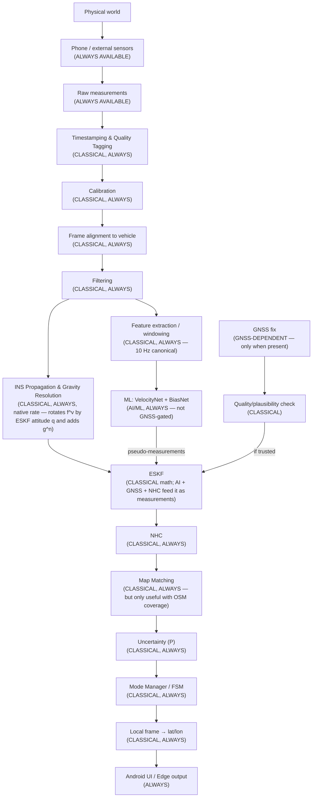

# End-to-End Real-Time Intelligent Dead Reckoning
## From Raw Phone Sensors to Corrected Vehicle Location
### SIH PS 26168 (ISRO)

Authoritative runtime and data-flow specification for SIH PS 26168 (ISRO), companion to `FINAL_MASTER_PLAN_SIH26168.md` and `FINAL_IMPLEMENTATION_PLAN_SIH26168.md`. Together, these three documents constitute the complete, authoritative, and frozen project specification. Its purpose is to trace what actually happens, in order, with concrete numbers and equations, executing the settled architecture decisions step-by-step from raw sensor input to display output.

Labels: `[OFFICIAL ISRO REQUIREMENT]` `[IO-VNBD FACT]` `[RESEARCH FINDING]` `[ENGINEERING RECOMMENDATION]` `[OUR DESIGN DECISION]` `[CORRECTION]` `[ADDED]` `[ILLUSTRATIVE — not a measured result]`.

---

# PART 1 — Absolute Basics

**What is location, really?** Latitude/longitude is an angular address on an ellipsoidal model of Earth (WGS84) — latitude is the angle north/south of the equator, longitude the angle east/west of a reference meridian. Crucially, **degrees of latitude/longitude are not fixed physical distances** — a degree of longitude shrinks toward the poles (it scales with `cos(latitude)`), while a degree of latitude is nearly constant (~111 km) everywhere. This single fact is *why* you cannot do dead-reckoning math directly in latitude/longitude (Part 21) — you'd be adding physical meters to angular degrees inconsistently depending on where on Earth you are.

**What is GNSS?** A satellite gives GNSS its position, velocity, and clock reference; your receiver measures the time each visible satellite's signal took to arrive, converts that into a distance ("pseudorange"), and solves a system of equations (typically ≥4 satellites — 3 for position, 1 to solve the receiver's own clock error) for its own position, velocity (via Doppler shift on the signal), and time. `[RESEARCH FINDING]`

**Why GNSS fails**: it needs a mostly-unobstructed line of sight to enough satellites. Tunnels/underground parking block it completely; urban canyons and dense forest cause multipath (signal bounces off surfaces, corrupting the timing) and reduced satellite visibility; jamming injects noise on the same band. The practical symptom ranges from "no fix" to "a fix that looks present but is wrong."

**What is dead reckoning, intuitively?** Close your eyes and try to walk to a door you saw a second ago — you're using your last known position plus your sense of how you've moved since. That's dead reckoning: no fresh outside reference, just "where I was" + "what I've measured about my own motion since." A car's phone does the same thing with an accelerometer and gyroscope instead of a sense of balance.

---

# PART 2 — What the Phone Actually Measures

| Sensor | Physically measures | Axes/units | Does it measure gravity? | What one sample means |
|---|---|---|---|---|
| Accelerometer | **Specific force** — the reaction force per unit mass holding the sensor's proof mass in place, which equals *true acceleration minus gravity's contribution* (note the sign — a phone sitting still on a table reads ~+9.81 m/s² "up," not zero, because it's measuring the force resisting gravity) | X/Y/Z, m/s², device frame | **Yes, always, inseparably, until you know orientation** | "Right now, along each of my three axes, this much specific force is acting" |
| Gyroscope | Angular velocity — how fast the device is rotating, not its absolute angle | X/Y/Z, rad/s, device frame | No | "Right now, I am rotating this fast around each axis" |
| Magnetometer | Local magnetic field vector | X/Y/Z, µT, device frame | No | "This is the field direction/strength right now" — **should we trust it?** Not much, inside a vehicle: engine, wiring, and the vehicle's own steel body distort the field substantially; used only as a coarse fallback (Part 7), never a primary heading source |
| GNSS | Position (lat/lon/alt), speed, bearing, accuracy, timestamps, and (on supporting devices) raw per-satellite measurements | degrees/metres/m/s/degrees, WGS84 | N/A | "As of this fix's timestamp, here's my best absolute position/motion estimate" |

**Which are actually used?** Accelerometer and gyroscope are the two load-bearing inputs for everything (always present, per Master Plan Section 4). GNSS lat/lon/speed/bearing/accuracy are used directly. Raw GNSS measurements (satellite count, C/N0) are optional enrichment. Magnetometer is fallback-only, explicitly excluded from the ML models because of the in-vehicle reliability problem above.

---

# PART 3 — Coordinate Systems

Getting this wrong silently produces plausible-looking garbage — this is worth being pedantic about.

| Frame | What it is | Axes |
|---|---|---|
| **Device/sensor frame** | Whatever direction the *phone chip* is physically oriented in, which depends entirely on how the phone happens to be mounted | Phone's own X/Y/Z as fixed by its manufacturer |
| **Vehicle frame** | Forward / lateral (left-right) / vertical (up-down) of the *car*, regardless of how the phone is mounted inside it | Forward, lateral, vertical |
| **Local navigation frame** | A flat, locally-Euclidean frame centered near the vehicle's current area, used for short-term dead-reckoning math (Part 21) | Typically East-North-Up (ENU) or North-East-Down (NED) |
| **Earth/global frame** | WGS84 latitude/longitude/altitude — the frame the *user* and GNSS ultimately think in | Angular (lat/lon), plus altitude |

**Why this matters, concretely**: if the phone is mounted rotated 90° from what your code assumes, "forward acceleration" in the code is actually reading "lateral acceleration" in the real car — the vehicle would appear to be sliding sideways at highway speed every time it merely accelerates forward. No amount of good filtering or a good ML model fixes a frame mistake; it has to be fixed *before* any of that math runs, which is exactly why alignment (Part 7) comes early in the pipeline, not late.

**Rotations**: device→vehicle (`R_b^v`) and vehicle→navigation-frame (`R_v^n`) rotations are represented as **quaternions** internally (4 numbers, no gimbal lock, cheap to compose/integrate) and converted to roll/pitch/yaw (Euler angles) only for human-readable display/debugging — never used as the internal representation for the actual math, because Euler-angle integration has a well-known singularity (gimbal lock) that quaternions avoid. `[RESEARCH FINDING]`

---

# PART 4 — First Real-Time Data Pipeline: One Sample, Traced All the Way Through

At `t = 10.350 s`, suppose (all numbers below are `[ILLUSTRATIVE]`, chosen only to make the trace concrete):

```
accel_raw (device frame) = [0.42, -0.05, 9.79]  m/s²
gyro_raw  (device frame) = [0.01, -0.02, 0.03]  rad/s
```

| Step | INPUT | PROCESS | OUTPUT |
|---|---|---|---|
| 1. Ingestion & Quality Tagging | Raw `SensorEvent` / packet | Read value + timestamp, attach non-destructive quality flags (NaN, non-monotonic, $|f|>4g$ extreme motion flag) | Immutable `RawIMUSample`, validated stream record, `t = 10.350s` |
| 2. Calibration | `accel_raw`, `gyro_raw`, stored gyro bias `b_g`, nominal accel prior | Subtract biases / apply scale | Calibrated device-frame `f_cal = [0.40, -0.06, 9.82]`, `ω_cal = [0.009, -0.0195, 0.0292]` |
| 3. Alignment | `f_cal`, `ω_cal`, stored `R_b^v` (device→vehicle rotation, Part 7) | `f_v = R_b^v · f_cal`; `ω_v = R_b^v · ω_cal` | Vehicle-frame `f_v ≈ [0.05, 0.38, 9.83]`, `ω_v ≈ [0.009, -0.02, 0.03]` |
| 4. Filtering | `f_v`, `ω_v`, filter state (median + Butterworth) | Apply fixed IIR filter coefficients | Denoised vehicle-frame specific force `f_filt ≈ [0.05, 0.38, 9.81]` and `ω_filt ≈ [0.009, -0.02, 0.03]` |
| 5. Strapdown propagation & gravity resolution | vehicle-frame `f_filt^v`, `ω_filt^v`, prior ESKF state `(p, v, q)` at `t=10.340s` | `a^n = R_v^n · (f_filt^v − b_a^v) + g^n` (`g^n = [0,0,-g]ᵀ`); `q ← q ⊗ Δq(ω_filt^v·Δt)`; `v ← v + a^n·Δt`; `p ← p + v·Δt` (Part 10/11) | Updated `(p, v, q)` at `t=10.350s` — raw, physics-based dead-reckoning state propagation |
| 6. (Every ~0.5–1s) ML inference | Last 2.0 s (20 samples @ 10 Hz) of filtered vehicle-frame specific force & gyro (Part 13/14) | VelocityNet + BiasNet forward pass on `(20, 9)` tensor | `v_forward ≈ 12.4 m/s`, `Δb` vector, each with predicted `log_variance` |
| 7. (Every ~0.5–10s, whenever fix/ML arrives) ESKF update | Propagated state, ML outputs, GNSS fix if present | Kalman update (Part 15) | Corrected `(p, v, q)`, reduced covariance along observed directions |
| 8. NHC | Corrected state (vehicle frame) | Pseudo-measurement: lateral/vertical velocity $v_y^v \approx 0, v_z^v \approx 0$ | Kinematically constrained state |
| 9. (≤2 Hz) Map matching | Corrected trajectory, OSM graph | HMM snap (downstream only, zero feedback into ESKF) | Snapped position (or unsnapped fallback if no confident match) |
| 10. Frame conversion | Local navigation-frame `(x,y,z)` | Convert to lat/lon (Part 21) | `latitude, longitude` |
| 11. UI | Final `(lat, lon, heading, mode, uncertainty)` | Render | Vehicle icon moves on screen |

Steps 1-5 happen **every single IMU sample** (native rate, up to ~200 Hz on the edge engine). Step 6 happens roughly every 0.5-1 s. Step 7 happens every IMU sample for the *prediction* half, but only when a measurement (ML or GNSS) is actually available for the *update* half. Step 9 can lag slightly behind the rest. This difference in cadence is the entire content of Part 29's real-time loop.

---

# PART 5 — Sensor Ingestion & Non-Destructive Quality Tagging

Android's `SensorManager` delivers each new reading via a `SensorEventListener.onSensorChanged(SensorEvent)` callback, asynchronously and independently per sensor type — the accelerometer and gyroscope do **not** arrive as a single combined packet, and they are **not guaranteed to arrive at exactly the same timestamps**, even if you request the same sampling period for both. `[RESEARCH FINDING — Android sensor framework]` GNSS fixes arrive via a separate callback (`LocationCallback`/`FusedLocationProviderClient`) at their own, much lower, independent rate.

The system's job in this stage is to turn three-plus independent, asynchronous callback streams into **one unified, time-ordered, quality-tagged record stream**:

```text
timestamp_ns | accel_x | accel_y | accel_z | gyro_x | gyro_y | gyro_z | gnss_lat | gnss_lon | gnss_speed | gnss_accuracy | flags | source
10350000000  | 0.42    | -0.05   | 9.79    | 0.010  | -0.020 | 0.030  |  null    |  null    | null        | null          | 0x00  | IMU
10351200000  | 0.44    | -0.03   | 9.80    | 0.011  | -0.019 | 0.028  |  null    |  null    | null        | null          | 0x00  | IMU
10400000000  |  null   |  null   |  null   |  null  |  null  |  null  | 22.5726  | 88.3639  | 12.3        | 4.1           | 0x00  | GNSS
```

**Non-Destructive Data Quality Policy (Critical Rule)**:
Raw sensor data is **strictly immutable and permanently preserved** in raw session logs. Incoming samples are never silently deleted or rewritten. Instead, every sample is evaluated against explicit integrity rules and tagged with bitmask quality flags:
- `FLAG_NAN_OR_NONFINITE (0x01)`: Sensed values contain NaN, +Inf, or -Inf.
- `FLAG_INVALID_TIMESTAMP (0x02)`: Non-positive or out-of-range epoch timestamp.
- `FLAG_NON_MONOTONIC_TIMESTAMP (0x04)`: Timestamp $t_k \le t_{k-1}$ arriving out-of-order.
- `FLAG_DUPLICATE_TIMESTAMP (0x08)`: Repeated timestamp for identical sensor ID.
- `FLAG_EXTREME_MOTION (0x10)`: Acceleration magnitude $\|\mathbf{f}\| > 4g$ ($>39.24 \text{ m/s}^2$) or angular rate $\|\boldsymbol{\omega}\| > 10 \text{ rad/s}$. **Important**: Extreme motion is NOT corruption; it represents real physical dynamics (potholes, speed bumps, emergency stops, curb impacts). These samples are tagged so the estimator and innovation gates can adjust measurement variances, but they are NEVER dropped from raw data.
- `FLAG_SENSOR_DROPOUT (0x20)`: Sampling gap $\Delta t > 3 \cdot \Delta t_{\text{nominal}}$.

Downstream estimators consume a derived **validated stream** where only genuinely non-computable records (`FLAG_NAN_OR_NONFINITE`, `FLAG_NON_MONOTONIC_TIMESTAMP`) are excluded from integration. All flags remain permanently accessible for diagnostics and real-time trust calculation.

External-IMU ingestion (edge engine) follows the same shape, standardizing packets via the `SensorAdapter` interface (Master Plan Section 21).

---

# PART 6 — Timestamp Synchronization

- **Frequencies differ**: accel/gyro at up to a few hundred Hz, GNSS at ~1 Hz (phone) or ~10 Hz (a dedicated vehicle GPS receiver, per IO-VNBD's own `V-` file rate).
- **Interpolation vs. nearest-neighbor**: for **training-time label alignment** (assigning a GPS-derived speed to an IMU window), linear interpolation of the lower-rate GNSS stream onto the IMU timeline is preferred over nearest-neighbor, since GNSS updates slowly enough relative to vehicle dynamics that linear interpolation between two real fixes is a better estimate of the "true" value at an intermediate timestamp than simply repeating the nearest one. For **live inference**, there's nothing to interpolate *toward* in the future — the system instead does the opposite operation: it buffers IMU samples into windows and, when a cycle needs the "current" GNSS-derived quantity, uses the most recent valid fix, explicitly aged by how long ago it arrived (feeding into the trust score, Part 18).
- **Delayed GNSS**: a fix can arrive with a timestamp *older* than the filter's current state (network/processing delay). For v1, discard fixes older than the current filter state rather than implementing full state rollback/replay; this is simpler and, for a phone's typical GNSS delivery latency, a reasonable trade.
- **Timestamp drift**: within a single phone, accel/gyro/GNSS timestamps share the same monotonic clock base (`elapsedRealtimeNanos`) so drift between them isn't a real concern. Drift **is** a real concern for a physically separate external IMU + host clock on the edge engine, handled via packet sequence-counter re-anchoring.
- **Recommended strategy, stated plainly**: ingest into the long-format stream (Part 5) → for training, interpolate GNSS onto IMU timestamps to build labels → for live inference, buffer IMU into fixed windows and always reference "most recent valid GNSS fix, with its own age tracked" rather than trying to force GNSS onto the IMU's exact clock tick.

---

# PART 7 — Calibration: The Startup Sequence

What happens when the user opens the app and starts a session, concretely:

1. **App starts, phone presumed stationary** (or the app prompts the user to hold still for a few seconds — a reasonable, low-friction UX ask).
2. **Stationary-period gyro bias & orientation initialization**: collect N seconds of accel/gyro samples at rest:
   - **Gyroscope bias**: $\mathbf{b}_g = \text{mean}(\boldsymbol{\omega})$ (since true angular rate is zero at rest, the mean is the bias estimate directly).
   - **Orientation initialization (gravity direction)**: at rest, the accelerometer measures the reaction force to gravity. Assuming an initial nominal prior of $\mathbf{b}_a \approx \mathbf{0}$, the direction of the measured specific force vector directly initializes pitch and roll (tilt relative to horizontal).
   - **Accelerometer bias observability principle**: A single arbitrary static pose **cannot** independently separate accelerometer bias from tilt (5 unknowns: 2 tilt angles + 3 bias components, with only 3 accelerometer measurements). Multi-pose tumbling calibration is not required for v1. Instead, $\mathbf{b}_a$ is initialized with a nominal zero prior and dynamically observed and refined by the ESKF during vehicle motion when GNSS fixes, NHC constraints, and ZUPT updates arrive.
3. **Yaw remains unresolved at this point** — gravity tells you nothing about which way the phone is pointing *horizontally*, only how it's tilted. This is a real, unavoidable gap: yaw can only be resolved once the vehicle actually starts moving in a roughly straight line and its GPS-derived direction of travel can be compared against the phone's own sensed heading drift (Implementation Plan Phase 3). Until then, yaw uses a placeholder (e.g., 0° or the magnetometer's coarse estimate as a rough seed, explicitly downweighted) and the system is surfaced as "aligning" on the debug overlay, rather than silently pretending full alignment exists from second one.
4. **Vehicle starts moving; once speed exceeds a minimum threshold and the path is reasonably straight, yaw is resolved** by comparing the device's sensed heading (integrated from gyro since step 2) against the GPS track heading over that same interval, and the residual difference becomes the final component of `R_b^v`.
5. **From this point on**, `R_b^v` is applied to every incoming sample (Part 4, step 3) until a re-calibration trigger fires (e.g., a sudden orientation discontinuity inconsistent with plausible vehicle dynamics, indicating the phone was bumped or remounted).

---

# PART 8 — Gravity, From First Principles

The accelerometer's proof-mass measures **specific force** $\mathbf{f}_m^b$ in the device/body frame ($b$), which is proper acceleration relative to free-fall (reaction force against gravity plus kinematic acceleration):
```
f_m^b = a_kinematic^b − R_n^b · g^n + b_a^b + η_a
```
where in an East-North-Up (ENU) navigation frame ($n$):
- Physical gravity points straight down toward Earth's center along $-Z$: $\mathbf{g}^n = [0, 0, -g]^T$, with $g \approx 9.80665 \text{ m/s}^2$.
- The support reaction force counteracting gravity acts upward ($+Z$). For a stationary phone flat on a horizontal table facing up (device orientation relative to navigation frame $R_b^n = \mathbf{I}$):
  $$\mathbf{f}_m^b \approx - \mathbf{I} \begin{bmatrix} 0 \\ 0 \\ -g \end{bmatrix} + \mathbf{b}_a^b = \begin{bmatrix} 0 \\ 0 \\ +g \end{bmatrix} + \mathbf{b}_a^b \approx \begin{bmatrix} 0 \\ 0 \\ +9.81 \end{bmatrix} \text{ m/s}^2$$
  *(Directly matches Android `Sensor.TYPE_ACCELEROMETER`, which outputs $+9.81 \text{ m/s}^2$ on $+Z$ at rest.)*

At rest, kinematic acceleration $\mathbf{a}_{\text{kinematic}} = \mathbf{0}$, so $\mathbf{f}_m^b \approx - R_n^b \mathbf{g}^n + \mathbf{b}_a^b$. As established above, one static pose initializes roll and pitch given prior $\mathbf{b}_a^b \approx \mathbf{0}$, while the ESKF refines $\mathbf{b}_a^v$ dynamically during motion.

**Live Canonical Vehicle-Frame Representation**:
Once device-to-vehicle alignment $R_b^v$ is applied (Part 7), the live pipeline operates in the vehicle frame ($v$). The measured vehicle-frame specific force is $\mathbf{f}_m^v = R_b^v (\mathbf{f}_m^b - \mathbf{b}_{a,\text{prior}})$. While moving, you cannot separate kinematic acceleration from gravity from one sample alone — the ESKF rotates the debiased vehicle-frame specific force into the local navigation frame using its current vehicle attitude estimate ($R_v^n$), and adds physical gravity $\mathbf{g}^n$:
```
a^n = R_v^n · (f_m^v − b_a^v) + g^n
```
where $\mathbf{g}^n = [0, 0, -g]^T$ in ENU. This is why **attitude estimation (Part 9) is a prerequisite for coordinate acceleration propagation** — you cannot get a good acceleration estimate without an accurate orientation estimate, and attitude tracking inside the ESKF jointly estimates orientation, velocity, position, and sensor biases through shared covariance updates.

---

# PART 9 — Attitude Estimation

| Method | What it does | Suitable here? |
|---|---|---|
| Pure gyro integration | `q ← q ⊗ Δq(ω·Δt)` every sample, nothing else | No, alone — drifts unboundedly with gyro bias, no correction mechanism |
| Complementary filter | Blends gyro integration (good short-term) with gravity-vector-derived tilt (good long-term, from the accelerometer, assuming low dynamic acceleration) via a simple weighted average | Reasonable, simple, low-cost — but a fixed blend weight doesn't adapt to how much the vehicle is actually accelerating (which corrupts the gravity-vector cue) |
| Mahony filter | A complementary-filter variant with a proportional-integral feedback structure on the gyro-bias estimate, popular in low-cost drone/robotics attitude estimation `[RESEARCH FINDING]` | Reasonable alternative, similar cost to complementary filter |
| Madgwick filter | Gradient-descent-based orientation filter, also popular in embedded/robotics IMU work, generally slightly better accuracy than Mahony for similar cost `[RESEARCH FINDING]` | Reasonable alternative |
| Android `TYPE_ROTATION_VECTOR` | OS-internal sensor fusion (accel+gyro+mag), quaternion output, generally well-engineered but a black box, and includes magnetometer influence this project deliberately distrusts in-vehicle | Sanity-check only (Master Plan Section 4/16 ruling, unchanged) |
| **Full ESKF, attitude as one part of the joint state** | Attitude, velocity, position, and sensor bias are all estimated *jointly*, with gyro integration in the process model and every available measurement (GNSS, VelocityNet, BiasNet, NHC) correcting all of them together through one consistent covariance | **Chosen** |

**What our system uses, and why**: the **full ESKF specified in Master Plan Section 16** — not a separate, standalone Mahony/Madgwick/complementary attitude filter running alongside it. `[NOTE — attitude is an integral block of the joint error-state]` A standalone complementary/Mahony/Madgwick filter is a *reasonable* choice for a system that only needs orientation — but this project needs orientation, velocity, position, and bias jointly and consistently, with a shared, adaptive notion of "how much do I currently trust this input" (the covariance) — which is precisely what a single joint ESKF gives you and a separate attitude filter bolted onto separate position/velocity logic would not, without a lot of extra hand-tuned glue code to keep them consistent.

Practically: gyro integration handles moment-to-moment attitude change (Part 4 step 6); gravity-vector tilt cues (available primarily when the vehicle isn't strongly accelerating) act as one implicit correction source alongside the explicit ML/GNSS measurements — all inside the one ESKF, not a separate pre-filter.

---

# PART 10 — Transform Acceleration to Vehicle/World Frame

```
f_m^v (aligned, filtered specific force in vehicle frame)
  → subtract bias:            f_debiased^v = f_m^v − b_a^v
  → rotate to nav frame:      f^n = R_v^n · f_debiased^v          (uses current ESKF attitude quaternion q)
  → add physical gravity:     a^n = f^n + g^n                    (with g^n = [0, 0, -g]ᵀ in ENU)
```
**Stationary-Vehicle Sanity Check**:
- Level vehicle at rest on horizontal surface facing north: $R_v^n = \mathbf{I}$, $\mathbf{b}_a^v = \mathbf{0}$, $\mathbf{f}_m^v = [0, 0, +g]^T$.
- $\mathbf{a}^n = \mathbf{I}[0, 0, +g]^T + [0, 0, -g]^T = [0, 0, 0]^T$. Coordinate acceleration is identically zero.

**Why this exact order matters**: bias removal happens in the vehicle frame (where $\mathbf{b}_a^v$ is tracked in the ESKF); gravity addition happens *after* rotating into the navigation frame, because gravity is a constant vector in the local ENU frame ($[0, 0, -g]^T$, pointing straight down) but a *varying* direction relative to vehicle pitch and roll.

**Why this matters for speed/velocity/position**: `a^n` (or `a_true`) is the input to strapdown integration (Part 11) and, separately, the filtered vehicle-frame specific force and angular velocity form the raw feature channels VelocityNet/BiasNet consume (Part 13). Every error in this transform chain shows up doubled (once in the classical integration, once via slightly-wrong training-time features) — which is exactly why Part 7's calibration/alignment sequence is treated as foundational rather than a minor setup step.

---

# PART 11 — Classical Dead Reckoning (the baseline, before ML)

```
v(t+Δt) = v(t) + a_true(t)·Δt
p(t+Δt) = p(t) + v(t)·Δt + ½·a_true(t)·Δt²
```
**Why tiny errors explode**: suppose `a_true` has a residual bias error of just 0.02 m/s² (small enough to be genuinely hard to notice by eye) left uncorrected after calibration. Over 60 seconds of continuous integration:
- Velocity error ≈ `0.02 × 60 = 1.2 m/s`
- Position error ≈ `½ × 0.02 × 60² = 36 m`

That's from a bias smaller than typical MEMS-grade specification tolerances — this single worked number is the entire justification for why this project cannot ship "just integrate the accelerometer" as its answer.

This pure classical loop, run with no GNSS, no ML, no NHC, no map matching, is **Level 1 (Pure Strapdown INS)** in the Axis A component-ablation suite (Master Plan Section 26 / Implementation Plan Phase 13) — it's the baseline number everything else is measured as an improvement over.

---

# PART 12 — Why AI/ML Is Needed (only now)

| Classical dead reckoning gets wrong | Because | Does ML help with this? |
|---|---|---|
| Accelerometer bias | At rest, a single pose cannot separate 3D bias from tilt; nominal prior is dynamically refined by ESKF during motion, but bias also drifts with vibration/temperature/dynamics | **Yes — BiasNet estimates context-dependent bias residuals** |
| Gyro bias | Static rest captures initial bias; bias continues drifting during motion | **Yes — BiasNet** |
| Sensor noise | Random, zero-mean, but integrates into random-walk error | Partially — the fixed filter (Part 4 step 4) handles most of this; ML isn't the primary tool here |
| Phone mounting | Handled by the classical alignment module (Part 7), not ML | No — this is explicitly a classical module's job |
| Vibration | Handled by the classical filter; AI's role here is deliberately limited | Mostly no, for v1 |
| Vehicle dynamics / true forward speed | **This is the one thing nothing classical can give you without an OBD-II feed** — you cannot cleanly separate "forward speed" from noisy IMU integration alone | **Yes — VelocityNet's specific job, the single clearest reason this project needs ML at all** |
| Integration drift (the general phenomenon) | A consequence of all of the above compounding | Yes, indirectly — by fixing bias (BiasNet) and providing an independent speed estimate (VelocityNet), not by "fixing drift" as some vague single action |

This table is the direct, concrete answer to "why exactly two models, and why these two" that Master Plan Section 7 establishes — restated here as a diagnosis table rather than a design justification, since this document's job is explanation, not decision-making.

---

# PART 13 — Real-Time ML Speed Estimation, Traced

At time `t = 45.0 s`, the system has been buffering filtered, aligned, vehicle-frame IMU samples (**not** gravity-compensated; gravity is resolved inside ESKF propagation, while ML consumes vehicle-frame specific force and gyro). The last 2.0 s (20 samples at the canonical 10 Hz) are assembled into the frozen 9-channel representation:

```
Aligned vehicle-frame samples (20 samples @ 10 Hz):
  - 6 kinematic channels: [f_x^v, f_y^v, f_z^v, ω_x^v, ω_y^v, ω_z^v] (specific force & angular velocity)
  - 3 derived physical channels: [||f^v||, ||ḟ^v||, ||ω^v||] (force magnitude, jerk magnitude, angular rate magnitude)
  → total 9 channels per timestep: (20, 9) tensor
  → normalized using stored training-set mean/std      → (20, 9), unitless
  → batch dimension added for the model                → tensor shape [1, 20, 9]
  → VelocityNet.forward(tensor)
  → output: (v_forward = 12.4 m/s, log_variance = -2.1)
```
**Where that number goes next**: `v_forward` becomes a forward-velocity pseudo-measurement ($z_v = [v_{\text{forward}}, 0, 0]^T$ in vehicle frame) fed into the ESKF's update step (Part 15) exactly the way a GPS-derived speed would be, weighted by the confidence derived from `log_variance` — it does **not** directly overwrite the navigation state's velocity, and it does **not** wait for a GNSS outage to matter: this inference and this ESKF update happen on this same roughly-1-2-Hz cadence continuously, GNSS present or not.

---

# PART 14 — Real-Time ML Residual Correction, Traced

Same input tensor shape as Part 13 `[1, 20, 9]`, fed to the second model:

```
tensor [1, 20, 9]  → BiasNet.forward(tensor)
  → output: (Δb_a = [0.003, -0.001, 0.002] m/s²,  Δb_g = [0.0002, 0.0001, -0.0003] rad/s,
             log_variance = [...six values...])
```
**What state the model is looking at**: it does *not* see the ESKF's current bias state directly (Master Plan Section 8 explicit exclusion, avoiding an unclosed feedback loop) — it only sees the windowed vehicle-frame motion features, and predicts, independently each time, what the current *bias residual* should be given what that motion pattern looks like.

**How the correction is applied**: `z_bias = current_bias_estimate + Δb`, fed into the ESKF exactly like any other measurement, with `H` selecting the bias sub-block of the state and `R` from the predicted `log_variance` (Part 15). **It is not simply added directly to the bias state outside the filter** — going through the Kalman update means the correction is automatically weighted against the filter's own current confidence in its bias estimate, not blindly trusted at face value every time.

**Decoupled Standalone Fallback & Output Clamping**: The core dead-reckoning engine (`VelocityNet + Classical ESKF + GNSS + NHC + Gated ZUPT`) is fully functional and standalone without BiasNet. BiasNet is an experimental add-on whose predicted corrections are hard-clamped to safe physical ranges ($|\Delta \mathbf{b}_a| \le 0.3 \text{ m/s}^2$, $|\Delta \mathbf{b}_g| \le 0.05 \text{ rad/s}$). If its validation gates fail, it is cleanly disabled without destabilizing the ESKF.

**Numeric intuition**: a `Δb_a` around 0.003 m/s² looks tiny, but recall Part 11's worked example — a bias error this size, left uncorrected, would still produce roughly `½ × 0.003 × 60² ≈ 5.4 m` of position error over a minute. Correcting biases of exactly this magnitude, continuously, is precisely BiasNet's value — it's not fixing large, obvious errors; it's fixing the small, easy-to-underestimate ones that Part 11 showed compound badly.

---

# PART 15 — ESKF, Taught for Practical Use

**State**:
- **Nominal state** `x = [position(3), velocity(3), attitude-quaternion(4), accel_bias(3), gyro_bias(3)]` — 16 numbers describing the current system state, with unit quaternion norm `||q|| = 1`.
- **Error state** `δx = [δposition(3), δvelocity(3), δattitude(3), δaccel_bias(3), δgyro_bias(3)]` — 15 numbers describing small perturbations, where attitude error `δθ ∈ so(3)` is a 3-component minimal rotation vector.

**Nominal state vs. error state**: the ESKF tracks a "nominal" (best-guess) state that's propagated with the full nonlinear strapdown equations (Part 4 step 6), and separately tracks a small, linear "error state" (how wrong the nominal state's covariance says it might currently be) — this separation is *why* it's called "error-state": the small-error assumption is much more valid for a *correction* than it would be for the *full* state directly, especially for orientation, which is why ESKF handles attitude more robustly than a naive full-state EKF (Master Plan Section 16).

**Covariance** `P` — strictly a **15×15** matrix representing error-state covariance on the manifold $SO(3) \times \mathbb{R}^{12}$. A 16×16 covariance would be overparameterized and singular due to the quaternion unity constraint. Every Kalman gain calculation, innovation covariance inversion, and covariance update operates strictly in 15 dimensions.

**Prediction (every IMU sample)**: nominal state propagated via Part 4 step 6's equations; `P` propagated via `P ← F·P·Fᵀ + Q` (`F` = linearized process model, `Q` = process noise, reflecting how much we trust the IMU between measurements).

**Update (whenever a measurement is available — GNSS, VelocityNet, BiasNet, NHC, ZUPT)**: standard Kalman update (Implementation Plan Phase 5 / Master Plan Section 16) — compute innovation, compute gain from `P` and the measurement's own `R`, correct the error-state, inject the correction into the nominal state, reset the error state to zero, and update `P ← (I − K·H)·P`.

**Why ESKF suits this project specifically**: it gives one consistent place for *every* correction source (GNSS, two ML models, NHC, ZUPT) to plug in through the same, well-understood mechanism, with the filter's own confidence (`P`) and each source's own confidence (`R`) jointly determining how much any single source is allowed to move the state in one step — exactly the property that makes the system robust to a single bad ML prediction or a single noisy GNSS fix rather than fragile to either.

**Practical data flow, restated as one line**: `IMU sample → propagate (every sample) → [whenever available: GNSS fix / VelocityNet output / BiasNet output / NHC pseudo-measurement / Gated ZUPT] → update → corrected state, ready for the next propagation step`.

---

# PART 16 — Dynamic Constraints: NHC & Gated ZUPT

### 16.1 Non-Holonomic Constraint (NHC)
A normal road vehicle (not skidding, not airborne) cannot move sideways or vertically relative to its own body — its lateral and vertical velocity **in the vehicle frame** are approximately zero. This is fed to the ESKF as a pseudo-measurement:
```
z_lateral = 0,  z_vertical = 0     (with a small noise term R_nhc, reflecting that this is "approximately", not "exactly", zero)
```
run through the exact same Kalman update mechanism as GNSS or the ML models (Part 15) — no special-case code path, just another measurement source with its own `H` (selecting the vehicle-frame lateral/vertical velocity components, accounting for attitude rotation) and `R`.

**Where in the pipeline**: after the main ESKF update (Part 4 step 9) — applied to the *already GNSS/ML-corrected* state, further tightening it, every cycle.

**When it should be weakened/disabled**: during a genuine skid (lateral velocity is *not* actually near zero) or an abnormal maneuver — detected via an implausibly large NHC innovation (the same consistency-gate mechanism specified in Master Plan Section 16) — the constraint's `R` is inflated (or the update skipped for that cycle) rather than forcibly zeroing a lateral velocity that's real. Sensor failure (e.g., gyro saturated during an extreme maneuver) should also suppress NHC temporarily, since the vehicle-frame projection NHC depends on is itself now unreliable.

### 16.2 Classical Gated ZUPT (Zero Velocity Update)
- **Zero-ML Dependency**: Stationary detection runs entirely on classical IMU signals without requiring VelocityNet:
  1. Gyroscope norm: $\|\boldsymbol{\omega}^b\| < 0.05 \text{ rad/s}$
  2. Accelerometer magnitude & variance: $|\|\mathbf{f}_m^b\| - g| < 0.25 \text{ m/s}^2$ and $\text{Var}(\|\mathbf{f}_m^b\|) < 0.015 \text{ (m/s}^2\text{)}^2$ over a sliding window $W \approx 0.8\text{ s}$
  3. External check (when available): GNSS Doppler speed $< 0.1 \text{ m/s}$ or CAN wheel speed $= 0$.
- **Update**: When stationary is confirmed, apply $z_{\text{zupt}} = [0, 0, 0]^T$ with $H_{\text{zupt}} = [\mathbf{0}_{3\times3}, \mathbf{I}_{3\times3}, \mathbf{0}_{3\times3}, \mathbf{0}_{3\times3}, \mathbf{0}_{3\times3}]$ and $R_{\text{zupt}} = \sigma_z^2 \mathbf{I}_{3\times3}$ ($\sigma_z = 0.03\text{ m/s}$).
- **Role**: Clamps velocity drift during stops, traffic lights, and engine startup, and enables rapid bias observation. Crucially, ZUPT is an opportunistic stationary update, **not an always-available moving outage mechanism** (which relies on INS + VelocityNet + NHC).

---

# PART 17 — GNSS Available Mode

```
GNSS fix arrives
  → timestamp alignment (Part 6: getElapsedRealtimeNanos-based)
  → quality check (Part 18: sat count / accuracy / plausibility)
  → innovation check (is this fix's implied position/velocity wildly inconsistent with the current ESKF state, beyond what the reported accuracy would explain?)
  → if it passes both: ESKF update (Part 15), using R derived from the fix's own reported accuracy
  → drift correction: whatever small error had accumulated since the last trusted fix is corrected, proportional to the Kalman gain
  → NHC (Part 16) applied on top
  → map matching (Part 22) applied on top of that
  → final location displayed
```
**How GNSS corrects inertial drift, concretely**: every trusted fix reduces uncertainty along observed position directions in `P` and pulls the nominal state's position/velocity toward the fix, in proportion to how confident the fix is *relative to* how confident the filter currently is in its own propagation — this is the exact same mechanism (Part 15) as every other measurement source, which is the whole point of building around one filter rather than special-casing GNSS handling separately from ML handling.

---

# PART 18 — GNSS Degradation Detection

| Evidence | Rule-based check | Would ML add value here? |
|---|---|---|
| Reported accuracy (metres) | Compare against a threshold, feed continuously into `R` rather than a hard cutoff | Marginal — a simple rule already captures this well |
| Satellite count | Threshold | Marginal |
| Fix state (present/absent) | Direct | N/A — binary fact |
| Position jump | Compare against max-feasible-speed-implied displacement since the last fix | Marginal |
| Speed inconsistency | Compare GNSS-reported speed against the ESKF's own current velocity estimate | Marginal — this is itself just another innovation check |
| GNSS/IMU disagreement | Same as above, generalized | Marginal |
| Innovation statistics (chi-squared/Mahalanobis test on the GNSS update itself) | **This is the most principled version of all of the above, and it's still classical** | No — a statistical test on a well-understood filter quantity, not a pattern-recognition problem |

**Chosen (re-confirmed, not changed): rule-based, built around the innovation-statistics test above as the unifying mechanism**, feeding a continuous trust score rather than a hard binary — consistent with Master Plan Section 7's finding that a learned GNSS-quality classifier is unnecessary. Nothing in this trace changes that conclusion; if anything, seeing it worked through mechanically here reinforces it — the innovation test is already exactly the kind of principled, adaptive signal a classifier would be trying to approximate, at a fraction of the complexity.

---

# PART 19 — GNSS Outage, Traced Step by Step

At `t = 100 s`, GNSS disappears (tunnel entry).

1. **Detection**: the next expected fix simply doesn't arrive within its expected window (Part 6); after a short grace period (to avoid overreacting to one missed cycle), the outage is confirmed.
2. **Mode changes**: FSM transitions `GNSS_AIDED → DR_ONLY` (Part 25).
3. **GNSS updates stop**: the ESKF's GNSS-measurement branch (Part 17) simply has nothing to consume — no special "outage code path" needed, the update step for that source just doesn't fire this cycle, and the next cycle, and so on.
4. **IMU propagation continues**: Part 4 steps 1-6 run exactly as before, every sample, completely unaffected by GNSS's absence — this is the part of the pipeline that makes dead reckoning possible at all.
5. **ML continues**: VelocityNet and BiasNet keep running on their own ~1-2 Hz cadence, unaffected by GNSS's absence (Part 13/14) — this is *precisely why* the outage doesn't cause the position estimate to simply stop being updated; it just stops being updated *by GNSS specifically*.
6. **ESKF behaves differently only in that one branch**: prediction (step 4) continues; GNSS-update (step 8 of Part 4) is simply absent; ML-updates (also step 8) continue exactly as before.
7. **NHC continues**: unaffected — it never depended on GNSS in the first place.
8. **Map matching continues**: unaffected in mechanism, though its input (the ESKF's own trajectory estimate) is now GNSS-free and therefore drifting more than it would with GNSS present — map matching's *value* goes up during exactly this window, since it's now one of the only remaining external correction sources.
9. **Uncertainty behavior during outage**: Prediction steps continuously inject process noise `Q`, which generally increases covariance `P`. Without absolute GNSS position fixes, position uncertainty generally increases over the duration of the outage. However, covariance does not grow strictly monotonically: valid VelocityNet, NHC, and gated ZUPT measurement updates locally reduce uncertainty in their observed directions (forward speed, lateral/vertical velocity, and sensor biases).
10. **Application outputs position**: the UI keeps rendering a smoothly-moving icon throughout — from the user's point of view, *nothing visibly changes* at the moment of outage entry, which is precisely the "seamless" requirement `[OFFICIAL ISRO REQUIREMENT]`.

---

# PART 20 — A Concrete Numerical Outage Example `[ILLUSTRATIVE — not a measured result]`

Suppose, at the moment GNSS is lost:
```
latitude  = 22.5726°N
longitude = 88.3639°E
speed     ≈ 15 m/s  (54 km/h)
heading   ≈ 90° (due east)
```
Over the next 4 seconds, suppose the vehicle continues roughly straight with a slight, real deceleration (approaching a bend), and VelocityNet/BiasNet are doing their job reasonably well:

| t (s since outage) | VelocityNet estimate | Displacement this second (east) | Cumulative displacement (east) |
|---|---|---|---|
| 1 | 14.8 m/s | ~14.8 m | 14.8 m |
| 2 | 14.5 m/s | ~14.65 m | 29.45 m |
| 3 | 14.1 m/s | ~14.3 m | 43.75 m |
| 4 | 13.6 m/s | ~13.85 m | 57.6 m |

Converting ~57.6 m eastward displacement near latitude 22.57°N into a longitude delta (Part 21's projection, `Δlon ≈ Δx / (R_earth · cos(lat))`, `R_earth ≈ 6,371,000 m`): `Δlon ≈ 57.6 / (6,371,000 × cos(22.57°)) ≈ 57.6 / 5,884,000 ≈ 0.0000098°`, giving an updated estimated position around `longitude ≈ 88.36400°E` (latitude essentially unchanged, since motion was due east).

**Where ML helped, concretely, in this trace**: without VelocityNet, the system would have had to derive these per-second speed values from double-integrating a noisy, imperfectly bias-corrected accelerometer signal instead of reading them from a model trained specifically to predict this quantity — Part 11's worked bias-error example (36 m of error from a 0.02 m/s² bias, over 60 s) is the direct illustration of what's being avoided here.

---

# PART 21 — Position Update During Outage: Local Frame → Lat/Lon

**Why not integrate directly in latitude/longitude**: Part 1 already established that degrees of longitude represent different physical distances depending on latitude, and neither degree is a simple linear unit of distance the way metres are — running `p ← p + v·Δt` directly on lat/lon values would require constantly correcting for this distortion inside the integration loop itself, and would behave inconsistently as the vehicle's latitude changes even slightly. `[RESEARCH FINDING — standard navigation-engineering practice]`

**What we actually do**: the ESKF's position state is a **local, Euclidean Cartesian frame** (`x` = east, `y` = north, `z` = up, relative to a single session-level reference point established at the first trusted 3D GNSS fix), and all of Part 4-16's math runs entirely in that local frame, where ordinary Euclidean integration (Part 11's equations, unmodified) is valid.

**Conversion to lat/lon, only when needed** (for display, for comparing against a GNSS fix, for map matching):
```
Δlat ≈ y / R_earth                              (radians, then convert to degrees)
Δlon ≈ x / (R_earth · cos(lat_reference))
lat  = lat_reference + Δlat
lon  = lon_reference + Δlon
```
This is a flat-Earth (equirectangular) local approximation. A single session-level origin is maintained throughout the run: mid-session resets are deliberately avoided because they would cause artificial state jumps, disrupt covariance continuity, corrupt trajectory history buffers, and complicate downstream matching. For typical driving distances (<50 km), the flat-Earth vertical curvature error is under 0.2 m and horizontal distortion is negligible (<10⁻⁵).

---

# PART 22 — Downstream Map Matching (OSM + HMM)

```
ESKF + NHC/ZUPT trajectory estimate (local frame converted to lat/lon)
  → candidate generation: query nearby OSM road-graph edges within search radius
  → emission probability: Gaussian-in-distance to each candidate road
  → transition probability: routing connectivity between consecutive candidates on the road graph
  → best path: fixed-lag sliding window Viterbi decode (last 5–10 epochs) for real-time streaming
  → snap/display: snap displayed path only if confidence exceeds threshold; otherwise emit unsnapped estimate
```

**Downstream-Only Flow (Zero Estimator Feedback)**:
$$\text{ESKF} \longrightarrow \text{NHC / ZUPT} \longrightarrow \text{Map Matching} \longrightarrow \text{Display / Output}$$
Map matching is strictly a **downstream visualization and route-progress module**. In v1, it **never feeds corrections back into the ESKF state vector or covariance matrix**. Decoupling map matching prevents catastrophic feedback loops (e.g., snapping onto a parallel frontage road and pulling the estimator off course) and avoids unmodeled cross-correlations.

**Why map matching should not blindly override the sensor estimate**: a wrong high-confidence-looking snap (e.g., onto a nearby parallel road, or a frontage road running alongside the actual highway) would silently *introduce* error that the sensors themselves never had — this is why the pipeline explicitly falls back to the unsnapped estimate (Master Plan Section 24 failure mode) rather than always forcing a snap, and why the confidence threshold for accepting a match should be conservative rather than aggressive.

**How it reduces apparent drift**: it's the one correction source in the entire pipeline that comes from *outside* the sensor chain entirely — even a perfectly-executed ML+ESKF+NHC stack still accumulates some drift over a long outage, and only an external constraint (the road genuinely being where it is on the map) can correct that without any new sensor information.

**Is HMM appropriate? Re-confirmed, unchanged from Master Plan Section 18 decision** — nothing in this trace surfaces a reason to replace it; it remains mature, cheap, explainable, and well-suited to exactly this kind of noisy-trajectory-vs-known-road-network problem.

---

# PART 23 — Uncertainty

The output is always **position + uncertainty**, never a bare lat/lon — because a bare coordinate implies a confidence the system frequently doesn't have, and hiding that from the UI/logs would make the system's actual reliability impossible to reason about, debug, or honestly report to a screening panel.

```
GNSS available, trusted     → updates reduce uncertainty in observed directions                   → low, roughly steady-state uncertainty
GNSS lost                   → prediction increases uncertainty; ML/NHC/ZUPT updates constrain drift → position uncertainty generally increases over time
GNSS returns, plausible fix → updates reduce uncertainty in observed directions (Part 24)        → uncertainty falls back down over ~1-2 s, not instantly
```
**How ML confidence influences uncertainty**: directly and mechanically, not as a separate concept — VelocityNet's and BiasNet's own predicted `log_variance` outputs become the `R` in their respective Kalman updates (Part 13/14/15), so a moment of low ML confidence (e.g., an unusual motion pattern) automatically produces a weaker update and therefore a smaller reduction in `P` that cycle — the system's overall uncertainty output is already an honest aggregate of every source's own honesty about itself, not a bolted-on separate "confidence meter."

---

# PART 24 — GNSS Recovery

```
GNSS fix returns
  → quality check (Part 18, same mechanism as always)
  → plausibility/innovation test (is this fix wildly inconsistent with the current, now-uncertain, DR-derived state — beyond what the *current*, now-larger, P would explain?)
  → if implausible: discard, remain in DR_ONLY (the fix might itself be a spurious first return, e.g. a brief multipath-corrupted read right at the tunnel exit)
  → if plausible: mode → REACQUIRING
  → bounded correction: the Kalman gain naturally limits how much a single update can move the state in one step (Part 15) — but additionally, an explicit maximum re-snap rate is enforced on the *displayed* output specifically, so the icon visibly glides rather than jumps even if the underlying state correction is large
  → reblend continues over subsequent fixes until the fused estimate and raw GNSS agree within tolerance across a few consecutive fixes
  → mode → GNSS_AIDED
```
**Why not snap instantly**: the PS explicitly asks for "seamless" transitions `[OFFICIAL ISRO REQUIREMENT]` in both directions — an instant snap to the new GNSS position after a long outage would be visually and functionally identical to the exact "position jumps" failure mode the PS is trying to eliminate, just moved from outage-entry to outage-exit.

---

# PART 25 — Complete State Machine, Critically Evaluated

```
GNSS_AIDED  ⇄  DR_ONLY  ⇄  REACQUIRING
```
| State | Entry condition | Exit condition | Notes |
|---|---|---|---|
| `GNSS_AIDED` | Default/start; or REACQUIRING converges | GNSS outage confirmed | GNSS *degraded-but-present* is handled *inside* this state via continuous trust-score downweighting (Part 18), not a separate discrete state |
| `DR_ONLY` | Outage confirmed (grace period elapsed) | A plausible GNSS fix returns | Position uncertainty generally increases; ML models, NHC, and ZUPT continuously active to constrain velocity and orientation drift |
| `REACQUIRING` | Plausible fix received while in `DR_ONLY` | Converged (agreement across a few consecutive fixes) or the fix proves implausible after all | Bounded-rate blend; distinct from `GNSS_AIDED`'s steady-state trust handling specifically because the *starting* uncertainty here is much larger |

**Critically evaluating whether three states are the best choice** (re-examined here, not merely repeated): a fourth explicit state for "degraded" was considered again in this trace and rejected again, for the same reason established in the earlier cross-document review — the continuous trust score already achieves smooth downweighting without the flapping risk a fourth discrete state with its own hysteresis would add. A fifth state distinguishing "just lost GNSS" from "long-duration outage" was also considered here (since Part 20's worked example and the PS's own two benchmark examples differ by roughly two orders of magnitude in duration) and **also rejected** — the uncertainty (`P`) already captures "how long has it been" continuously and correctly; a discrete duration-based state would be redundant with information the filter's covariance already encodes natively, and would only add another hand-tuned threshold to get wrong.

**Hysteresis/timeouts/safety checks**: minimum dwell time in each state before a reverse transition is allowed (prevents flapping on borderline signal); the grace period before confirming an outage (step 1, Part 19); the plausibility/innovation gate at every transition boundary (Parts 17, 18, 24) — these three mechanisms, not additional states, are what make the three-state design robust.

---

# PART 26 — Phone vs. Edge

| Stage | Identical on both? | Difference |
|---|---|---|
| Ingestion (Part 5) | Logic identical | Different adapter: `SensorManager` callbacks (phone) vs. file/socket packet stream (edge) |
| Timestamp sync (Part 6) | Identical mechanism | Phone shares one OS clock; edge needs the packet re-anchoring for a physically separate clock |
| Calibration/alignment (Part 7) | Identical | Per-sensor-ID profile storage differs (one profile per phone install vs. one per external sensor) |
| Filtering/strapdown (Parts 8-11) | **Identical math & logic** | Python reference implementation on edge, behaviorally equivalent Kotlin port on mobile; native rate differs (up to ~200 Hz edge vs. typically lower on phone) |
| ML inference (Parts 13-14) | **Identical models, identical ~1-2 Hz cadence** | Runtime differs: LiteRT (phone) vs. ONNX Runtime (edge) — both execute exported ONNX-derived graph with verified numerical parity |
| ESKF, NHC, Gated ZUPT (Parts 15-16) | Identical math & logic | Python reference vs. Kotlin production implementation |
| GNSS handling (Parts 17-19) | Identical *if* the edge setup has a GNSS source; if not, the system simply never leaves the logical equivalent of `DR_ONLY`/no-GNSS-ever, which the FSM already handles without modification |
| Map matching (Part 22) | Identical | Edge use-cases without a meaningful road context (e.g., a non-vehicle platform) may simply not invoke this stage — an acknowledged design flexibility |
| UI vs. output (Part 27/28) | **Not identical, by design** | Phone renders a mobile UI; edge writes to a log/API — this is the one layer that's genuinely different, on purpose |

The shared navigation architecture (realized as an authoritative Python reference on edge and a behaviorally equivalent Kotlin production port on mobile, sharing identical math and trained ONNX models) is the direct, mechanical proof of the PS's sensor-agnosticism requirement `[OFFICIAL ISRO REQUIREMENT]` — not an architectural claim, but something this trace shows actually holds up step by step.

---

# PART 27 — Exact Software Architecture

```
SensorManager / EdgeSensorAdapter
        │
GNSSManager (phone) / EdgeGNSSAdapter (optional)
        │
TimestampSynchronizer   ← unifies both streams (Part 5-6)
        │
Calibration             ← gyro bias / nominal accel prior (Part 7)
        │
Alignment                ← R_b^v (Part 7)
        │
Preprocessor              ← filtering & vehicle-frame representation (Parts 8, 10)
        │
        ├──→ INSPropagation (strapdown, every sample, Part 11)
        │
        └──→ FeatureBuilder ← 10 Hz windowing/normalization (Part 13)
                    │
              MLInference ← VelocityNet + BiasNet (Parts 13-14)
                    │
        ┌───────────┴───────────┐
        ▼                       ▼
   ESKF ←──────────────── GNSSManager (fix, when present)
        │
     NHC
        │
   MapMatcher
        │
   ModeManager (FSM, Part 25)
        │
   ┌────┴────┐
   ▼         ▼
  Logger    UI (phone) / OutputWriter (edge)
```
Data passes strictly downward in the live pipeline: IMU readings are ingested, calibrated, aligned to vehicle frame, and filtered as vehicle-frame specific force and angular velocity; the ESKF's strapdown propagation step rotates vehicle-frame specific force into navigation coordinates using its own current attitude quaternion and adds physical gravity (`g^n = [0,0,-g]ᵀ`); ESKF updates incorporate GNSS, ML, and NHC; and map matching sits strictly downstream without feeding back into the filter state. The standalone bootstrap attitude estimator is strictly an offline Phase 3 unit-test utility, completely retired from live runtime execution.

---

# PART 28 — Data Structures

```
RawIMUSample:
  timestamp_ns: uint64          # from elapsedRealtimeNanos()
  accel: [f32, f32, f32]        # device-frame raw specific force, m/s²
  gyro:  [f32, f32, f32]        # device-frame raw angular velocity, rad/s
  quality_flags: uint32         # non-destructive bitflags (NAN, NON_MONOTONIC, EXTREME_MOTION, etc.)
  source: enum { PHONE, EXTERNAL }
  sensor_id: string             # calibration lookup key

AlignedIMUSample:
  timestamp_ns: uint64
  accel_vehicle: [f32, f32, f32] # vehicle-frame specific force f^v = R_b^v · (f_raw - b_a), m/s²
  gyro_vehicle:  [f32, f32, f32] # vehicle-frame angular velocity ω^v = R_b^v · (ω_raw - b_g), rad/s
  quality_flags: uint32
  is_usable_for_integration: bool

FeatureWindow:
  window_end_timestamp_ns: uint64
  samples: Matrix(20, 9)        # 20 samples @ 10 Hz: [f_x^v, f_y^v, f_z^v, ω_x^v, ω_y^v, ω_z^v, ||f^v||, ||ḟ^v||, ||ω^v||]
  is_valid: bool

GNSSSample:
  timestamp_ns: uint64          # from getElapsedRealtimeNanos(), not getTime()
  lat, lon, alt: f64
  speed: f32 | null
  bearing: f32 | null
  accuracy_m: f32 | null
  sat_count: int | null
  trust_score: f32              # continuous 0.0-1.0 trust score

OrientationState:
  q: [f32, f32, f32, f32]       # attitude quaternion, nav frame
  gyro_bias: [f32, f32, f32]    # rad/s

NavigationState:
  position_local: [f32, f32, f32] # ENU, relative to single fixed session reference point (lat0, lon0)
  velocity_local: [f32, f32, f32] # ENU velocity, m/s
  orientation: OrientationState
  accel_bias: [f32, f32, f32]     # m/s²
  covariance: Matrix(15, 15)      # error-state ESKF covariance (p(3), v(3), θ(3), ba(3), bg(3))
  reference_point: (lat0, lon0)   # fixed local-frame origin for the session
  mode: enum { GNSS_AIDED, DR_ONLY, REACQUIRING }
  timestamp_ns: uint64

MLPrediction:
  model: enum { VELOCITY_NET, BIAS_NET }
  value: f32[]                   # scalar forward speed for VelocityNet; 6-vector for BiasNet
  log_variance: f32[]            # predicted log-variance (heteroscedastic uncertainty)
  window_end_timestamp_ns: uint64

MapMatchResult:
  snapped: bool
  snapped_lat_lon: (f64, f64) | null
  matched_road_id: string | null
  confidence: f32
```
These structures are the concrete implementation-facing version of everything traced narratively in Parts 4-24 — a teammate implementing this system in Python or Kotlin should be able to build each pipeline stage as a function taking and returning these exact objects.

---

# PART 29 — Real-Time Loop

**At every IMU sample** (native rate, up to ~200 Hz):
1. Ingest, timestamp.
2. Calibrate, align.
3. Gravity-compensate (using current `OrientationState`), filter.
4. Propagate `NavigationState` one step (Part 11 equations) — attitude, velocity, position, covariance all advance.

**At every ML window** (~0.5-1 Hz for VelocityNet, ~1 Hz for BiasNet):
1. Assemble the last 2.0 s of preprocessed samples into a window.
2. Normalize, run inference.
3. Package as an `MLPrediction`, feed into the ESKF update mechanism (Part 15).

**At every GNSS update** (~1-10 Hz, event-driven, whenever a fix arrives):
1. Timestamp-align (`getElapsedRealtimeNanos`).
2. Quality/plausibility check (Part 18).
3. If accepted, feed into the ESKF update; if `DR_ONLY`, evaluate for recovery instead (Part 24).

**At every navigation output** (fixed 10 Hz on mobile, higher on edge with a FOG source `[OFFICIAL ISRO REQUIREMENT]`):
1. Apply NHC.
2. Attempt map matching (may run at a slightly lower internal cadence, ≤2 Hz, and simply reuse its last result between its own updates).
3. Convert local frame → lat/lon (Part 21), package with current uncertainty and mode, emit to UI/logger/edge output.

**Rate summary**: 100-200 Hz — ingestion, calibration, alignment, filtering, INS propagation & gravity resolution (all classical, all cheap arithmetic). 10 Hz — navigation output (mobile, `[OFFICIAL ISRO REQUIREMENT]`), higher on edge. 1-2 Hz — ML inference (both models). Event-driven — GNSS updates, mode transitions, re-calibration triggers.

---

# PART 30 — Failure Examples

| Failure | What breaks | Detection | Recovery |
|---|---|---|---|
| Phone rotated in mount | `R_b^v` becomes wrong; "forward" in code no longer matches the vehicle's actual forward | Orientation discontinuity inconsistent with plausible vehicle dynamics | Re-trigger the Part 7 calibration/alignment sequence |
| Extreme vibration | Raw signal amplitude spikes well above the fixed filter's design assumptions | Rolling variance/energy exceeds threshold | Filter chain attenuates most of it (Implementation Plan Phase 4); if the filtered signal is still out-of-range, treat that window as low-confidence (feeds naturally into ML uncertainty, Part 23) |
| Bad magnetometer | Coarse yaw seed (Part 7 step 4) is wrong | N/A — this is exactly why the system never trusts magnetometer beyond a rough, quickly-superseded seed | Superseded automatically once GPS-heading-based yaw resolution (Part 7 step 5) kicks in |
| GNSS jumps 50 m | A fix implies a position change far beyond what max-feasible-vehicle-speed would allow since the last fix | Plausibility/innovation check (Part 17/18) | Reject the fix, continue on the existing state |
| ML prediction becomes unreasonable | e.g., VelocityNet predicts a physically implausible speed | Innovation/consistency gate at the ESKF update level (Master Plan Section 16) rejects the update regardless of the model's own (possibly overconfident) uncertainty | Skip that cycle's ML update, continue on propagation + whatever other sources remain |
| IMU sample missing | A gap in the expected sample stream | Timestamp-gap detection | Interpolate a short gap; treat a longer gap like a temporary sensor-missing condition (Master Plan Section 24) |
| External IMU uses 200 Hz instead of the assumed rate | Naively, windowing logic could misalign if it assumed a fixed sample count per window | Solved architecturally, not as a failure case at all — windows are defined in **time** (2.0 s), and the canonical-decimation rule (Master Plan Section 12) means the ML models never see the raw native rate regardless of what it is | No special handling needed — this is exactly the scenario the rate-agnostic design exists to make into a non-event |

**Governing principle, formalized across this specification, worth restating once more in this trace**: the system never blindly trusts any single input — every measurement source is gated by both its own confidence and an independent plausibility check before it's allowed to move the navigation state.

---

# PART 31 — Training-Time vs. Live-Time Information

| | Offline training | Live inference |
|---|---|---|
| GNSS | **Available** — used to generate labels (Implementation Plan Phase 6) and to build the reference trajectory BiasNet's label-generation optimization needs | Available *only when GNSS itself is actually present* — never assumed, never required |
| Ground truth / future data | **Available** — an entire recorded drive exists on disk before training starts, so ground-truth velocity at time `t` is available to supervise the model at the causal window-end `t` (matching live inference timing) | **Not available** — inference must be strictly causal; a live window at time `t` can only use samples up to `t`, never samples that haven't happened yet |
| Labels | Computed once, offline, at each window's end timestamp from the synchronized GPS/wheel-speed reference | N/A — the model produces predictions, not labels, at inference time |
| **Explicit leakage check**: does any live-inference input ever include something only available offline? | | **No** — GNSS is never a model input (Master Plan Section 11 leakage rule); labels are assigned at the causal window end to match real-time inference timing. This is the distinction most worth double-checking in code review: features must be strictly causal, labels supervise the state at window end `t`, and test/train splits must never share driving windows. |

---

# PART 32 — Complete End-to-End Diagram



---

# PART 33 — One Complete 60-Second Example

**0-20 s — GNSS available.** Sensors: accel/gyro streaming continuously at native rate; GNSS delivering fixes roughly every second (phone) or every 100 ms (edge with a `V-`-grade GPS receiver). Every IMU sample runs Part 4 steps 1-5 (ingest → calibrate → align → filter → strapdown propagate with gravity resolution). Every ~1 s, VelocityNet and BiasNet run (Parts 13-14) and their outputs update the ESKF exactly as they always do. Every GNSS fix runs Part 17's full chain and further tightens the state. NHC runs every cycle. Map matching runs continuously, generally finding confident matches given a good GNSS-anchored trajectory. Mode: `GNSS_AIDED` throughout. Uncertainty: low, roughly steady-state. **Nothing about this phase is "waiting for an outage" — the full stack, including both ML models, is already fully active.**

**20-45 s — GNSS outage** (e.g., entering and traversing a tunnel). At `t=20s`, Part 19's ten-step sequence fires: outage confirmed after a short grace period, mode → `DR_ONLY`. From `t=20s` to `t=45s` (25 seconds): IMU sampling and propagation are completely unaffected (still native rate, still every sample); VelocityNet/BiasNet keep running on their own cadence, now the *dominant* correction sources since GNSS's branch is silent; NHC keeps running; map matching keeps attempting matches against the (now GNSS-free, more slowly drifting) trajectory estimate, which is genuinely useful if the tunnel's road geometry is present in the OSM extract; position uncertainty generally increases across this outage window, with local reductions along observed directions each time VelocityNet or NHC/ZUPT updates fire — by `t=45s`, following the spirit of Part 11's and Part 20's worked numbers, accumulated position uncertainty is meaningfully larger than at `t=20s`, though (per the Axis A ablation logic in Master Plan Section 26) still meant to stay within the PS's own drift-percentage benchmark for a 25-second, moderate-speed outage. The UI continues rendering a smoothly-moving icon throughout, per the seamlessness requirement.

**45-60 s — GNSS returns.** At `t=45s`, a fix arrives (tunnel exit). Part 24's sequence fires: quality/plausibility check passes (assume, for this narrative, that it's a genuine, sane fix); mode → `REACQUIRING`; the bounded-rate blend runs over the next roughly 1-2 seconds, visibly (but smoothly) tightening the displayed position toward the new GNSS-confirmed location rather than snapping instantly; uncertainty falls back toward its steady-state low value over this same short window; once the fused estimate and a few consecutive raw fixes agree within tolerance (say, by `t≈47s`), mode → `GNSS_AIDED`, and the system spends the remaining ~13 seconds of this 60-second example back in ordinary steady-state operation, identical in mechanism to the first 20 seconds.

---

# PART 34 — Final "What Actually Happens" Summary

The prompt's draft summary is close but glosses over three things this trace showed matter: (1) ML runs continuously, not just during outages; (2) gravity compensation is performed inside ESKF strapdown propagation using the joint attitude state, not as an upstream pre-filter; (3) local-frame propagation with lat/lon conversion only at the edges is a distinct, necessary step, not an implementation detail. Corrected and expanded:

```text
Sensors measure motion, continuously, regardless of GNSS state
↓
We timestamp and merge accel/gyro/GNSS into one ordered stream
↓
We calibrate (bias/scale) and align (device → vehicle frame)
↓
We filter vibration and noise on body specific force and gyro (classical, fixed filter)
↓
We propagate a strapdown INS state every single IMU sample, rotating specific force into navigation coordinates using ESKF attitude and adding physical gravity (g^n = [0,0,-g]ᵀ), in a LOCAL Cartesian frame — not directly in lat/lon
↓
In parallel, every ~1 second, we build a windowed feature tensor and run two small ML models — VelocityNet (forward speed) and BiasNet (bias correction) — CONTINUOUSLY, not only when GNSS is absent
↓
Both ML outputs become ESKF measurements, weighted by their own predicted confidence, exactly like a GNSS fix would be
↓
The ESKF combines IMU propagation with whichever measurements are currently available (GNSS when present, ML always, NHC always) through one consistent, covariance-aware update mechanism
↓
NHC further constrains the state using the simple physical fact that a car doesn't slide sideways or fly
↓
Map matching, when a confident match exists, snaps the result onto the real road network — an external correction source no sensor alone can provide
↓
The local Cartesian position is converted to latitude/longitude only at this final stage, using the single session-level reference origin
↓
The system reports position + uncertainty together, never a bare coordinate
↓
When GNSS disappears, nothing about the above stops — only the GNSS-specific measurement branch goes quiet, and position uncertainty generally increases accordingly while ML/NHC/ZUPT constrain drift
↓
When GNSS returns, the filter checks plausibility, then reacquires smoothly over roughly a second or two — never an instant snap
```

---

## Key Citations (shared across the document set)
- Onyekpe, U.; Palade, V.; Kanarachos, S.; Szkolnik, A. (2021). *IO-VNBD*. Data in Brief, 35, 106885 (arXiv:2005.01701).
- Onyekpe, U.; Palade, V.; Kanarachos, S. (2021). *Learning to Localise Automated Vehicles... using INS.* Applied Sciences, 11(3), 1270 (arXiv:2010.02363).
- El-Sheimy, N.; Shin, E.-H.; Niu, X. (2006). *EKF vs UKF for Integrated GPS/MEMS Inertial.* Inside GNSS.
- Newson, P.; Krumm, J. (2009). *Hidden Markov Map Matching Through Noise and Sparseness.* ACM SIGSPATIAL.
- Mahony, R.; Hamel, T.; Pflimlin, J.-M. (2008). *Nonlinear Complementary Filters on the Special Orthogonal Group.* IEEE Transactions on Automatic Control — Mahony filter, referenced in Part 9.
- Madgwick, S. (2010). *An efficient orientation filter for inertial and inertial/magnetic sensor arrays* — Madgwick filter, referenced in Part 9.
- Android sensor framework documentation (`SensorEvent`, `SensorManager`, `Location.getElapsedRealtimeNanos()`).
