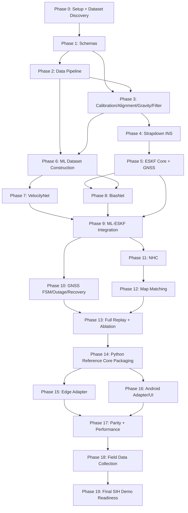

# FINAL_IMPLEMENTATION_PLAN_SIH26168.md
## Zero-to-Final Execution Roadmap — AI-ML Based Intelligent Dead Reckoning (SIH PS 26168, ISRO)

This document is the **execution companion** to `FINAL_MASTER_PLAN_SIH26168.md` (architectural authority — settled decisions, not re-litigated here) and `EndToEnd_Trace_SIH26168.md` (execution/runtime reference — used here to justify ordering and cadence, not re-explained). This document answers **how to build it, in what order, with what gates** — it does not repeat what or why.

**Phase count and rationale**: **20 phases (Phase 0 – Phase 19)**, chosen because each represents a genuinely distinct, independently-testable capability boundary in the dependency chain the Master Plan implies — not a round number. Several phases the Master Plan discusses together (e.g., VelocityNet and BiasNet) are deliberately split here because they have materially different validation gates (Section on BiasNet explains why); several others (e.g., ESKF core mechanics and the first real GNSS measurement) are deliberately combined because splitting them would create a phase with no independently-testable output.

**Gravity-Compensation & Bootstrap Architecture Resolution**: In the final live architecture, the preprocessor does **not** attempt to precompute a gravity-compensated acceleration stream before the ESKF exists. Instead, the preprocessor aligns and filters specific force into the vehicle frame, providing vehicle-frame specific force $\mathbf{f}_m^v$ directly to the ESKF. The ESKF maintains the running vehicle attitude quaternion $\mathbf{q}$ ($R_v^n$) and vehicle-frame accelerometer bias $\mathbf{b}_a^v$, rotating specific force into local navigation coordinates and adding physical gravity inside its strapdown propagation step:
$$\mathbf{g}^n = \begin{bmatrix} 0 \\ 0 \\ -g \end{bmatrix}, \quad \mathbf{a}^n = R_v^n (\mathbf{f}_m^v - \mathbf{b}_a^v) + \mathbf{g}^n$$
This completely eliminates any conceptual circularity. For Phase 3, where preprocessing math and coordinate transforms are validated in isolation *before* the full ESKF exists (Phase 5), a **standalone bootstrap attitude estimator** (gyro integration + gravity tilt correction) is implemented strictly as an offline test harness. In Phase 5, the ESKF's internal attitude state drives strapdown propagation, and the bootstrap estimator is retired from the live path, remaining solely as an offline unit-test utility.

---

## Repository Layout (established in Phase 1, referenced throughout)

```
/navigation        # Authoritative Python reference implementation and behavioral oracle for all navigation math
  /navigation/schemas       # IMUSample, GNSSSample, NavigationState, config dataclasses
  /navigation/preprocessing # calibration, alignment, filtering (and offline gravity-resolution test utility)
  /navigation/ins           # strapdown mechanization
  /navigation/eskf          # ESKF state, covariance, predict/update, measurement models
  /navigation/gnss          # quality scoring, outage/recovery FSM
  /navigation/nhc
  /navigation/mapmatch
  /navigation/core.py       # NavigationCore — Python reference entry point and behavioral oracle
/ml
  /ml/data           # dataset pipeline (parsing, sync, windowing, labels, splits)
  /ml/models         # VelocityNet, BiasNet architecture definitions
  /ml/training        # training loops, configs
  /ml/export          # ONNX/LiteRT export, parity checks
/data
  /data/raw            # (gitignored) IO-VNBD + self-collected
  /data/manifests       # dataset manifest files (versioned, small)
  /data/splits          # driver/file-level split definitions (versioned)
/edge               # Edge CLI: sensor adapters, ONNX Runtime wiring
/android            # Kotlin Android app: platform adapters, UI, LiteRT integration, and behaviorally equivalent Kotlin navigation-core port
/maps               # OSM extract prep scripts
/models             # (gitignored or Git LFS) exported model artifacts + model_config.json
/scripts            # one-off utilities (inspection, plotting, benchmarking)
/notebooks          # exploratory only — nothing production-critical lives only here
/tests
  /tests/unit
  /tests/integration
  /tests/replay
/docs               # README, architecture notes, model cards, instructions (Section: Documentation)
```

---

# Phase 0 — Project Understanding, Repository Setup, Dataset Discovery & Technical Validation

#### Objective
A repository that exists, an agent that has actually read and can restate the architecture, and a first factual (not assumed) picture of IO-VNBD.

#### Why This Phase Exists
Every later phase depends on (a) shared conventions existing and (b) the dataset's real structure being verified rather than assumed — the Master Plan already documents IO-VNBD's facts, but this phase is where the agent *confirms* those facts against the actual files, since a wrong assumption here corrupts every downstream phase silently.

#### Dependencies
None — this is the entry point.

#### Inputs
`FINAL_MASTER_PLAN_SIH26168.md`, `EndToEnd_Trace_SIH26168.md`, raw IO-VNBD files (or access to the repository at github.com/onyekpeu/IO-VNBD).

#### Detailed Tasks
1. Read both source documents fully; produce a short internal summary (can be a `/docs/agent_notes.md`, not required reading for humans) confirming understanding of: the two-model architecture, the ESKF-as-backbone decision, the canonical-10Hz-decimation rule, the three-state FSM, and the offline-first constraint.
2. Initialize the repository with the layout above (empty modules with docstrings, not implementations).
3. Set up Python environment (`pyproject.toml`/`requirements.txt`, pinned versions) and a `.gitignore` covering `/data/raw`, `/models`, virtual environments.
4. Download/locate IO-VNBD; inventory every file: filename, prefix (`S-`/`V-`), byte size, row count.
5. Parse a sample of files from each prefix; extract and record the **actual** column headers, dtypes, and row-to-row timestamp deltas (i.e., measured sample rate, not assumed).
6. Identify and open the "Synchronised V and S" vs. "Unsynchronised" folders; confirm file-naming correspondence between paired `S-`/`V-` files.
7. Locate and inspect the GPS-outage index file; confirm its format and how it references rows/timestamps in the main files.
8. Locate stationary segments (either explicitly tagged or identifiable via near-zero variance in accel/gyro over a sustained window); record at least one example.
9. Check for missing values, duplicate rows, and any rows with physically implausible values (e.g., accel magnitude far outside gravity+dynamic range) in a sample of files.
10. Draft the **dataset manifest schema** (not yet the full manifest) — one row per file: `filename, prefix, driver_id, vehicle_id, country, row_count, measured_rate_hz, has_v_pair, stationary_segments_present, outage_index_present`.
11. Document known dataset gaps explicitly in `/docs/dataset_notes.md`: no tagged tunnel scenario, 10 Hz native rate, no RTK ground truth (already known from the Master Plan — this task is about *confirming* them against the actual files, not re-deriving them).
12. Investigate (briefly, do not build) whether any additional public dataset is genuinely needed — the Master Plan already concluded no; this task is a sanity check, not a re-investigation, and should conclude quickly unless something in the actual IO-VNBD files contradicts the Master Plan's description.
13. Note licensing status as an open item (already flagged as `[OPEN QUESTION]` in the Master Plan) — do not resolve it here, just carry it forward.

#### Repository Changes
```
/README.md (stub)
/pyproject.toml or requirements.txt
/.gitignore
/navigation/**/__init__.py (empty modules, docstrings only)
/ml/**/__init__.py
/scripts/inspect_iovnbd.py
/docs/agent_notes.md
/docs/dataset_notes.md
```

#### Algorithms / Technical Implementation
No navigation math yet. `scripts/inspect_iovnbd.py` should: walk the raw data directory, parse headers, compute per-file measured sample rate as `1 / median(diff(timestamps))`, cross-check `S-`/`V-` filename pairing, and print/save a summary report — this script is the seed of the Phase 1-2 manifest tooling, not throwaway.

#### Validation
Manual review of the inspection script's output against the Master Plan's stated dataset facts (Section 10) — every discrepancy found must be written down, not silently absorbed.

#### Expected Artifacts
`docs/dataset_notes.md` (confirmed facts + any discrepancies found), a draft manifest schema, a working `inspect_iovnbd.py`.

#### Definition of Done
The agent can, without re-opening either source document, correctly state: the two model names and what each predicts; the filter choice and why; the canonical rate rule; the three FSM states and what "degraded" means. The dataset inspection script runs successfully against the actual IO-VNBD files and its output has been manually cross-checked against the Master Plan's Section 10.

#### Failure / Recovery
If measured sample rates, column names, or file-pairing conventions **disagree** with the Master Plan's description: **stop, do not proceed to Phase 1**, document the discrepancy precisely, and treat the Master Plan's affected claim as provisionally suspended until resolved (this is exactly the kind of "genuine technical inconsistency" the agent is instructed to flag, not silently work around).

#### GitHub Commit Strategy
One commit for repo scaffolding; one commit for the inspection script + its first real output; one commit for `dataset_notes.md`. Do not commit raw IO-VNBD data.

#### Next-Phase Gate
Dataset facts confirmed and documented; repository scaffolding exists; no unresolved discrepancy against the Master Plan.

---

# Phase 1 — Canonical Data Schemas & Interfaces

#### Objective
The shared vocabulary every later phase writes to and reads from — before any algorithm exists.

#### Why This Phase Exists
Building calibration, ESKF, ML pipelines, and platform adapters against ad-hoc data shapes guarantees rework; the Master Plan Section 22/28 already specifies these structures — this phase is where they become real code, once, centrally.

#### Dependencies
Phase 0.

#### Inputs
Master Plan Section 22 (interfaces) and 13/28-equivalent structures (via the End-to-End Trace document, Part 28).

#### Detailed Tasks
1. Implement `RawIMUSample`, `AlignedIMUSample`, `FeatureWindow`, `GNSSSample`, `OrientationState`, `NavigationState`, `MLPrediction`, `MapMatchResult` as typed dataclasses (Python) — fields exactly as specified in the Master Plan/Trace document, formalizing the explicit transition from device-frame raw measurements to aligned vehicle-frame features:
   - `RawIMUSample`: `timestamp_ns`, `accel` (device frame), `gyro` (device frame), `quality_flags`, `source`, `sensor_id`.
   - `AlignedIMUSample`: `timestamp_ns`, `accel_vehicle` ($f^v$), `gyro_vehicle` ($\omega^v$), `quality_flags`, `is_usable_for_integration`.
   - `FeatureWindow`: `window_end_timestamp_ns`, `samples` (20×9 matrix of vehicle-frame motion features), `is_valid`.
2. Implement the `SensorAdapter` and `GnssAdapter` interfaces as abstract base classes (no implementation yet — Phases 15/16 provide concrete adapters).
3. Implement the `model_config.json` schema (normalization means/stds, filter coefficients, window/stride params, channel order) as a dataclass + JSON (de)serializer — this artifact does not have real values yet, only a schema and a loader/writer.
4. Implement the standardized external-sensor packet schema (Master Plan Section 9/21: `seq, t_host_ns, t_sensor_ns, accel, gyro, mag?, declared_rate_hz, sensor_id`) as a dataclass, used later by the edge adapter.
5. Write unit tests asserting round-trip (de)serialization for every schema.

#### Repository Changes
```
/navigation/schemas/imu.py            # RawIMUSample, AlignedIMUSample, FeatureWindow
/navigation/schemas/gnss.py
/navigation/schemas/state.py
/navigation/schemas/ml.py
/navigation/schemas/mapmatch.py
/navigation/schemas/config.py         # model_config.json schema + loader
/navigation/adapters/base.py          # SensorAdapter, GnssAdapter ABCs
/tests/unit/test_schemas.py
```

#### Algorithms / Technical Implementation
Pure data definitions; no numerical algorithms in this phase.

#### Validation
Unit tests: instantiate each schema with representative values, serialize, deserialize, assert equality. No integration tests needed yet (nothing to integrate).

#### Expected Artifacts
A `navigation/schemas` package fully covered by unit tests; no data artifacts yet.

#### Definition of Done
Every schema used anywhere later in this plan already exists here, is tested, and is imported (never redefined) by every subsequent phase.

#### Failure / Recovery
If a later phase seems to need a field not in these schemas, **update the schema here** (single source of truth) rather than creating a parallel ad-hoc structure downstream — this is a standing rule for the rest of the project, not just this phase.

#### GitHub Commit Strategy
One commit per schema module plus its test; a final commit tagging this as the frozen v1 schema set (`git tag schemas-v1`), so later drift is visible in history.

#### Next-Phase Gate
All schemas implemented and unit-tested; no navigation logic written yet.

---

# Phase 2 — Offline Data Pipeline: Parsing, Non-Destructive Quality Tagging, Synchronization, Dataset Manifest

#### Objective
Raw IO-VNBD CSVs turned into an immutable raw archive, a quality-tagged synchronized record stream, and a manifest-indexed dataset of `RawIMUSample`/`AlignedIMUSample`/`GNSSSample` sequences per file — reproducible, cached, and versioned.

#### Why This Phase Exists
Every downstream consumer (classical-math validation in Phase 3-5, ML training in Phase 6-8) needs this once, correctly, rather than each phase re-parsing raw CSVs its own way.

#### Dependencies
Phase 0 (dataset facts confirmed), Phase 1 (schemas exist).

#### Inputs
Raw IO-VNBD files, the Phase 0 manifest schema, the Phase 1 `RawIMUSample`/`GNSSSample` schemas.

#### Detailed Tasks
1. Implement CSV parsing into `RawIMUSample`/`GNSSSample` sequences per file, using schemas from Phase 1.
2. Implement **non-destructive data quality tagging**:
   - Raw sensor records are **immutable and preserved** without modification in raw session archives.
   - Every sample is evaluated against explicit integrity rules and tagged with bitmask flags:
     * `FLAG_NAN_OR_NONFINITE (0x01)`: Sensed accel/gyro contains NaN, +Inf, or -Inf.
     * `FLAG_INVALID_TIMESTAMP (0x02)`: Non-positive or out-of-range epoch timestamp.
     * `FLAG_NON_MONOTONIC_TIMESTAMP (0x04)`: Timestamp $t_k \le t_{k-1}$ arriving out-of-order.
     * `FLAG_DUPLICATE_TIMESTAMP (0x08)`: Repeated timestamp for identical sensor ID.
     * `FLAG_EXTREME_MOTION (0x10)`: Acceleration magnitude $\|\mathbf{f}\| > 4g$ ($>39.24 \text{ m/s}^2$) or angular rate $\|\boldsymbol{\omega}\| > 10 \text{ rad/s}$. **Important**: Extreme motion is NOT corruption; it represents real physical dynamics (potholes, speed bumps, emergency stops, curb impacts). These samples are tagged so the estimator and innovation gates can adjust measurement variances, but they are NEVER dropped from raw data.
     * `FLAG_SENSOR_DROPOUT (0x20)`: Sampling gap $\Delta t > 3 \cdot \Delta t_{\text{nominal}}$.
   - Create a downstream **validated stream** for filter integration where only genuinely non-computable records (`FLAG_NAN_OR_NONFINITE`, `FLAG_NON_MONOTONIC_TIMESTAMP`) are omitted. All flags remain permanently accessible for diagnostics.
3. Implement `S-`/`V-` synchronization for the "Synchronised" folder pairs: align on shared timestamps (linear interpolation per Master Plan Section 12/13), producing one combined per-file record.
4. Integrate the GPS-outage index: tag each `GNSSSample`/time-range as `real_outage=True/False`.
5. Integrate stationary-segment detection: tag time ranges as `stationary=True/False` (from Phase 0's discovered examples, generalized into a reusable detector — e.g., sustained low accel/gyro variance).
6. Build the full **dataset manifest**: one row per file with the Phase 0 schema fields plus `cleaned_path`, `has_stationary_segment`, `outage_windows: [...]`.
7. Cache cleaned/synchronized per-file outputs to `/data/manifests` (small, versioned) referencing cached array data (e.g., `.npz`/parquet, gitignored raw arrays, but the manifest itself is small and versioned).
8. Write data-quality tests: row counts before/after quality tagging per file, % non-computable rows omitted from validated stream, sanity distribution checks (e.g., accel magnitude histogram centered near 9.81 m/s² at rest).

#### Repository Changes
```
/data/pipeline/parse.py
/data/pipeline/quality_tagger.py        # non-destructive bitmask tagging
/data/pipeline/sync.py
/data/pipeline/outage_index.py
/data/pipeline/stationary_detect.py
/data/pipeline/manifest.py
/data/manifests/iovnbd_manifest_v1.csv   # versioned, small
/tests/unit/test_pipeline_quality.py
/tests/integration/test_pipeline_full_file.py
```

#### Algorithms / Technical Implementation
Non-destructive quality tagging rule: Raw IMU data is immutable. Evaluated records receive quality bitflags. Truly corrupt/non-computable rows (NaN or non-monotonic timestamps) are omitted only from the downstream validated stream; samples with $\|\mathbf{f}\| > 4g$ or $\|\boldsymbol{\omega}\| > 10 \text{ rad/s}$ are flagged as `FLAG_EXTREME_MOTION` but preserved so estimators and innovation gates can adjust measurement variances rather than silently losing physical dynamic spikes. Stationary detection: rolling-window variance of $\|\mathbf{f}\|$ and $\|\boldsymbol{\omega}\|$ below threshold for $\ge N$ seconds (threshold/$N$ tuned against Phase 0's known example).

#### Validation
Integration test: run the full pipeline on one real `S-`/`V-` pair, assert the output row count is within an expected range of the raw count, assert at least one stationary segment and (if present) at least one outage window is correctly tagged.

#### Expected Artifacts
`data/manifests/iovnbd_manifest_v1.csv`; cached cleaned/synchronized per-file arrays; a data-quality report (`docs/data_quality_report.md` or notebook output) summarizing drop rates and distribution sanity checks across the full dataset.

#### Definition of Done
The full IO-VNBD dataset has been run through the pipeline once; the manifest exists and is versioned; data-quality report shows no systematic anomaly (e.g., no file with >X% dropped rows without a documented reason).

#### Failure / Recovery
If synchronization between `S-`/`V-` files produces implausible offsets (e.g., consistent multi-second misalignment), **stop before Phase 3** — this is a timestamp-convention issue that would corrupt every later phase's ground truth.

#### GitHub Commit Strategy
Commits per pipeline stage (parse, clean, sync, outage, stationary, manifest-assembly); one commit for the generated manifest file itself, tagged (`git tag manifest-v1`) once the full-dataset run is validated.

#### Next-Phase Gate
Manifest complete and quality-checked; cleaned/synchronized data cached and accessible by file ID.

---

# Phase 3 — Classical Preprocessing: Calibration, Alignment, Filtering (Offline Gravity-Resolution Test)

#### Objective
Pure, unit-testable functions turning a raw (calibrated-device-frame) IMU stream into an aligned, filtered vehicle-frame stream — providing calibrated vehicle-frame specific force $\mathbf{f}_m^v$ and angular velocity $\boldsymbol{\omega}_m^v$ for ESKF strapdown propagation (where physical gravity is added internally via ESKF vehicle attitude $R_v^n$) and ML feature construction.

#### Why This Phase Exists
This is the foundational transform chain (Master Plan Section 3/14/Trace Parts 7-10) that everything else depends on; getting it wrong here silently corrupts every later number. It's built and validated in isolation, against both synthetic and real (Phase 2) data, before strapdown/ESKF exist.

#### Dependencies
Phase 1 (schemas), Phase 2 (cleaned data + stationary segments to calibrate against).

#### Inputs
Cleaned `IMUSample` sequences (Phase 2), stationary-segment tags, `[FLAGGED CORRECTION]` a bootstrap attitude estimator (built in this phase, see below).

#### Detailed Tasks
1. Implement initial calibration & orientation: given a stationary sample window at rest, compute `b_g = mean(gyro)` (true angular rate is ≈0 at rest). Initialize roll and pitch from the direction of measured specific force $\mathbf{f}_m^b$ (using initial nominal prior $\mathbf{b}_a \approx \mathbf{0}$). Document that one arbitrary rest pose cannot independently separate accelerometer bias from tilt; multi-pose tumbling is omitted for v1, and $\mathbf{b}_a$ is refined dynamically by the ESKF during motion. If a previous-session calibration profile is loaded, treat it strictly as an optional initial prior with appropriate uncertainty, not an authoritative full bias replacement.
2. Implement the **bootstrap attitude estimator** (temporary offline unit-test utility only): a simple complementary-filter-style quaternion estimator (gyro integration + gravity-vector tilt correction), used *only* to validate coordinate rotation and gravity-resolution math in this phase and in unit tests before the ESKF exists — explicitly marked as an offline test utility, not a live dependency.
3. Implement device→vehicle alignment: pitch/roll from the gravity vector at rest; yaw from comparing gyro-integrated heading drift against GPS track heading while moving above a minimum speed threshold (using Phase 2's synchronized GNSS data). Vehicle-frame specific force and angular rate are formed as $\mathbf{f}^v = R_b^v (\mathbf{f}^b - \mathbf{b}_{a,\text{prior}})$ and $\boldsymbol{\omega}^v = R_b^v (\boldsymbol{\omega}^b - \mathbf{b}_g)$.
4. Implement offline gravity resolution unit test: using unified ENU standard `g^n = [0, 0, -g]ᵀ` (g ≈ 9.80665 m/s²), `a^n = R_v^n · (f_m^v − b_a^v) + g^n` (driven in Phase 3 offline tests by bootstrap attitude $R_v^n$). Verify stationary-phone test: at rest facing up ($R_v^n = \mathbf{I}, \mathbf{b}_a^v = \mathbf{0}$), $\mathbf{f}_m^v = [0, 0, +g]^T$, yielding $\mathbf{a}^n = [0, 0, 0]^T$ (identically zero drift). Note: In the live runtime, preprocessed vehicle-frame specific force $\mathbf{f}_m^v$ is passed directly to the ESKF strapdown mechanization, which performs this coordinate rotation internally using ESKF vehicle attitude $R_v^n$.
5. Implement the fixed filter chain: median spike filter (window 3-5 samples) → 4th-order Butterworth low-pass (cutoff configurable, starting point per Master Plan Section 14).
6. Implement the re-calibration trigger detector: flag an orientation discontinuity inconsistent with plausible vehicle dynamics (a threshold-based check, tuned against real data, not assumed).
7. Write unit tests against **synthetic known scenarios**: perfectly stationary sensor (zero coordinate acceleration verification), constant known rotation (alignment recovery), a synthetically rotated accelerometer signal (confirm gravity compensation correctly isolates a known injected "true acceleration").
8. Write integration tests against **real** Phase 2 data: run calibration+alignment+filtering+gravity-resolution on one real stationary segment and one real driving segment; visually/statistically sanity-check the output (e.g., gravity-resolved vertical acceleration should hover near zero on a flat-road segment).

#### Repository Changes
```
/navigation/preprocessing/calibration.py
/navigation/preprocessing/bootstrap_attitude.py    # temporary offline test utility, documented as such
/navigation/preprocessing/alignment.py
/navigation/preprocessing/gravity.py
/navigation/preprocessing/filtering.py
/navigation/preprocessing/recalibration_trigger.py
/tests/unit/test_calibration.py
/tests/unit/test_alignment.py
/tests/unit/test_gravity_compensation.py
/tests/unit/test_filtering.py
/tests/integration/test_preprocessing_on_real_data.py
```

#### Algorithms / Technical Implementation
```
b_g = mean(gyro[stationary_window])
q_init = pitch_roll_from_accel(f_m^b[stationary_window], prior_b_a=zeros)
b_a_prior = zeros(3)                                               # dynamic refinement performed by ESKF during motion
R_b^v = R_pitch_roll(gravity_vector) · R_yaw(gps_heading_vs_sensed_heading)
f_m^v = R_b^v · (f_m^b - b_a_prior)
g^n = [0, 0, -g]ᵀ                                                  # ENU physical gravity
a^n = R_v^n · (f_m^v − b_a^v) + g^n                                # Phase 3 unit test uses bootstrap R_v^n; Phase 5 uses ESKF internal attitude
```
Filter: standard IIR Butterworth design (`scipy.signal.butter` + `filtfilt` offline; fixed-coefficient causal IIR for the eventual live/Kotlin port, not built yet).

#### Validation
Unit tests (synthetic, exact-answer-known) + integration tests (real data, statistical sanity, not exact-answer). Both required — synthetic tests catch implementation bugs, real-data tests catch scenarios the synthetic tests didn't anticipate.

#### Expected Artifacts
A validated, documented preprocessing module; a short report showing before/after filtering plots on one real segment; calibration profile format finalized (feeds `model_config.json`-adjacent per-session storage).

#### Definition of Done
All unit tests pass with exact/near-exact expected values on synthetic data; integration test on real data shows physically sane output (near-zero vertical acceleration on flat-road stationary/cruise segments, correctly reduced high-frequency energy after filtering).

#### Failure / Recovery
If gravity compensation on real data does not converge to near-zero vertical acceleration during a known stationary segment, **stop before Phase 4** — this indicates a frame-convention or sign error that must not propagate into strapdown integration.

#### GitHub Commit Strategy
One commit per module + its tests; a final commit explicitly noting "bootstrap attitude estimator — temporary, see Phase 5" in the commit message, so its planned removal is traceable.

#### Next-Phase Gate
Preprocessing chain validated on both synthetic and real data; bootstrap attitude estimator functioning and clearly marked temporary.

---

# Phase 4 — Attitude Representation & Strapdown INS Propagation

#### Objective
A deterministic, testable strapdown mechanization producing position/velocity/attitude from the Phase 3 preprocessed stream — and, critically, a **measured** (not assumed) baseline drift number reproducing Ablation Stage 1.

#### Why This Phase Exists
This is the classical dead-reckoning core the ESKF (Phase 5) wraps; it must be correct and its failure mode (drift) must be *quantified* on real data before any correction mechanism is layered on top, so later improvements can be measured against a real baseline, not an assumed one.

#### Dependencies
Phase 3.

#### Inputs
Phase 3's preprocessed stream (using the bootstrap attitude estimator, per the flagged correction).

#### Detailed Tasks
1. Implement quaternion representation and propagation: `q[k+1] = q[k] ⊗ Δq(ω_v[k]·Δt)`.
2. Implement velocity/position propagation in the **local ENU Cartesian frame** (Master Plan Section 13/21 — never lat/lon directly): `v[k+1] = v[k] + a_true[k]·Δt`, `p[k+1] = p[k] + v[k]·Δt + ½a_true[k]·Δt²`.
3. Implement the local-frame ↔ lat/lon conversion utility (equirectangular approximation about a **single session-level reference origin** initialized at the first trusted 3D fix; no mid-session resets to preserve continuity).
4. Run the full open-loop propagation (no correction at all) on a real IO-VNBD driving segment with known GPS ground truth; **measure** the resulting drift over time — this is the literal Ablation Stage 1 number.
5. Cross-check the measured drift order-of-magnitude against the Master Plan's worked illustrative example (Section 3: ~36 m over 60 s from a 0.02 m/s² bias) — expect the real number to be in a broadly similar range; a wildly different order of magnitude (not just a different value) is itself a signal worth investigating before proceeding.
6. Write unit tests: constant acceleration for a known duration → exact expected velocity/position (closed-form check); constant angular velocity for a known duration → exact expected final orientation; a 90°-known-rotation scenario → confirm quaternion composition behaves as expected.

#### Repository Changes
```
/navigation/ins/attitude.py       # quaternion propagation
/navigation/ins/propagation.py    # velocity/position propagation
/navigation/frames/local_geo.py   # ENU <-> lat/lon conversion (single session-level origin)
/tests/unit/test_ins_propagation.py
/tests/unit/test_frame_conversion.py
/scripts/run_ablation_stage1.py
/docs/ablation_stage1_report.md
```

#### Algorithms / Technical Implementation
As specified in Master Plan Section 15, unmodified. Frame conversion (using fixed session reference origin `lat_ref, lon_ref, alt_ref`):
```
Δlat ≈ y / R_earth ;  Δlon ≈ x / (R_earth · cos(lat_ref))     (R_earth ≈ 6,371,000 m)
```

#### Validation
Unit tests: closed-form-known-answer scenarios (constant accel, constant rotation). Integration/replay test: real IO-VNBD segment, drift measured and reported, no assumed pass/fail threshold at this stage (this is a diagnostic baseline, not a target to hit yet).

#### Expected Artifacts
`docs/ablation_stage1_report.md` with a real, measured drift-vs-time plot and number — **the first real evidence artifact in the whole project**, everything after this is measured *relative to* this number.

#### Definition of Done
Unit tests pass exactly; the ablation-stage-1 script runs on real data and produces a documented, plausible (order-of-magnitude-sane) drift measurement.

#### Failure / Recovery
If the measured drift is *nonsensically small* (near-zero, suspicious for uncorrected open-loop integration) or *diverges non-physically* (e.g., runaway exponential rather than roughly quadratic growth), suspect a sign error or a frame bug in Phase 3/4 — stop and debug before Phase 5, since the ESKF cannot fix a propagation bug, only mask it.

#### GitHub Commit Strategy
Commit per module; a distinctly-tagged commit for the ablation-stage-1 report (`git tag ablation-stage1`), since this is a reference artifact later phases will compare against repeatedly.

#### Next-Phase Gate
Strapdown propagation validated on synthetic scenarios; real-data baseline drift measured and documented.

---

# Phase 5 — ESKF Core Mechanics + First Real Measurement Source (GNSS)

#### Objective
A working, generically-testable Error-State Kalman Filter, proven first on synthetic scenarios, then wired to real GNSS as its first true measurement source on real IO-VNBD data — and the bootstrap attitude estimator retired.

#### Why This Phase Exists
This is the single most important classical component (Master Plan Section 16); it must work correctly and generically (any measurement source pluggable via the same `H`/`R` mechanism) before VelocityNet/BiasNet exist, so their later integration (Phase 9) is "plug in a new measurement source" rather than "build the filter and the integration simultaneously."

#### Dependencies
Phase 4 (propagation), Phase 2 (real GNSS data).

#### Inputs
Phase 4's propagation module, Phase 2's cleaned/synchronized GNSS samples.

#### Detailed Tasks
1. Implement the ESKF state: 16-element nominal state `x = [position(3), velocity(3), attitude-quaternion(4), accel_bias(3), gyro_bias(3)]` (`||q|| = 1`), 15-element error state `δx = [δp(3), δv(3), δθ(3), δb_a(3), δb_g(3)]` (`δθ ∈ so(3)`), and strictly **15×15 error-state covariance `P`**.
2. Implement the generic predict step: nominal-state propagation (reuses Phase 4), `P ← F·P·Fᵀ + Q` in 15 dimensions.
3. Implement the generic update step: `y = z − h(x)`, `K = P·Hᵀ·(H·P·Hᵀ+R)⁻¹`, state/covariance correction — implemented as a **generic function taking `(z, H, R)`**, not hardcoded per measurement type, so Phase 6+9-11 can each plug in their own `(z,H,R)` without modifying this code.
4. Implement the innovation/consistency gate (chi-squared/Mahalanobis-style rejection of implausible updates) as part of the generic update path.
5. Implement the GNSS measurement model specifically: `z_gnss`, `h(x)` = predicted position/velocity, `R` from reported accuracy.
6. Implement **Classical Gated ZUPT (Zero Velocity Update)**:
   - Zero-ML detector: standstill confirmed when vehicle-frame gyro norm `||ω^v|| < 0.05 rad/s`, `|||f_m^v|| - g| < 0.25 m/s²`, and `Var(||f_m^v||) < 0.015 (m/s²)²` over an 8-sample (0.8 s) window, with optional GNSS Doppler speed check (`< 0.1 m/s`). Zero ML dependency.
   - Measurement update: `z_zupt = [0, 0, 0]ᵀ`, `H_zupt = [0₃×₃, I₃×₃, 0₃×₃, 0₃×₃, 0₃×₃]`, `R_zupt = σ_z² · I₃×₃` (`σ_z = 0.03 m/s`).
7. **Retire the bootstrap attitude estimator from live runtime**: in the final live pipeline, preprocessed vehicle specific force `f_m^v` is passed directly to the ESKF strapdown mechanization. Inside the ESKF, strapdown propagation rotates vehicle-frame specific force into navigation coordinates using its running vehicle attitude quaternion `q` (`R_v^n`), subtracts vehicle-frame accelerometer bias `b_a^v`, and adds physical gravity: `a^n = R_v^n · (f_m^v − b_a^v) + g^n` (`g^n = [0,0,-g]ᵀ`). This completely eliminates any circular dependency or pre-ESKF gravity stripping. Confirm via test and code inspection that the Phase 3 bootstrap attitude estimator remains solely as an offline unit-test harness and is not referenced in the live execution path.
8. Run the full ESKF (propagation + GNSS updates + gated ZUPT, no ML/NHC/map matching yet) on a real IO-VNBD driving segment with continuous GNSS available; compare drift/RMSE against Phase 4's open-loop baseline — expect a substantial improvement, since GNSS correction alone should already outperform uncorrected propagation.
9. Write unit tests against synthetic scenarios: a known simulated trajectory with synthetic noisy GNSS fixes injected at known intervals — confirm the filter converges toward the true trajectory, that error-state covariance `P` remains symmetric and positive-semidefinite, and that uncertainty reduces along observed measurement directions after each update. Test gated ZUPT on synthetic standstill segments to verify zero velocity drift.

#### Repository Changes
```
/navigation/eskf/state.py            # 16 nominal state, 15 error state, 15x15 covariance P
/navigation/eskf/predict.py
/navigation/eskf/update.py           # generic (z, H, R) update
/navigation/eskf/gating.py           # innovation/consistency check
/navigation/eskf/measurements/gnss.py
/navigation/eskf/measurements/zupt.py # classical gated ZUPT (zero ML dependency)
/tests/unit/test_eskf_synthetic.py
/tests/unit/test_zupt.py
/tests/integration/test_eskf_gnss_real_data.py
/docs/eskf_gnss_baseline_report.md
```

#### Algorithms / Technical Implementation
Exactly the ESKF equations in Master Plan Section 16 — reproduced here only as an implementation checklist, not re-derived.

#### Validation
Synthetic: filter recovers a known trajectory from noisy synthetic GNSS within an expected tolerance, covariance `P` remains symmetric and positive-semidefinite, uncertainty reduces along observed directions upon measurement updates, and synthetic trajectories converge as expected. Real data: GNSS-aided drift/RMSE measurably better than Phase 4's open-loop baseline.

#### Expected Artifacts
`docs/eskf_gnss_baseline_report.md` — the second real evidence artifact, and the direct precursor to the Master Plan's ablation stages (this is conceptually "Stage 0.5," proving the filter mechanism itself works, before VelocityNet is Stage 3).

#### Definition of Done
Synthetic tests pass; real-data GNSS-aided result clearly improves on Phase 4's baseline; bootstrap attitude estimator confirmed removed from the live runtime pipeline (code review / grep check, not just a claim).

#### Failure / Recovery
If GNSS-aided fusion does **not** improve on the open-loop baseline, or if covariance `P` violates positive-semidefiniteness or fails to reduce uncertainty along observed measurement directions in synthetic tests, stop — a filter bug here will silently corrupt every later measurement-source integration (VelocityNet, BiasNet, NHC all reuse this exact update mechanism).

#### GitHub Commit Strategy
Commits per sub-module; a tagged commit (`git tag eskf-gnss-v1`) once the real-data baseline is validated, since this is the filter's first proof of correctness on real data.

#### Next-Phase Gate
Generic ESKF update mechanism proven correct on synthetic and real data via GNSS; bootstrap attitude estimator retired.

---

# Phase 6 — ML Dataset Construction: Windowing, Feature Tensors, Normalization, Labels

#### Objective
Shared, reusable infrastructure producing `(20,9)` normalized tensors and their associated labels for **both** VelocityNet and BiasNet, from Phase 2/3's cleaned, preprocessed data.

#### Why This Phase Exists
Both models consume an identical tensor construction pipeline (Master Plan Section 8) — building it once, generically, avoids the two models silently drifting apart on preprocessing details, which would be exactly the kind of train/serve or model-to-model inconsistency the project has already had to catch once (Section 30 of the Master Plan).

#### Dependencies
Phase 2 (cleaned/synced data), Phase 3 (calibration/alignment/filtering — providing calibrated, filtered vehicle-frame specific force $\mathbf{f}^v$ and angular velocity $\boldsymbol{\omega}^v$; ML consumes aligned vehicle-frame motion features without gravity removal, which is resolved inside the ESKF strapdown mechanization).

#### Inputs
Phase 2 manifest + cached cleaned data, Phase 3 preprocessing functions.

#### Detailed Tasks
1. Implement resampling/decimation to canonical 10 Hz (no-op for native-10Hz IO-VNBD; implemented generically so it's exercised for real once self-collected/edge data exists — write a synthetic higher-rate test case now rather than waiting).
2. Implement vehicle-frame feature computation across the frozen **9 channels**:
   - 6 kinematic channels: $[f_x^v, f_y^v, f_z^v, \omega_x^v, \omega_y^v, \omega_z^v]$ (aligned vehicle-frame specific force and angular velocity).
   - 3 derived physical channels: $[\|\mathbf{f}^v\|, \|\dot{\mathbf{f}}^v\|, \|\boldsymbol{\omega}^v\|]$ (specific force magnitude, specific force rate-of-change / jerk, angular rate magnitude).
3. Implement time-based windowing: 2.0 s window (20 samples at 10 Hz), 0.5 s stride, **strictly causal** (no sample beyond the window's final timestamp).
4. Implement normalization: compute per-channel mean/std **on the training split only** (this requires the split to already be defined — implement the driver/file-level split as part of this phase, not deferred).
5. Implement the driver/file-level train/validation/test split (Master Plan Section 11) — explicit, versioned split definition file, at least one entirely held-out driver in test.
6. Implement a leakage-audit test: assert no window from a file in `train` shares source data with any window in `val`/`test`.
7. Implement VelocityNet's label pipeline: extract GPS/wheel-speed at each window's end timestamp (causally consistent with real-time inference), apply short median smoothing to the label signal before assignment.
8. Implement BiasNet's label pipeline **as a distinct module** (its real implementation belongs to Phase 8, since it needs the ESKF — but its *data plumbing*, i.e., "which windows are excluded due to overlapping a real GPS outage," belongs here, shared infrastructure).
9. Serialize final tensors + labels + split assignment to a cached, versioned format (e.g., per-split `.npz`/parquet), referenced by a small manifest.

#### Repository Changes
```
/ml/data/resample.py
/ml/data/features.py
/ml/data/windowing.py
/ml/data/normalization.py
/ml/data/split.py
/data/splits/split_v1.json
/ml/data/velocitynet_labels.py
/ml/data/exclusion_rules.py           # real-outage-overlap exclusion, shared
/tests/unit/test_windowing_causality.py
/tests/unit/test_leakage_audit.py
/tests/unit/test_normalization_train_only.py
```

#### Algorithms / Technical Implementation
Exactly the windowing/normalization/labeling rules in Master Plan Section 8/11 and Phase 1 schemas (already settled — this phase implements, not redesigns).

#### Validation
Leakage-audit test is **mandatory and must fail loudly** if violated — this is the single most important test in this phase, since a passing model evaluation built on leaked splits would be a false positive the team might not otherwise catch until real-world testing.

#### Expected Artifacts
`data/splits/split_v1.json`; cached windowed tensors per split; a leakage-audit report confirming zero violations.

#### Definition of Done
Windowing/normalization/labeling run end-to-end on the full IO-VNBD dataset; leakage audit passes; split file versioned and reviewed (at least one driver fully held out, confirmed by inspection, not just by code logic).

#### Failure / Recovery
If the leakage audit fails, **stop — do not train any model until fixed.** A model trained on a leaking split will look good and be wrong, which is worse than a model that visibly fails.

#### GitHub Commit Strategy
Commits per module; a tagged commit (`git tag ml-dataset-v1`) once the full pipeline runs clean and the leakage audit passes on the complete dataset.

#### Next-Phase Gate
Cached, leakage-audited, versioned tensors+labels+split exist for VelocityNet training; BiasNet's exclusion-rule plumbing exists (real label logic deferred to Phase 8).

---

# Phase 7 — VelocityNet: Training, Validation, Export, Acceptance Gate

#### Objective
A trained, exported, and accepted VelocityNet model evaluated strictly standalone on frozen datasets, establishing an empirical pseudo-velocity measurement candidate — without yet integrating into the ESKF.

#### Why This Phase Exists
VelocityNet learns forward vehicle velocity from IMU kinematics. In Phase 7, it is treated strictly as an isolated ML subsystem to prove generalization, causal temporal behavior, and deployment export parity before introducing closed-loop filter integration risk in Phase 9.

#### Dependencies
Phase 6 (canonical `(B, 20, 9)` dataset, train-only normalization, driver/file split).

#### Inputs
Phase 6's cached windowed tensors and targets (`train.npz` Driver E: 226,928 windows; `validation.npz` Driver B: 21,080 windows; `test.npz` Driver A: 123,464 windows).

#### Detailed Tasks
1. Train candidate architectures on full Driver E training data ($N = 226,928$ windows) using identical budgets (Adam, initial lr $10^{-3}$ with `CosineAnnealingLR` to $10^{-6}$, $T_{\max}=15$, batch size 256, weight decay $10^{-5}$, gradient clipping 5.0, seed 42):
   - Candidate A: 2-layer GRU (64 hidden, 32 dense, dual head, 41,506 params).
   - Candidate B: Lightweight 1D-CNN (48, 64, 64 channels, global pooling, 32 dense, dual head, 25,474 params).
   - Candidate C: Conv1D-GRU Hybrid (32 conv, 48 GRU hidden, 32 dense, dual head, 14,402 params).
2. **Two-Stage Selection Procedure**:
   - Stage 1 (Checkpointing): Within each candidate training run, the best model checkpoint was selected by minimum Driver B validation Gaussian NLL.
   - Stage 2 (Architecture Selection): After each candidate was restored to its best-NLL checkpoint, candidate architecture selection was performed using an explicit, deterministic hierarchical policy on Driver B validation (primary: lowest `val_rmse`; secondary: lowest `val_mae`; tertiary: lowest `val_nll`; quaternary: lowest `high_speed_rmse`; tie-breakers: `latency_p50_ms`, then `params`).
   - The deterministic hierarchical policy was formalized during the final selection audit and verified against complete Driver B results without using Driver A.
3. Candidate B (Lightweight 1D-CNN, 25,474 params) won validation selection: Val RMSE $4.433\text{ m/s}$ (vs $4.600\text{ m/s}$ for C and $5.060\text{ m/s}$ for A), Val MAE $3.387\text{ m/s}$, competitive NLL $2.918$, best bias $+0.282\text{ m/s}$, correlation $0.7110$, and CPU latency $0.26\text{ ms}$ P50. Candidate C achieved lowest NLL ($2.874$) but not lowest RMSE. Candidate A (2L-GRU) is preserved intact as the historical v1.0 baseline.
4. **Causal Downstream Smoothing (EMA)**: Evaluate causal Exponential Moving Average filtering strictly along contiguous physical trips with state resets at trip boundaries. Parameter $\alpha = 0.2$ selected on Driver B validation (Val RMSE drops to $3.510\text{ m/s}$) and frozen prior to test evaluation.
5. **Single-Pass Held-Out Test Evaluation on Driver A ($N = 123,464$)**:
   - VelocityNet v1.1 Raw: Test RMSE $7.070\text{ m/s}$ (vs v1 baseline $7.320\text{ m/s}$).
   - VelocityNet v1.1 + Causal EMA ($\alpha=0.2$): Test RMSE $6.484\text{ m/s}$ ($23.34\text{ km/h}$), MAE $4.891\text{ m/s}$, Pearson $r = 0.4659$ ($11.4\%$ error reduction vs v1 baseline; $30.3\%$ error reduction vs operational static mean baseline $9.305\text{ m/s}$).
   - Lag-1 Doppler Oracle ($0.401\text{ m/s}$): Explicitly classified as a non-causal diagnostic reference (requires preceding GNSS Doppler ground truth; inoperable during outages; NOT beaten).
6. **Scenario Analysis in Physical Units**: Evaluated scenario masks strictly in physical units ($|\omega_z| \le 0.05\text{ rad/s}$ for straight driving; $|\|\mathbf{f}\| - 9.81| > 1.5\text{ m/s}^2$ for Dynamic Specific-Force Deviation Proxy).
7. **Uncertainty Diagnostics & Limitations**: Coverage degrades on unseen Driver A ($87.6\%$ at $2\sigma$ vs $97.7\%$ on Driver B). Phase 9 must empirically calibrate or conservatively adjust the neural measurement covariance before fusion.
8. **Export & Numerical Parity**: Export PyTorch model to ONNX (`opset 17`) and LiteRT (`.tflite`) with fixed single-window shape $[1, 20, 9]$. Verify numerical parity across 500 real held-out Driver A test windows ($\le 10^{-4}$ ONNX, $\le 10^{-3}$ LiteRT).
9. **Zero ESKF Modification**: Standalone Phase 7 does not integrate with or modify the ESKF; filter integration is deferred to Phase 9.

#### Repository Changes
```
/ml/models/velocitynet.py
/ml/models/baselines/cnn1d_velocity.py
/ml/experiments/final_model_selection.py
/ml/export/export_velocitynet.py
/models/velocitynet_v1_best.pt               # historical baseline
/models/velocitynet_v1_1_best.pt             # selected 1D-CNN candidate
/models/velocitynet_v1_1.onnx
/models/velocitynet_v1_1.tflite
/models/velocitynet_model_selection.json     # selection provenance
/models/model_config_velocitynet_v1_1.json   # deployment config
/models/velocitynet_v1_1_evaluation.json     # Driver A evaluation
/models/velocitynet_v1_1_export_parity.json  # 500-window parity record
/docs/model_cards/velocitynet.md
/docs/velocitynet_eval_report.md
/tests/unit/test_velocitynet_scenarios.py
/tests/unit/test_velocitynet_model_selection.py
/tests/integration/test_velocitynet_export_parity.py
```

#### Expected Artifacts
Frozen checkpoints (`v1_best.pt`, `v1_1_best.pt`), exported ONNX and LiteRT models, model configs, model selection provenance record, 500-window export parity report, model card, and evaluation report.

#### Definition of Done — Acceptance Gate Status
**CLASSIFICATION**: **B. MODEL IMPROVED BUT REQUIRES FURTHER RESEARCH (Validated as Materially Improved Candidate for Phase 9 ESKF Fusion; v1 GRU Preserved as Historical Baseline)**.
VelocityNet v1.1 is accepted as an experimental pseudo-velocity candidate for Phase 9 integration evaluation, with documented standalone generalization limitations.

---

# Phase 8 — BiasNet: Label Generation, Training, Validation, Export, Acceptance Gate

#### Objective
Build and evaluate **BiasNet** as a cautious learned IMU-bias correction source, starting from inverse-problem pseudo-ground-truth label generation, rigorous identifiability gating, direct label-space evaluation, indirect ESKF navigation validation on synthetic outages, and an explicit decoupled standalone fallback to `Classical ESKF + GNSS + Gated ZUPT + VelocityNet v1.1` if BiasNet does not demonstrate clear value.

#### Why This Phase Exists
BiasNet targets are **computed via an inverse optimization problem, not directly observed**. Because IMU bias corrections are not guaranteed to be identifiable over short horizons from arbitrary motion windows, the label generation and identifiability must be audited and proven stable before model training. Furthermore, the core navigation pipeline must not depend on BiasNet: if BiasNet fails or destabilizes the filter, it is disabled (`biasnet_enabled: false`), and the decoupled classical + VelocityNet architecture continues seamlessly.

#### Dependencies
Phase 5 (ESKF strapdown mechanization and update machinery), Phase 6 (canonical windowing infrastructure), Phase 7 (VelocityNet v1.1 accepted).  
**CRITICAL**: Phase 8 **MUST NOT** require Non-Holonomic Constraints (NHC) or Map Matching. NHC belongs to Phase 11; Map Matching belongs to Phase 12.

#### Inputs
Phase 4/5 strapdown mechanization, Phase 2 synchronized reference trajectories (`V-` high-precision VBOX ground truth), Phase 6 windowing and driver/file splits (`train`: Driver E, `validation`: Driver B, `test`: Driver A).

#### Detailed Tasks
1. **Inverse-Problem Label Generation (`ml/data/biasnet_labels.py`)**:
   - For each eligible window, infer a short-horizon bias correction $\Delta \mathbf{b} = [\Delta \mathbf{b}_a^T, \Delta \mathbf{b}_g^T]^T \in \mathbb{R}^6$ by propagating the strapdown mechanization from the window start state and minimizing a weighted residual against independent VBOX ground truth over the horizon:
     $$r(\Delta \mathbf{b}) = \begin{bmatrix} W_p (\mathbf{p}_{\text{prop}} - \mathbf{p}_{\text{ref}}) \\ W_v (\mathbf{v}_{\text{prop}} - \mathbf{v}_{\text{ref}}) \\ W_\theta \delta \boldsymbol{\theta}(\mathbf{q}_{\text{prop}}, \mathbf{q}_{\text{ref}}) \end{bmatrix}$$
   - Residual scaling is explicitly documented so position errors ($W_p$) do not numerically overpower velocity ($W_v$) or orientation ($W_\theta$) errors.
   - Orientation residuals respect the project's quaternion conventions and rotation utilities.
   - Solve via linearized Gauss-Newton / damped least-squares with multi-criteria convergence stopping criteria (step norm $< 10^{-4}$, relative residual improvement $< 10^{-4}$, gradient infinity norm $< 10^{-3}$). Rejects non-converged windows with reason code `SOLVER_FAILURE`.
   - Three-tier bound taxonomy:
     1. Solver Safeguard Bounds ($|\Delta \mathbf{b}_a| \le 5.0\text{ m/s}^2, |\Delta \mathbf{b}_g| \le 0.5\text{ rad/s}$): In-loop optimization boundaries preventing divergence.
     2. Post-Solve Physical Eligibility Bounds ($|\Delta \mathbf{b}_a| \le 2.0\text{ m/s}^2, |\Delta \mathbf{b}_g| \le 0.15\text{ rad/s}$): Post-convergence physical plausibility filter.
     3. Neural Output In-Graph Clamps ($[-2.0, 2.0]\text{ m/s}^2, [-0.15, 0.15]\text{ rad/s}$): In-graph bounding of neural inferences.
   - Evaluate horizon length (0.5 s, 1.0 s, 2.0 s) on a methodology audit; $H = 1.0\text{ s}$ selected based on conditioning ($\kappa \approx 10.5$), full rank 6, high convergence, and causal stability.
2. **Label Identifiability & Conditioning Gate**:
   - Compute Jacobian singular values, condition number $\kappa(J)$, and residual reduction ratio $\|r_{\text{before}}\| / \|r_{\text{after}}\|$.
   - Enforce deterministic reason-code precedence: `NON_FINITE_INPUT` $\to$ `TIMESTEP_ANOMALY` $\to$ `WINDOW_TOO_SHORT` $\to$ `HORIZON_TOO_SHORT` $\to$ `NON_FINITE_SOLUTION` $\to$ `SOLVER_FAILURE` $\to$ `DEFICIENT_RANK` $\to$ `ILL_CONDITIONED` $\to$ `BOUNDS_ACTIVE` $\to$ `POOR_RESIDUAL_REDUCTION` $\to$ `VALID`.
3. **Label Stability Report (`docs/biasnet_label_stability_report.md`)**:
   - Document candidate window count, rejection statistics, component distributions ($\Delta b_a$, $\Delta b_g$), temporal smoothness, truthful autocorrelation ($r \approx 0.55-0.75$ accel, $0.25-0.45$ gyro), and physical plausibility.
   - **Mandatory Decision Gate**: Must decide whether labels are sufficiently stable to proceed to training (PASS / CONDITIONAL) or too unstable (FAIL $\to$ trigger decoupled fallback).
4. **Model Architecture (`ml/models/biasnet.py`)**:
   - Stage A (Mean Model): Recurrent network (2-layer GRU, 48 hidden units, 23,934 parameters) predicting 6 bias corrections with internal hard physical clamps ($[-2.0, 2.0]\text{ m/s}^2, [-0.15, 0.15]\text{ rad/s}$).
   - Stage B (Uncertainty Head): Deferred to Phase 9 covariance calibration; hand-specified diagonal measurement noise $R_b = \text{diag}([1.21, 1.21, 1.21, 0.0025, 0.0025, 0.0025])$ used in Phase 8 navigation ablation.
5. **Model Training (`ml/training/train_biasnet.py`, `ml/training/configs/biasnet_v1.yaml`)**:
   - Train on Driver E (4,060 eligible windows across 30 trips) using weighted Smooth L1 loss. Early stopping on Driver B validation (480 eligible windows).
   - Driver A strictly held out.
6. **Baselines & Direct Validation on Driver B**:
   - Evaluate BiasNet against Zero Correction Baseline ($\Delta \mathbf{b} = \mathbf{0}$) and Training Set Mean Baseline ($\Delta \mathbf{b} = \bar{\mathbf{b}}_{\text{train}}$).
   - Report component-wise MAE, RMSE, bias, and vector norms $\|\Delta \mathbf{b}_{\text{pred}} - \Delta \mathbf{b}_{\text{target}}\|$.
7. **Indirect ESKF Navigation Validation**:
   - Evaluate through the ESKF on controlled synthetic GNSS outages (10 s, 30 s, 60 s) on held-out segments (`Categorised_S1.npz`).
   - Navigation Baseline: `Classical ESKF + GNSS + Gated ZUPT + frozen VelocityNet v1.1` (NO NHC).
   - Compare Baseline vs Baseline + BiasNet across horizontal RMSE, max horizontal drift, velocity RMSE, attitude error, NIS statistics, and filter divergence count.
8. **Filter Authority & Safety Verification**:
   - Verify BiasNet never directly overwrites filter states.
   - Verify extreme model outputs are clamped and implausible innovations are rejected by ESKF gates.
   - Verify disabling BiasNet (`biasnet_enabled = false`) leaves the baseline navigation system fully operational.
9. **Dual Export & Numerical Parity**:
   - Export PyTorch $\to$ ONNX $\to$ LiteRT ($B=1, [1, 20, 9]$).
   - Verify numerical parity on 500 real held-out test windows.
10. **Evidence-Based Acceptance Gate**:
    - If BiasNet improves outage navigation without filter instability $\to$ ACCEPTED.
    - If BiasNet fails to improve or destabilizes the filter $\to$ REJECTED / DECOUPLED FALLBACK (`biasnet_enabled: false`).

#### Repository Changes
```
/ml/data/biasnet_labels.py
/ml/models/biasnet.py
/ml/training/train_biasnet.py
/ml/training/configs/biasnet_v1.yaml
/ml/export/export_biasnet.py
/data/ml_dataset_biasnet_v1/                 # separate label dataset
/models/biasnet_v1_best.pt
/models/biasnet_v1.onnx
/models/biasnet_v1.tflite
/models/model_config_biasnet_v1.json
/docs/biasnet_label_stability_report.md
/docs/biasnet_eval_report.md
/docs/model_cards/biasnet.md
/docs/phase8_biasnet_completion_report.md
/tests/unit/test_biasnet_label_generation.py
/tests/unit/test_biasnet_model.py
/tests/unit/test_biasnet_training_contract.py
/tests/integration/test_biasnet_export_parity.py
/tests/integration/test_biasnet_real_data.py
```

#### Definition of Done — Acceptance Gate Status
**STATUS**: **Phase 8 complete and frozen as an experimental BiasNet aiding candidate for Phase 9.**
- **Label Quality Gate**: PASSED (CONDITIONAL). 4,060 eligible train windows (52.4%), 480 eligible val windows (68.6%) under documented physical bounds ($|\Delta b_a| \le 2.0\text{ m/s}^2, |\Delta b_g| \le 0.15\text{ rad/s}$), LM convergence gate (`converged == True`), and conditioning gate ($\kappa \le 50.0, \rho \ge 1.20$).
- **Direct Validation Gate**: PASSED. On Driver B, BiasNet achieves Total Vector RMSE of $0.7372\text{ m/s}^2$ vs Zero Baseline $1.0401\text{ m/s}^2$ (+29.1% reduction). On held-out Driver A (single post-freeze pass), BiasNet achieves $0.7153\text{ m/s}^2$ vs Zero Baseline $1.0656\text{ m/s}^2$ (+32.9% reduction).
- **Indirect Navigation Gate**: PASSED (MODEST/DIAGNOSTIC). Evaluated on synthetic outages (10s, 30s, 60s); maintains filter stability with bounded innovations (Mean NIS $\le 2.543$) and achieves lowest velocity tracking RMSE ($3.292\text{ m/s}$ on 30s outage vs Pure ESKF $3.775\text{ m/s}$, +VNet $3.361\text{ m/s}$; $130.002\text{ m/s}$ on 60s outage vs Pure ESKF $133.082\text{ m/s}$, +VNet $131.604\text{ m/s}$). Horizontal position RMSE is comparable to VelocityNet ($10.049\text{ m}$ vs $10.031\text{ m}$ at 30s; $1735.228\text{ m}$ vs $1740.133\text{ m}$ at 60s).
- **Filter Authority & Safety Gate**: PASSED. In-graph physical clamps bound activations; no direct state overwrites; updates enter solely through Kalman gain; `biasnet_enabled = false` decouples cleanly.
- **Export & Parity Gate**: PASSED. ONNX max error $6.56 \times 10^{-7}$, LiteRT max error $3.58 \times 10^{-7}$ across 500 real driving windows.

---

# Phase 9 — ML → ESKF Integration + Full ML-Augmented Offline Replay

#### Objective
VelocityNet and BiasNet wired into the ESKF as measurement sources, with the filter remaining fully authoritative — and a first full (GNSS + VelocityNet + BiasNet) offline replay on real data.

#### Why This Phase Exists
This is where the two independently-validated models actually start affecting the navigation state — the Master Plan (Section 16) and the user's instructions are explicit that this integration must preserve the filter's authority (no direct state overwrite) and must be independently tested for exactly that property.

#### Dependencies
Phase 5 (generic ESKF update mechanism), Phase 7 (VelocityNet accepted), Phase 8 (BiasNet accepted).

#### Inputs
The exported models, the ESKF's generic `(z,H,R)` update function from Phase 5.

#### Detailed Tasks
1. Implement `ModelRunner`: loads the ONNX/LiteRT model, runs inference on a Phase 6-style windowed input, returns `(mean, log_variance)`.
2. Implement the VelocityNet measurement adapter: converts `(speed, log_var)` into `(z, H, R)` — evaluates the measurement model using the ESKF's current attitude (mapping forward speed in the vehicle frame to navigation velocity `v^n`), `H` selects the forward velocity component, and `R` is derived from `log_var`.
3. Implement the BiasNet measurement adapter: `z = current_bias_estimate + Δbias`, `H` selects the bias sub-state, `R` from `log_var`.
4. Wire both adapters into the ESKF's cycle at their respective cadences (~2 Hz VelocityNet, ~1 Hz BiasNet) — implement the cadence scheduling explicitly (not "run every sample"), reusing the time-based windowing from Phase 6.
5. Implement the invalid-input/OOD skip logic: if the input window has NaN/out-of-range values or a timestamp gap beyond threshold, skip that cycle's measurement entirely (no update call).
6. **Write a dedicated test proving the filter remains authoritative**: feed a deliberately extreme/implausible ML output into the update path and assert the innovation gate (Phase 5) rejects it, i.e., the state is *not* corrupted by a single bad model output — this is the concrete test of "ML does not directly overwrite state," not just a code-review claim.
7. **Write a dedicated test proving ML remains active during both `GNSS_AIDED` and `DR_ONLY`-equivalent conditions** (the FSM itself doesn't exist until Phase 10 — simulate by simply withholding GNSS updates in this test and confirming VelocityNet/BiasNet updates still fire).
8. Run a full offline replay (propagation + GNSS + VelocityNet + BiasNet, no NHC/map matching yet) on a real IO-VNBD segment; compare drift/RMSE against Phase 5's GNSS-only baseline — this is effectively ablation Stages 3-4 combined, an early preview, with the formal ladder run completing in Phase 13.

#### Repository Changes
```
/navigation/ml/model_runner.py
/navigation/eskf/measurements/velocitynet.py
/navigation/eskf/measurements/biasnet.py
/navigation/eskf/scheduling.py         # cadence management for ML updates
/tests/integration/test_ml_eskf_authority.py     # the "filter stays authoritative" test
/tests/integration/test_ml_active_without_gnss.py
/tests/integration/test_full_ml_replay_real_data.py
/docs/ml_eskf_integration_report.md
```

#### Algorithms / Technical Implementation
Exactly the measurement-model equations in Master Plan Section 16's table — implemented as concrete `(z,H,R)` constructors feeding Phase 5's generic update function, no new filter logic introduced.

#### Validation
The two dedicated authority/always-active tests (steps 6-7) are the most important tests in this phase — they encode two of the "Rules for the AI Coding Agent" (Section below) as executable checks, not just documentation.

#### Expected Artifacts
`docs/ml_eskf_integration_report.md` with the ML-augmented drift/RMSE result vs. the Phase 5 GNSS-only baseline.

#### Definition of Done — Acceptance Gate Status
**STATUS**: **COMPLETE** (Validated, Repaired, and Freeze-Ready)
- **ModelRunner & Export Contract**: `ONNXModelRunner` loads frozen `velocitynet_v1_1.onnx` and `biasnet_v1.onnx` with training-only normalizer (`normalization.json`). Rejects non-finite, out-of-bounds, or discontinuous windows with reason codes.
- **VelocityNet Adapter**: Evaluates attitude-dependent forward projection $fwd_n = R_v^n[:, 0]$, 15D Jacobian $H_v[0, 3:6] = fwd_n^T$, bounded heteroscedastic uncertainty $R_v \in [1.0, 25.0]\text{ m}^2/\text{s}^2$, causal EMA smoothing ($\alpha=0.2$), and standstill motion suppression ($< 0.5\text{ m/s}$).
- **BiasNet Adapter**: Implements pseudo-measurement $z_b = b_{\text{nom}} + \Delta b_{\text{pred}}$, $h_b(x) = b_{\text{nom}}$, error-state Jacobian $H_b[0:3, 9:12] = I_3$, $H_b[3:6, 12:15] = I_3$, and frozen Phase 8 covariance $R_b = \text{diag}([1.21, 1.21, 1.21, 0.0025, 0.0025, 0.0025])$.
- **Cadence & Causality**: Explicit time-aware scheduler enforces ~2 Hz VelocityNet ($\Delta t \ge 0.5\text{ s}$) and ~1 Hz BiasNet ($\Delta t \ge 1.0\text{ s}$). Diagnostic counters cleanly separate `scheduler_due`, `buffer_not_ready`, `inference_executed`, `update_accepted`, and `update_rejected`. Warm-up advances due timestamps when buffer history is insufficient without 10 Hz sample-by-sample retries. `CausalWindowBuffer` strictly prevents lookahead ($t_i \le t_{\text{update}}$).
- **Filter Authority & Safety**: PASSED (`test_ml_eskf_authority.py`). Deliberately absurd speed ($1000\text{ m/s}$) and bias ($50\text{ m/s}^2$) predictions are rejected by the Mahalanobis gate, leaving nominal state and covariance strictly unmodified.
- **GNSS-Denied Aiding**: PASSED (`test_ml_active_without_gnss.py`). When GNSS is withheld, VelocityNet and BiasNet continue firing and aiding the ESKF.
- **Controlled Real-Data Replay (`Categorised_S1.npz`, Segment-Local ENU Frame)**:
  - **Frame Consistency**: All replay positions, GNSS measurements, and evaluation ground truth are expressed in one consistent segment-local ENU coordinate frame anchored at the segment initial fix ($p_0 = [0, 0, 0]$ with $GT(start) \approx [0, 0, 0]$ within $10^{-5}\text{ m}$).
  - **Timeline Alignment**: Exact epoch alignment enforced ($pos\_history[i] \leftrightarrow gt\_history[i] \leftrightarrow timestamp\_history[i]$) with runtime assertions.
  - **Scenario Suite Evaluated**:
    1. `continuous_gnss_sanity` (60s, moving at 14.1 m/s, 842.2m traveled): Validates GNSS/ESKF tracking and filter stability. Pure ESKF: RMSE $0.514\text{ m}$, Final H $0.152\text{ m}$; +VNet+BNet: RMSE $0.708\text{ m}$, Final H $0.857\text{ m}$; 60/60 GNSS fixes applied.
    2. `moving_outage_10s` (10s, moving at 13.4 m/s, 133.9m traveled): Pure ESKF Final H $13.836\text{ m}$; +BNet Final H $13.153\text{ m}$ (BiasNet reduces drift by $0.68\text{ m}$); +VNet+BNet Final H $20.534\text{ m}$.
    3. `moving_outage_30s` (30s, moving at 13.9 m/s, 417.5m traveled): Pure ESKF Final H $106.423\text{ m}$, Vel RMSE $4.566\text{ m/s}$; +VNet+BNet Final H $287.410\text{ m}$, Vel RMSE $3.894\text{ m/s}$ (-14.7% velocity error reduction).
    4. `moving_outage_60s` (60s, moving at 14.1 m/s, 842.2m traveled): Pure ESKF Final H $753.808\text{ m}$, Vel RMSE $23.239\text{ m/s}$; +VNet+BNet Final H $500.235\text{ m}$ (-253.57m drift reduction!), Vel RMSE $7.365\text{ m/s}$ (-68.3% error reduction!).
    5. `sharp_turn_stress` (60s, turning segment, 238.2m traveled): Retained as diagnostic stress test. 27/60 GNSS fixes applied. In ground truth, an 84° turn begins at $t_{\text{trip}} = 51.5\text{s}$ ($t_{\text{rel}} = 26.5\text{s}$), but sensor angular velocity is delayed and recorded primarily in the phone pitch axis (as stationary calibration determined `is_yaw_aligned: False`). At $t_{\text{rel}} = 28.0\text{s}$ ($t_{\text{trip}} = 53.0\text{s}$), the position innovation reaches $18.73\text{m}$, evaluating to $\text{NIS} = 19.76 > 11.345$ ($\chi_3^2(0.99)$), triggering outlier rejection. Without Phase 10's persistent-rejection reacquisition logic, open-loop dead reckoning ensues for the remaining 33 fixes.
- **Covariance Health**: 100% PASS across all scenarios and conditions (strictly finite, symmetric, PSD, normalized quaternion).
- **Test Suite Accounting**:
  - Full Test Suite: `uv run pytest` $\to$ **341 collected, 341 passed, 0 failed, 0 skipped, 14 warnings in 28.92s**.
  - Phase 9 Core & Integration Suite: `uv run pytest tests/unit/test_ml_measurements.py tests/integration/test_ml_eskf_authority.py tests/integration/test_ml_active_without_gnss.py tests/integration/test_full_ml_replay_real_data.py` $\to$ **32 collected, 32 passed in 3.66s**.
- **Artifacts Generated**: `docs/ml_eskf_integration_results.json`, `docs/ml_eskf_integration_report.md`.

#### Next-Phase Gate
Phase 9 complete and freeze-ready. System ready for Phase 10 (GNSS Quality/Trust, Outage Detection, Mode FSM, Persistent Rejection Recovery). Phase 10 not started.


---

# Phase 10 — GNSS Quality/Trust, Outage Detection, Mode FSM, Recovery

#### Objective
The continuous trust-score mechanism and the three-state FSM (`GNSS_AIDED`/`DR_ONLY`/`REACQUIRING`), tested against both synthetic and real outages.

#### Why This Phase Exists
Now that GNSS, VelocityNet, and BiasNet are all wired into the filter (Phase 5, 9), this phase builds the *behavioral* layer governing how much GNSS is trusted moment to moment and how the system announces/manages an outage — this needs the full fused state to be meaningful (a trust score computed against an unintegrated filter would be premature).

#### Dependencies
Phase 9.

#### Inputs
The full ESKF (Phase 5+9), Phase 2's real outage index, synthetic-outage injection tooling (built in this phase).

#### Detailed Tasks
1. Implement the continuous trust score: function of GNSS reported accuracy, satellite count (where available), fix-to-fix plausibility, and the ESKF's own innovation statistics on recent GNSS updates.
2. Wire the trust score into GNSS's `R` (Phase 5's measurement adapter) as a continuous scaling — **not** a discrete on/off — confirming the Master Plan's explicit "degraded lives inside GNSS_AIDED" design.
3. Implement outage confirmation: a grace period after the expected-fix window elapses without a new fix, before declaring `DR_ONLY`.
4. Implement the three-state FSM with hysteresis (minimum dwell time) and the transition conditions exactly as specified in Master Plan Section 17.
5. Implement recovery: plausibility/innovation check on a returning fix, `REACQUIRING` entry, bounded-rate blend (explicit maximum re-snap rate on the *state* update, distinct from Phase 5's generic Kalman gain, per the Master Plan's explicit note that this is an *additional* smoothing mechanism), convergence check across consecutive fixes, return to `GNSS_AIDED`.
6. Build **synthetic outage injection tooling**: mask GNSS fixes for a configurable duration/distance in a replay, sized to the PS's own benchmark examples (~50m/1min, ~1km@60km/h) and to intermediate/long durations for stress testing.
7. Run replay tests using **both** synthetic-masked outages and IO-VNBD's own real outage-index windows — **explicitly label results by which category they came from**, per the user's instruction never to conflate the two.
8. Write a flapping test: inject borderline/noisy GNSS quality and confirm the FSM does not oscillate rapidly between states (hysteresis working as intended).

#### Repository Changes
```
/navigation/gnss/trust_score.py
/navigation/gnss/outage_detection.py
/navigation/gnss/fsm.py
/navigation/gnss/recovery.py
/scripts/inject_synthetic_outage.py
/tests/integration/test_outage_synthetic.py
/tests/integration/test_outage_real_iovnbd.py
/tests/integration/test_fsm_no_flapping.py
/tests/integration/test_recovery_bounded_rate.py
/docs/outage_recovery_report.md
```

#### Algorithms / Technical Implementation
FSM exactly as in Master Plan Section 17's table. Trust score is a weighted/rule-based combination — starting weights are tunable, not asserted a priori; document the tuning process in the report.

#### Validation
Synthetic-outage drift measurement against the PS's own benchmark durations (this is the **first phase where R12/R13/R14 can actually be checked**, even if only partially — full-system numbers await Phase 13). Real-outage replay as a secondary, "found in the wild" check. Flapping test. Bounded-rate recovery test (assert no single-cycle position jump beyond a defined threshold during `REACQUIRING`).

#### Expected Artifacts
`docs/outage_recovery_report.md`, explicitly split into synthetic-outage results and real-outage results, with the PS's benchmark numbers referenced as the target (not yet necessarily met — that depends on NHC/map matching too, added next).

#### Definition of Done
FSM transitions correctly and without flapping in all test scenarios; recovery is measurably bounded-rate (no instant snap); synthetic and real outage results both documented, separately labeled.

#### Failure / Recovery
If the FSM flaps under realistic borderline-quality conditions, tune hysteresis/dwell-time parameters before proceeding — a flapping demo is a direct, visible failure of the PS's "seamless" requirement and must not be deferred to later polish.

#### GitHub Commit Strategy
Commits per module; tagged `git tag gnss-fsm-v1` once both synthetic and real outage tests pass and flapping test passes.

#### Next-Phase Gate
FSM validated; outage/recovery behavior measured on both synthetic and real data, clearly distinguished.

---

# Phase 11 — Kinematic Constraints: NHC & Gated ZUPT Integration

#### Objective
The lateral/vertical-velocity pseudo-measurement (NHC) and stationary zero-velocity update (ZUPT) wired into the ESKF, with skid/slip relaxation.

#### Why This Phase Exists
Kinematic constraints represent domain-specific vehicle physics that constrain dead-reckoning drift without requiring extra sensors. NHC constrains non-forward motion during driving, while Gated ZUPT clamps drift during standstills (traffic lights, stops, parking). Both are classical, computationally lightweight, and operate without ML dependency.

#### Dependencies
Phase 9 (generic measurement integration pattern established).

#### Inputs
The ESKF's current vehicle-frame and navigation-frame velocity state.

#### Detailed Tasks
1. Implement the NHC measurement adapter: `z=[0,0]` (lateral, vertical velocity in vehicle frame), `H_nhc` selects those state components accounting for attitude rotation, small fixed `R_nhc`.
2. Implement skid/slip detection: an implausibly large NHC innovation (reusing Phase 5's gating mechanism) triggers relaxation (inflate `R_nhc` or skip the update that cycle) rather than forcing a physically-wrong zero-velocity constraint.
3. Wire classical Gated ZUPT into the fusion loop: when the classical detector confirms standstill (from Phase 5), apply `z_zupt = [0, 0, 0]ᵀ` with `H_zupt = [0₃×₃, I₃×₃, 0₃×₃, 0₃×₃, 0₃×₃]`.
4. Wire NHC to run every fusion cycle, after the main GNSS/ML update (Master Plan Section 18).
5. Write unit tests: a synthetic straight-driving scenario (NHC should have near-zero innovation, minimal effect); a synthetic sharp-turn/skid scenario (NHC should be relaxed, not corrupt the state); a stop-and-go scenario (ZUPT clamps velocity drift to zero during stops).
6. Run replay tests with NHC + ZUPT added on top of Phase 9's integration; measure drift/RMSE improvement.

#### Repository Changes
```
/navigation/nhc/measurement.py
/navigation/nhc/skid_detection.py
/tests/unit/test_nhc_straight_driving.py
/tests/unit/test_nhc_skid_relaxation.py
/tests/unit/test_zupt_fusion_integration.py
/tests/integration/test_nhc_replay_improvement.py
```

#### Algorithms / Technical Implementation
Exactly Master Plan Section 18's NHC and ZUPT equations.

#### Validation
Straight-driving and skid unit tests; stop-and-go ZUPT tests; replay-level drift/RMSE comparison against Phase 9's result.

#### Expected Artifacts
Updated replay report showing kinematic constraints' specific contribution (this feeds directly into the Phase 13 ablation ladder as the "+NHC/ZUPT" stage).

#### Definition of Done
NHC measurably reduces drift on straight/moderate-turn segments without corrupting genuine skid segments; ZUPT successfully clamps velocity to zero during stops without false triggering while moving.

#### Failure / Recovery
If NHC's skid-relaxation logic doesn't trigger correctly (i.e., the constraint is wrongly forced during a genuine skid in the unit test), fix before replay testing — a forced, wrong NHC update during a real skid would actively corrupt the state, worse than not having NHC at all in that moment.

#### GitHub Commit Strategy
Small, focused commits; tagged `git tag nhc-zupt-v1`.

#### Next-Phase Gate
Kinematic constraints integrated and validated; drift improvement over Phase 9's result documented.

---

# Phase 12 — Downstream Map Matching & Trajectory Snapping (OSM + HMM)

#### Objective
HMM map matching against an offline OSM extract, sitting **strictly downstream** of the ESKF+NHC output (`ESKF → NHC/ZUPT → Map Matching → Output/Display`), with a confident-fallback design and zero estimator feedback in v1.

#### Why This Phase Exists
This is the one correction source external to the sensor chain entirely; it's added last among the classical corrections because it depends on having a reasonably good trajectory estimate already (Phase 9-11) to match against. Crucially, keeping it strictly downstream prevents catastrophic feedback loops: if a match snaps onto an incorrect parallel road, it will only affect display rendering, never corrupt the internal ESKF state vector or covariance matrix.

#### Dependencies
Phase 11 (a validated, NHC/ZUPT-constrained trajectory to match against).

#### Inputs
An OSM extract for the demo region (`.osm.pbf`), the fused trajectory from Phase 9-11's output.

#### Detailed Tasks
1. Build the OSM extract preparation script (`osmnx`-based) for at least one real demo region (matching a planned self-collection route or the IO-VNBD-covered region for testing).
2. Implement candidate road-edge search (nearby-edge query within a radius of each trajectory point).
3. Implement the emission probability model (Gaussian-in-distance).
4. Implement the transition probability model (road-graph routing connectivity between consecutive candidates).
5. Implement online **fixed-lag sliding window Viterbi decoding** (operating on the last 5–10 epochs for live streaming, rather than full-trajectory offline batch Viterbi).
6. Implement the confidence threshold and fallback: below-threshold matches return the unsnapped ESKF estimate unchanged, never a forced snap.
7. Confirm strictly downstream decoupling: verify that no map-matching outputs or snapped coordinates feed back into the ESKF state or covariance.
8. Write **deterministic tests with a small, known synthetic road graph** (not real OSM data) — a hand-constructed 2-3-road graph with a known correct path, confirming the Viterbi decode picks the intended road under controlled noise.
9. Run replay tests with map matching added on top of Phase 11's result on real data with real OSM coverage; measure the % of trajectory correctly snapped and the visual drift-reduction effect.
10. Explicitly test the poor-coverage fallback: run against a trajectory segment with no nearby OSM data and confirm graceful fallback (no crash, no forced bad snap).

#### Repository Changes
```
/maps/extract_osm.py
/navigation/mapmatch/candidates.py
/navigation/mapmatch/emission.py
/navigation/mapmatch/transition.py
/navigation/mapmatch/viterbi.py             # fixed-lag sliding window implementation
/navigation/mapmatch/matcher.py             # downstream-only trajectory snapper with fallback
/tests/unit/test_mapmatch_known_graph.py
/tests/integration/test_mapmatch_real_data.py
/tests/integration/test_mapmatch_no_coverage_fallback.py
/docs/mapmatch_report.md
```

#### Algorithms / Technical Implementation
Exactly Master Plan Section 19's pipeline, implemented as a fixed-lag online sliding window.

#### Validation
Deterministic known-graph test (exact expected path); real-data snap-rate and visual alignment measurement; explicit no-coverage fallback test; architectural verification of zero ESKF feedback.

#### Expected Artifacts
An OSM extract for at least the primary test/demo region; `docs/mapmatch_report.md` with snap-rate and downstream alignment numbers.

#### Definition of Done
Known-graph test passes exactly; real-data replay shows clean road snapping; no-coverage fallback confirmed to never crash or force a bad snap; zero feedback into ESKF verified by code review.

#### Failure / Recovery
If the known-graph test doesn't pick the correct path, fix the Viterbi/probability implementation before testing on real data — real-data map-matching bugs are much harder to diagnose than a small controlled-graph failure.

#### GitHub Commit Strategy
Commits per module; tagged `git tag mapmatch-v1`.

#### Next-Phase Gate
Downstream map matching validated on both synthetic and real data; fallback behavior confirmed safe.

---

# Phase 13 — Full Offline Replay Integration Test + 3-Axis Evaluation & Ablation Suite

#### Objective
The complete classical+ML stack (everything from Phase 2-12) running end-to-end in one deterministic offline replay, with the **formal 3-axis evaluation and ablation framework** run and reported, NIS uncertainty consistency verified, and the PS's own benchmark (<1.5% drift over 60s outage) evaluated against the complete system.

#### Why This Phase Exists
Prior phases validated individual modules in isolation. This phase evaluates the integrated architecture. Crucially, evaluation is structured into **three distinct evaluation dimensions / axes** rather than an ambiguous linear sequence. This separation is required to rigorously answer:
*"What actually improved because of AI/ML vs. classical constraints vs. operating conditions?"*

#### Dependencies
Phases 2-12, all individually validated.

#### Inputs
The full pipeline; the held-out test split (Phase 6); real and synthetic outage scenarios (Phase 10).

#### Detailed Tasks
1. Assemble the full replay pipeline as one callable function/script, taking a raw file (or synced pair) and producing a full trajectory + metrics report.
2. Implement the **3-Axis Evaluation Suite**:

   **Axis A — Fusion & Component Contribution (Ablation Ladder at 60s Outage)**:
   - `Level 1: Pure Strapdown INS` — Baseline unconstrained inertial integration (Phase 4 baseline).
   - `Level 2: INS + Continuous GNSS` — Nominal reference trajectory and baseline tracker accuracy.
   - `Level 3: INS + GNSS + VelocityNet` — Quantifies exact dead reckoning drift reduction from ML speed aiding.
   - `Level 4: INS + GNSS + VelocityNet + BiasNet` — Quantifies incremental gain from ML bias residual estimation.
   - `Level 5: Level 4 + Classical NHC` — Evaluates lateral/vertical non-holonomic velocity constraints ($v_y^v \approx 0, v_z^v \approx 0$).
   - `Level 6: Level 5 + Gated ZUPT` — Adds classical stationary zero-velocity updates during detected vehicle stops.
   - `Level 7: Full System (+ Downstream Map Matching)` — Adds output-level HMM road-snapping (purely downstream, zero filter feedback).

   *Key Isolations Enabled by Axis A*:
   - *Classical-only baseline* vs. *+VelocityNet* (isolates speed ML).
   - *+VelocityNet* vs. *+VelocityNet + BiasNet* (isolates bias ML).
   - *Full ML fusion* vs. *Classical kinematic constraints* (isolates NHC/ZUPT physics).
   - *ESKF state* vs. *Map-matched output* (isolates display snapping).

   **Axis B — GNSS Outage & Operating-Condition Analysis**:
   - `B1: Continuous GNSS` — Open-sky baseline tracking error (RMSE).
   - `B2: Short Synthetic Outages (10s, 30s)` — Urban canyon / overpass drift scaling.
   - `B3: Standard Benchmark Outage (60s)` — Primary SIH competition metric (<1.5% distance drift).
   - `B4: Extended Outages (120s, 300s)` — Stress testing filter divergence bounds and covariance growth.
   - `B5: Real Environmental Outages` — Field test validation (underpasses, parking structures, tunnels).
   - `B6: Reacquisition & Recovery` — Convergence time, innovation Mahalanobis gate behavior, smooth covariance collapse.

   **Axis C — Output Processing & Display Refinement**:
   - `C1: Raw ESKF State` — Metric position, velocity, attitude directly from estimator.
   - `C2: ESKF + Kinematic Constraints` — Filter output with NHC and gated ZUPT active.
   - `C3: ESKF + Downstream Map Matching` — Snapped to offline OSM road network for UI presentation.

3. Implement the full metric suite (Master Plan Section 25/26): drift %, meters drift, velocity error, heading error, ATE/RTE, map-matching accuracy, inference latency, stratified by scenario/driver/vehicle/dataset-source/GNSS-state.
4. Run the full 3-axis suite on the held-out test set, per-level and stratified.
5. **Explicitly check Axis B3 (60s benchmark outage) against R12/R13/R14** (<1.5% distance drift) on both synthetic and real outage tests — report the result honestly with documented gap analysis if it falls short.
6. Produce position-plot figures required for the screening proposal: raw GNSS track vs. fused+snapped track vs. reference, on at least one held-out sequence.

#### Repository Changes
```
/navigation/replay.py                   # full end-to-end replay entry point
/scripts/run_ablation_ladder.py         # executes Axis A, B, C test matrices
/scripts/generate_screening_plots.py
/tests/integration/test_full_replay_deterministic.py   # bit-identical replay test
/docs/ablation_ladder_report.md
/docs/screening_evidence/               # plots + tables for SIH proposal
```

#### Algorithms / Technical Implementation
Orchestration and measurement of all previously built modules across the 3 experimental evaluation matrices.

#### Validation
Determinism test (replay produces bit-identical or near-identical output on repeated runs). 3-axis evaluation suite run and verified (each level in Axis A demonstrates isolated component contribution; Axis B confirms drift scaling with outage duration; Axis C validates display refinement).

#### Expected Artifacts
`docs/ablation_ladder_report.md` — **the primary evidence document** proving ML attribution, constraint effectiveness, and benchmark compliance.

#### Definition of Done
All 3 axes evaluated and reported; Axis B3 checked against R12/R13/R14; determinism confirmed.

#### Failure / Recovery
If the PS drift benchmark is not met at Level 7: document the gap, identify via Axis A which component contributed least, and treat closing that gap as the primary focus. If an Axis A level shows an unexpected regression (e.g. Level 4 worse than Level 3), re-evaluate that component's gating/tuning before freezing results.

#### GitHub Commit Strategy
One clearly-tagged commit/release once the full 3-axis suite runs and reports are generated (`git tag evaluation-suite-v1`).

#### Next-Phase Gate
Full offline system validated end-to-end; 3-axis ablation evidence produced; benchmark status recorded.

---

# Phase 14 — Navigation Core Packaging (Authoritative Python Reference Engine)

#### Objective
`NavigationCore` as a clean, single, importable Python reference entry point (`process(raw_sample, gnss_fix?) -> PositionEstimate`) wrapping everything from Phase 2-13, serving as the canonical behavioral specification and numerical parity oracle for Kotlin porting in Phase 16.

#### Why This Phase Exists
One shared navigation architecture requires an authoritative reference implementation in Python that defines bit-accurate mathematical and behavioral contracts for the Kotlin production port. No new navigation logic should be written here.

#### Dependencies
Phase 13 (everything validated).

#### Inputs
All prior `/navigation` modules.

#### Detailed Tasks
1. Implement `NavigationCore` per Master Plan Section 22's interface, internally composing Phases 3-12's modules in the correct call order.
2. Implement a `Config` object bundling every tunable parameter (filter cutoffs, thresholds, model paths) so no adapter needs to know internal module structure.
3. Remove/refactor any remaining direct cross-module calls from scripts into calls through `NavigationCore`, so the replay script from Phase 13 itself becomes a thin caller of this interface.
4. Re-run Phase 13's full replay test *through* the new `NavigationCore` interface and confirm bit-identical (or tolerance-identical) results to the pre-refactor version — this is a refactor, not a rewrite, and must be provably so.
5. Write architecture documentation (`docs/architecture.md`) describing the module boundaries and the `NavigationCore` contract, for the Android and edge developers who consume it in the next phases.

#### Repository Changes
```
/navigation/core.py                # NavigationCore, authoritative Python reference entry point
/navigation/config.py
/docs/architecture.md
/tests/integration/test_core_matches_replay.py   # refactor-safety test
```

#### Algorithms / Technical Implementation
No new math — composition and interface contract definition only.

#### Validation
The refactor-safety test (step 4) is mandatory and is this phase's primary gate.

#### Expected Artifacts
`docs/architecture.md`; a stable `NavigationCore` API serving as the reference for Android Kotlin porting.

#### Definition of Done
`NavigationCore` fully wraps the validated pipeline; refactor-safety test passes; Phase 13's ablation numbers are reproducible through the new interface.

#### Failure / Recovery
If refactoring into `NavigationCore` changes the numerical result even slightly beyond tolerance, treat this as a bug in the refactor (an accidental behavior change), not a new "feature" — revert and redo more carefully rather than accepting the drift.

#### GitHub Commit Strategy
A dedicated refactor commit/PR, reviewed against the refactor-safety test's pass/fail, tagged `git tag navigation-core-v1`.

#### Next-Phase Gate
Stable, tested `NavigationCore` interface exists and is provably equivalent to the validated Phase 13 pipeline. **This is the gate the Master Plan/user instructions treat as "the point after which Android/edge work may begin"** — not before.

---

# Phase 15 — Edge Adapter

#### Objective
A working edge CLI: external-IMU ingestion (including synthetic high-rate/FOG-rate testing) through `NavigationCore`, ONNX Runtime inference, log/file output.

#### Why This Phase Exists
Built before the Android UI (per the user's explicit ordering) because it's a thinner adapter (no UI, same language as the core) and directly proves R8/R9/R11 (sensor-agnosticism, higher-rate support) with less incidental complexity than a mobile app.

#### Dependencies
Phase 14 (`NavigationCore`).

#### Inputs
`NavigationCore`, the standardized external-sensor packet schema (Phase 1).

#### Detailed Tasks
1. Implement the concrete `SensorAdapter`/`GnssAdapter` for file/socket input, per Phase 1's packet schema.
2. Implement ONNX Runtime model loading and inference calls, conforming to the `ModelRunner` interface from Phase 9.
3. Implement the CLI (`engine --input <log> --output <trajectory> [--rate <hz>]`).
4. **Test explicitly at multiple synthetic input rates** (e.g., 10 Hz, 50 Hz, 100 Hz, 200 Hz replayed from the same underlying trajectory data, resampled) — confirm the canonical-decimation rule holds: ML inference cadence stays ~1-2 Hz regardless of input rate, and classical layers correctly run at the native rate.
5. Run a parity test: feed an identical logged window through the edge's ONNX inference and (once Phase 16 exists) the Android app's LiteRT inference; assert matching output within float tolerance — this specific test may be finalized after Phase 16, but its scaffolding (the shared test-fixture window) should be built now.
6. Profile throughput at 200 Hz synthetic input to confirm the classical layers keep up comfortably (Master Plan Section 25's expectation).

#### Repository Changes
```
/edge/adapters/file_adapter.py
/edge/adapters/socket_adapter.py
/edge/model_runner_onnx.py
/edge/cli.py
/tests/integration/test_edge_multi_rate.py
/tests/integration/test_edge_200hz_throughput.py
/docs/edge_usage.md
```

#### Algorithms / Technical Implementation
No new navigation math — this phase is pure adapter/plumbing work over `NavigationCore`.

#### Validation
Multi-rate test (explicitly required by the user's instructions: "must include tests for different sensor rates"); 200 Hz throughput profiling.

#### Expected Artifacts
A working, documented edge CLI; multi-rate test report.

#### Definition of Done
CLI runs end-to-end on a real or synthetic external-IMU log at multiple rates; ML cadence confirmed decoupled from input rate at every tested rate; 200 Hz classical-layer throughput confirmed adequate.

#### Failure / Recovery
If ML inference cadence is found to accidentally scale with input rate (i.e., the canonical-decimation rule was violated in implementation despite being correct in design), this is exactly the failure mode the user's instructions call out explicitly — stop and fix the windowing/scheduling logic before proceeding, do not treat it as a performance detail to optimize later.

#### GitHub Commit Strategy
Commits per adapter/CLI component; tagged `git tag edge-v1` once multi-rate tests pass.

#### Next-Phase Gate
Edge CLI functioning correctly across tested rates; R8/R9/R11 demonstrated in code, not just architecturally claimed.

---

# Phase 16 — Android Adapter/UI

#### Objective
A working Android app: sensor/GNSS ingestion, LiteRT inference, bridged to the (ported) navigation core, 10 Hz output, map UI, mode/uncertainty indicator.

#### Why This Phase Exists
Deliberately last among the core-logic phases, per the user's explicit instruction not to build UI before the replayable core is trustworthy — everything this phase does is now integration and platform work against an already-proven algorithm, minimizing the risk of debugging "is this a UI bug or an algorithm bug" simultaneously.

#### Dependencies
Phase 14 (`NavigationCore`, algorithm proven), Phase 15 (parity-test fixture scaffolding).

#### Inputs
`NavigationCore`'s logic (ported to Kotlin — see note below), exported LiteRT models + `model_config.json`.

#### Detailed Tasks
1. **Port** (not redesign) the navigation core logic to Kotlin, module-for-module matching the Python reference — the Python `/navigation` package remains the authoritative reference implementation; the Kotlin port's correctness is judged by matching it, not by independent design choices.
2. Implement `SensorManager` integration (accelerometer/gyroscope, uncalibrated variants where available), GNSS (`FusedLocationProviderClient` + raw measurements where available), using `getElapsedRealtimeNanos()` for GNSS timestamps (Master Plan Section 12 — a specific, easy-to-get-wrong detail worth a dedicated code-review check).
3. Implement the foreground service for continuous background sensor+GNSS operation.
4. Implement session lifecycle (start/stop, calibration startup sequence per Master Plan Section 14).
5. Implement LiteRT model loading and inference, reading `model_config.json` (never hardcoding normalization/filter constants — Master Plan Section 23).
6. Bridge the Kotlin navigation core to the app's UI layer: 10 Hz `NavigationState` stream.
7. Implement the OSMDroid-based map UI with a smoothed (interpolated) vehicle icon, mode indicator, and debug overlay (mode, trust score, uncertainty) — per Master Plan Section 27's explicit statement that this is not cosmetic but a credibility mechanism.
8. Implement graceful failure behavior in the UI layer (Master Plan Section 24) — no crash on any single module's failure.
9. Implement local logging (raw + intermediate signals, mode transitions).
10. Run the **Kotlin-vs-Python parity test**: feed the same logged window through both implementations, assert matching output within tolerance — the direct Kotlin analog of Phase 15's edge parity test, and the concrete proof that "one navigation architecture, thin platform adapters" (Master Plan Section 21) actually holds.
11. Validate on **at least two physical Android devices** (per the user's explicit instruction), checking for sensor-API/mount variance.

#### Repository Changes
```
/android/app/src/main/kotlin/.../sensors/SensorService.kt
/android/app/src/main/kotlin/.../gnss/GnssService.kt
/android/app/src/main/kotlin/.../navigation/*.kt     # the ported core, mirroring /navigation's module structure
/android/app/src/main/kotlin/.../ml/LiteRTRunner.kt
/android/app/src/main/kotlin/.../ui/MapActivity.kt
/android/app/src/main/kotlin/.../ui/DebugOverlay.kt
/android/app/src/main/assets/models/*.tflite
/android/app/src/main/assets/models/model_config*.json
/android/app/src/test/.../NavigationCoreParityTest.kt
/docs/android_build_run.md
```

#### Algorithms / Technical Implementation
No new algorithms — a faithful port. Any Kotlin-side numerical difference from Python (floating-point behavior, library differences) should be small enough to pass the parity test's tolerance; a difference that doesn't should be treated as a porting bug, not accepted as "close enough."

#### Validation
Kotlin-vs-Python parity test (mandatory); two-device field test; on-device 10 Hz update-rate confirmation (informal at this stage — formal profiling is Phase 17).

#### Expected Artifacts
A working, installable Android app; parity test report; two-device validation notes.

#### Definition of Done
App runs a full session (calibration → drive → outage-simulated-or-real → recovery) on two physical devices without crashing; parity test passes; debug overlay correctly reflects mode/uncertainty in real time; navigation output confirmed running at approximately 10 Hz.

#### Failure / Recovery
If the Kotlin-vs-Python parity test fails beyond tolerance, **do not proceed to Phase 17's performance work** — a numerically incorrect port would make every subsequent on-device measurement meaningless, since you'd be profiling and optimizing the wrong algorithm.

#### GitHub Commit Strategy
Commits per module, mirroring the Python structure for easy cross-reference; tagged `git tag android-v1` once parity + two-device tests pass.

#### Next-Phase Gate
Android app functionally correct and parity-verified against the Python reference on two devices.

---

# Phase 17 — Parity & Performance Validation

#### Objective
Measured (not estimated) latency, memory, and quantization-accuracy numbers, on real target hardware, for both mobile and edge.

#### Why This Phase Exists
Master Plan Section 25 explicitly marks every current latency/memory/model-size figure as an unverified engineering estimate — this phase is where those become measured facts, and only after correctness (Phases 14-16) is already established, per the user's explicit "do not optimize prematurely" instruction.

#### Dependencies
Phase 15 (edge), Phase 16 (Android).

#### Inputs
The working edge CLI and Android app.

#### Detailed Tasks
1. Measure per-model inference latency on-device (both platforms) — compare against the `<5ms` engineering estimate; document the actual measured number regardless of outcome.
2. Measure end-to-end pipeline latency per 10 Hz cycle on Android; confirm the update rate actually achieved matches R10.
3. Measure edge throughput at 200 Hz synthetic input on the target edge hardware profile (not just a dev laptop, if a representative target is available).
4. Measure model memory footprint and app memory footprint on-device.
5. **Definitive Deployment Matrix & Precision Evaluation**: Follow the definitive model deployment matrix: PyTorch training → ONNX export → ONNX Runtime on edge and LiteRT on Android, with export and numerical parity tests. Precision is empirical, not assumed: evaluate FP32 baseline vs. FP16 and INT8 post-training quantization on the held-out test set for both models, quantifying accuracy delta and inference latency delta on real hardware.
6. Re-run the finalized edge-vs-mobile parity test (Phase 15/16) across the deployed models (ONNX Runtime vs. LiteRT) on real devices, confirming numerical equivalence within tolerance.
7. Note Android battery-impact behavior qualitatively (continuous sensor+GNSS+inference is inherently power-hungry) — report honestly rather than asserting an unverified efficiency claim.

#### Repository Changes
```
/scripts/benchmark_mobile_latency.py (or Android instrumentation test)
/scripts/benchmark_edge_throughput.py
/scripts/compare_fp32_int8_accuracy.py
/docs/performance_report.md
```

#### Algorithms / Technical Implementation
Measurement/profiling only — no algorithm changes unless a measured result reveals a genuine problem, in which case fix and re-measure (do not guess at a fix without a measurement showing it's needed).

#### Validation
Every number in `docs/performance_report.md` must be a measured result, explicitly labeled as such, replacing the corresponding "unverified engineering estimate" entries in the Master Plan's Section 25 table.

#### Expected Artifacts
`docs/performance_report.md` — the document that finally resolves Master Plan Section 25/Open-Question item 4/5.

#### Definition of Done
All Section 25 "unverified" entries have a corresponding measured result (pass or documented shortfall); deployment matrix parity (PyTorch → ONNX → LiteRT / ONNX Runtime) verified; FP16/INT8 accuracy delta quantified empirically against FP32 baseline, and deployed precision chosen based on evidence rather than assumptions.

#### Failure / Recovery
If measured latency exceeds the 10 Hz budget on target hardware, this is a real, now-confirmed problem — the response is targeted (profile which specific stage is the bottleneck, e.g., preprocessing vs. inference vs. UI render) rather than a broad, unfocused "optimize everything" effort.

#### GitHub Commit Strategy
One commit per benchmark script + its report section; tagged `git tag performance-v1`.

#### Next-Phase Gate
All performance claims replaced with measurements; no remaining "assumed achievable" targets in the performance-critical path.

---

# Phase 18 — Field Data Collection & Self-Collected Validation

#### Objective
Real self-collected Indian-road data run through the full validated pipeline, closing (or honestly documenting the remaining gap in) IO-VNBD's known limitations.

#### Why This Phase Exists
Placed after the system is functionally, numerically, and performance-validated, because the goal here is *validation against reality*, not development — running an unfinished system against real field data would waste the collection effort on debugging rather than evidence-gathering.

#### Dependencies
Phase 16 (working app), Phase 17 (known performance characteristics).

#### Inputs
The Master Plan Section 10 / this-plan-inherited collection protocol.

#### Detailed Tasks
1. Execute the collection protocol (Master Plan Section 10): multiple mount configurations, at least one 4-wheeler (and 2-wheeler if feasible), highest stable native sampling rate, a real tunnel/underpass/parking structure if locally available, deliberate phone-orientation disturbance mid-drive.
2. Run the collected data through the Phase 2-style ingestion (now targeting a second data source, confirming the pipeline generalizes beyond IO-VNBD's specific format).
3. Run the full replay (Phase 13's ablation runner) against self-collected data; compare results to the IO-VNBD-based results — this is the direct measurement of the domain-gap question (Master Plan Section 31, item 7, for the smartphone-vs-smartphone case; the FOG domain gap remains genuinely unresolved without ISRO-provided data).
4. Explicitly evaluate rate-transfer: confirm the IO-VNBD-trained (10 Hz native) models perform reasonably when fed self-collected data natively sampled faster and decimated to canonical 10 Hz.
5. If a real tunnel/underpass was captured, treat this result as the most credible outage-performance evidence in the whole project — report it distinctly from both the synthetic and IO-VNBD-real-outage results (three-way distinction, not two).
6. Document any privacy considerations for the collected data (e.g., GPS traces of real routes) — a lightweight internal note, not a formal legal review, but not skipped either.
7. Decide, based on this phase's results, whether fine-tuning (not just validation) on self-collected data is warranted for the finale — document the decision either way.

#### Repository Changes
```
/data/self_collected/README.md            # collection log, metadata, NOT raw data itself if privacy-sensitive
/scripts/ingest_self_collected.py
/docs/field_validation_report.md
```

#### Algorithms / Technical Implementation
Reuses Phase 2/13's pipeline and ablation runner entirely — no new algorithm, a new data source.

#### Validation
Comparison of self-collected-data results against IO-VNBD-based results, stratified by the three outage-evidence categories (synthetic, IO-VNBD-real, self-collected-real).

#### Expected Artifacts
`docs/field_validation_report.md` with the three-way comparison; a real (or at least attempted) tunnel/underpass result if one was locally accessible.

#### Definition of Done
Self-collected data successfully ingested and evaluated through the identical pipeline; domain-gap/rate-transfer questions answered with actual numbers (or documented as still-open if the collection didn't allow a clean answer); a fine-tune-or-not decision recorded.

#### Failure / Recovery
If self-collected-data performance is dramatically worse than IO-VNBD-based performance in a way not explained by an already-known gap (rate, scenario coverage), investigate before the finale — this could indicate an overfitting issue to IO-VNBD's specific geography/vehicles that wasn't visible in the driver-held-out test alone.

#### GitHub Commit Strategy
One commit for the collection protocol execution log; one for the field-validation report; tagged `git tag field-validation-v1`.

#### Next-Phase Gate
Field validation complete; domain-gap picture as clear as the available data allows; fine-tuning decision made.

---

# Phase 19 — Final SIH Demo Readiness

#### Objective
A rehearsed, reliable demo narrative; the screening proposal's evidence assembled; known limitations documented for honest presentation.

#### Why This Phase Exists
The last phase — everything before this validated capability; this phase is about presentation, reliability-under-repetition, and honesty, not new engineering.

#### Dependencies
All prior phases.

#### Inputs
Every report/artifact produced so far.

#### Detailed Tasks
1. Assemble the screening proposal document using Phase 13's position plots and ablation table, Master Plan Section 28's honest-limitations list, and Phase 18's field-validation evidence.
2. Script and rehearse the live demo narrative (Master Plan Section 27): normal navigation → GNSS degradation → outage (real or controlled mock-location injection) → continued navigation → recovery → edge-engine side-demo.
3. Rehearse the demo **at least three consecutive times without manual intervention** — treat any failure during rehearsal as a real bug to fix, not bad luck to hope doesn't recur.
4. Prepare the debug overlay specifically for demo legibility (larger text/clearer color coding if needed — a presentation concern, not an algorithm concern).
5. Prepare a one-page honest-limitations handout/slide drawing directly from Master Plan Section 28, so the team is never caught overclaiming under a panel's questioning.
6. Final repository cleanup: ensure `README.md`, `docs/architecture.md`, build/run instructions for both Android and edge, and the model cards are all current and match the actually-shipped code (not stale earlier-phase drafts).

#### Repository Changes
```
/README.md (finalized)
/docs/demo_script.md
/docs/screening_proposal/  (compiled document + figures)
/docs/known_limitations.md
```

#### Algorithms / Technical Implementation
None — this phase produces no new code, only assembles and rehearses.

#### Validation
Three consecutive successful demo rehearsals; documentation cross-checked against actual shipped code (not description drift).

#### Expected Artifacts
Screening proposal package; demo script; final documentation set.

#### Definition of Done
Demo rehearsed successfully three times in a row; screening proposal assembled with real (not placeholder) evidence; documentation matches shipped code.

#### Failure / Recovery
Any demo-rehearsal failure is treated as a real defect to root-cause and fix, following the standard failure-handling philosophy of every prior phase — not patched over with a "just don't do that during the real demo" workaround.

#### GitHub Commit Strategy
Final tagged release for the SIH submission (`git tag sih-2026-submission`).

#### Next-Phase Gate
N/A — final phase.

---

# Dependency Graph



**Strictly sequential**: 0→1→2→3→4→5→9→13→14→17→18→19 (the classical/ML integration backbone).
**Can run in parallel**: Phase 6 (ML dataset construction) can start as soon as Phase 2+3 are done, in parallel with Phase 4-5 (a data engineer and a navigation engineer working simultaneously). Phase 7 (VelocityNet) and the early parts of Phase 8 (BiasNet's label-generation, once Phase 5 exists) can be developed by different people concurrently, though Phase 8's full training should follow Phase 7's acceptance per this plan's sequencing choice (not a hard technical requirement, a rigor/pacing choice — see Phase 8). Phase 11 (NHC) and the start of Phase 10 (GNSS FSM) have no hard dependency on each other and could be parallelized by two engineers, provided both merge before Phase 13. Phase 15 (Edge) and Phase 16 (Android) are explicitly parallelizable once Phase 14 exists — Android ports the reference core to Kotlin, while edge executes the Python reference engine directly.
**Blocked by data**: Phase 2 onward, all blocked by Phase 0's dataset validation.
**Blocked by model validation**: Phase 9 blocked by both Phase 7 and Phase 8's acceptance gates; Phase 13 blocked by Phase 9-12 all being individually validated.
**Blocked by hardware**: Phase 16's two-device validation and Phase 17's on-device measurements are blocked by physical device availability; Phase 18 is blocked by vehicle/route access.
**Can proceed using simulation/replay alone**: everything through Phase 15 can be fully developed and validated without any physical hardware beyond a development machine — this is a deliberate property of the plan, not incidental, and is worth the team recognizing explicitly: **the entire algorithmic core, both ML models, and even the edge deployment can be built and proven correct before a single line of Android code is written or a single physical test drive occurs.**

---

# Milestones

| Milestone | Corresponds to | Meaning |
|---|---|---|
| M0 | End of Phase 0 | Repository + dataset understood and confirmed |
| M1 | End of Phase 2 | Reproducible classical data pipeline + manifest |
| M2 | End of Phase 5 | Classical INS + ESKF (GNSS-only) replay working, first real baseline |
| M3 | End of Phase 7 | VelocityNet validated and accepted |
| M4 | End of Phase 8 | BiasNet validated and accepted |
| M5 | End of Phase 9 | Full ML-augmented fusion replay working |
| M6 | End of Phase 10 | GNSS outage/recovery validated |
| M7 | End of Phase 12 | NHC + map matching integrated |
| M8 | End of Phase 14 | Shared navigation core stable |
| M9 | End of Phase 15 | Edge deployment working |
| M10 | End of Phase 16 | Android deployment working |
| M11 | End of Phase 18 | Field validation complete |
| M12 | End of Phase 19 | Final SIH-ready system |

(Aligned to the suggested milestone list in the source prompt, mapped onto this plan's actual 20-phase structure — M2 and M6/M7 shift slightly from the suggested numbering because this plan splits the "individual measurement sources" step (Phase 5) and the NHC/map-matching step (Phases 11-12) more finely than the original 13-milestone sketch implied, for the reasons given in each phase's "why this phase exists.")

---

# "Do Not Move Forward If..." Rules

| At milestone | Do not proceed if | Because |
|---|---|---|
| M0 | Dataset timestamps, column schema, or S/V pairing convention disagree with the Master Plan's description | Every downstream number would be built on a wrong assumption |
| M1 | The leakage audit (Phase 6, but conceptually belongs here too for the raw pipeline) shows any file appearing in more than one split | Guarantees misleadingly good, non-generalizing results later |
| M2 | GNSS-aided fusion does not outperform open-loop propagation, or filter covariance fails to remain positive-semidefinite or reduce uncertainty along observed directions in synthetic tests | Indicates a fundamental filter-math bug that would corrupt every later measurement-source integration |
| M2 | The bootstrap attitude estimator has not been retired from the live pipeline | Leaves a temporary offline test harness in the live runtime instead of ESKF strapdown attitude propagation |
| M3/M4 | Held-out-driver evaluation is not measurably better than the naive baseline, or export parity (PyTorch/ONNX/LiteRT) fails | A model that looks good only in-sample, or whose deployed form doesn't match its trained form, is worse than no model |
| M4 specifically | The BiasNet label-stability report shows a pathological label distribution, uninspected | Training on unstable computed labels produces an uninterpretable model |
| M5 | The "filter remains authoritative" test (Phase 9) fails, i.e., an extreme ML output is not rejected by the innovation gate | This is the core safety property of the whole hybrid architecture; without it, the system is effectively the end-to-end black box the architecture was specifically designed to avoid |
| M6 | The FSM flaps under realistic borderline conditions | A visibly flapping mode indicator directly contradicts the PS's "seamless" requirement |
| M7 | Map matching forces an incorrect snap without a working fallback path, confirmed via the no-coverage test | Would let map matching *introduce* error the sensors never had |
| M8 | Refactoring into `NavigationCore` changes any numerical result beyond tolerance versus the pre-refactor Phase 13 baseline | Indicates an accidental behavior change hidden inside what was supposed to be a pure interface refactor |
| M9/M10 | The Kotlin-vs-Python or edge-vs-mobile parity test fails beyond tolerance | Every subsequent on-device measurement (Phase 17) would be measuring the wrong algorithm |
| M11 | Self-collected-data results are dramatically worse than IO-VNBD-based results with no explanation traceable to an already-known gap | May indicate hidden overfitting to IO-VNBD's specific geography/vehicles |
| M12 | The live demo has not succeeded three consecutive times without manual intervention | A demo that "usually works" is not ready for a one-shot, high-stakes screening/finale presentation |

---

# START HERE — First 10 Actions

1. Read `FINAL_MASTER_PLAN_SIH26168.md` and `EndToEnd_Trace_SIH26168.md` in full; write `docs/agent_notes.md` restating (in your own words) the two model names, the filter choice, the canonical rate rule, and the three FSM states, as a self-check.
2. Initialize the repository with the layout specified at the top of this document (empty modules, no logic).
3. Set up the Python environment (`pyproject.toml`/`requirements.txt`, pinned) and `.gitignore` (excluding `/data/raw`, `/models`).
4. Locate/download IO-VNBD; run an initial directory walk producing a file inventory (filename, prefix, size, row count) — do not yet parse contents.
5. Write and run `scripts/inspect_iovnbd.py`: parse a sample of `S-` and `V-` files, extract actual column headers and measured sample rates, and compare them against the Master Plan Section 10's stated facts.
6. Locate and open the "Synchronised V and S" folder; confirm at least one real `S-`/`V-` filename-pairing example.
7. Locate the GPS-outage index file and inspect its format; locate at least one real stationary segment.
8. Write `docs/dataset_notes.md` documenting every confirmed fact and every discrepancy found in steps 5-7 against the Master Plan.
9. Implement the Phase 1 schemas (`IMUSample`, `GNSSSample`, `NavigationState`, `MLPrediction`, `MapMatchResult`) with round-trip serialization unit tests.
10. If (and only if) steps 5-8 found no unresolved discrepancy: begin Phase 2's parsing/cleaning module. If a discrepancy was found: stop, document it clearly, and do not proceed past Phase 0 until it is resolved.

---

# Rules for the AI Coding Agent

- Read `FINAL_MASTER_PLAN_SIH26168.md` before writing any code; treat it as architectural authority.
- Use `EndToEnd_Trace_SIH26168.md` to understand execution flow and cadence when a phase's ordering seems unclear.
- Follow this document's phases in dependency order; do not start Android/edge work (Phase 15-16) before Phase 14's `NavigationCore` gate passes.
- Do not skip a phase's validation gate to "come back to it later" — a later phase built on an unvalidated earlier one compounds the risk silently.
- Do not silently redesign settled architecture (ESKF, GRU, the two named models, HMM map matching, the three-state FSM) — if you believe a change is genuinely warranted, document the specific technical reason and flag it explicitly, the way this document flagged the gravity-compensation bootstrapping gap.
- Do not add unnecessary ML models — the Master Plan's Decision Register (Section 30) already evaluated and rejected the alternatives; re-litigating them requires a new, specific technical finding, not a preference.
- Do not use random window-level train/test splits — always driver/file-level, and always run the leakage audit.
- Do not let GNSS reach either ML model as an input at inference time or training time — it is a label source only.
- Do not directly overwrite ESKF state with an ML prediction — every ML output is a gated, weighted measurement, proven by the Phase 9 authority test.
- Do not integrate directly in latitude/longitude — always the local ENU Cartesian frame, converted only at the display/GNSS-fusion boundary.
- Do not run ML inference at the sensor's native rate merely because an external IMU happens to be 200 Hz — always canonical 10 Hz, time-based windowing, tested explicitly at multiple rates (Phase 15).
- Do not build Android UI before `NavigationCore` (Phase 14) is stable and replay-validated.
- Do not declare a performance target achieved without a measurement (Phase 17) — an engineering estimate is not a result.
- Prefer simple, testable implementations over clever abstractions — every phase's validation section exists because untested cleverness is exactly what produces an unreproducible, undebuggable system under demo pressure.
- Keep the system explainable and demo-defensible — if a design choice can't be explained in one sentence to a technical panel, reconsider it before shipping it.
- When uncertain, inspect data/code/tests before inventing an assumption — Phase 0's entire purpose is to replace assumption with verification, and that discipline should continue through every later phase.
- Document any necessary deviation from the Master Plan the same way this document's opening section documented the gravity-compensation bootstrapping correction: state the inconsistency, state the resolution, state the reason.
- Never hide a failed experiment — record what was tried, why it failed, and what replaced it (this applies especially to BiasNet's label-stability work and to hyperparameter tuning across both models).
