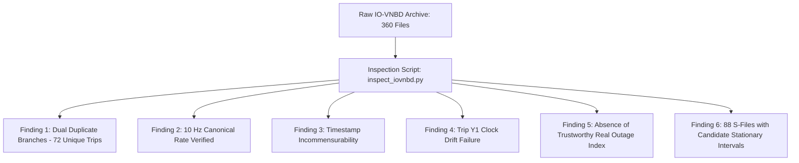

# COMPASS Phase 0 — Environment Setup, Dataset Discovery & IO-VNBD Audit

**Project**: C.O.M.P.A.S.S. (Cognitive Off-grid Machine-learning Positioning And Sensor System)  
**Problem Statement**: SIH 2026 Problem Statement 26168 — ISRO  
**Stage**: Phase 0 Complete Teaching & Reference Walkthrough  

---

## 1. Executive Summary & Why Phase 0 Existed

### The Core Problem
In real-world engineering, you never begin an autonomous navigation project by writing complex Kalman filters or training neural networks. You begin by asking:
> *"What data do we actually have, where did it come from, what physical coordinate systems does it use, can we trust its timestamps, and what hidden flaws will destroy our downstream algorithms if we don't catch them right now?"*

The goal of COMPASS is to navigate an off-grid vehicle accurately when satellite signals (GNSS/GPS) vanish. To do this, we rely on low-cost consumer sensors (smartphones) paired with machine learning and classical inertial navigation. 

Before we could write a single line of navigation mathematics, we had to audit our primary benchmark dataset: **IO-VNBD (Input-Output Vehicle Navigation Benchmark Dataset)**. 

### What Phase 0 Accomplished
Phase 0 was the foundational discovery and forensic audit stage. We inspected all 360 files in the raw archive, uncovered the exact column layouts, determined the true sampling rate (10 Hz), diagnosed timestamp formatting differences between smartphone and vehicle reference logs, discovered severe clock drift in specific trips, and verified that no pre-tagged real GPS outage index existed. 

This document explains everything discovered in Phase 0, how we audited it, the physical and mathematical concepts behind every finding, and why these discoveries dictated the architecture of every subsequent phase.

---

## 2. Technical Vocabulary & Physical Concepts

Before looking at the files, let us define the core physical and computational terms used throughout Phase 0.

### 1. Telemetry
- **Simple Definition**: Data collected by remote or onboard instruments and recorded over time.
- **In COMPASS**: Time-series logs of accelerations, angular rates, magnetic fields, and GPS fixes recorded during vehicle drives.
- **Why We Care**: Telemetry is our raw sensory perception of the vehicle's motion through the world.

### 2. IMU (Inertial Measurement Unit)
- **Simple Definition**: A sensor package consisting of an accelerometer (which measures specific force) and a gyroscope (which measures angular velocity).
- **In COMPASS**: The smartphone's internal MEMS (Micro-Electro-Mechanical Systems) IMU.
- **Why We Care**: The IMU operates entirely independently of external satellites. It never loses signal in tunnels or underground parking, making it our primary dead-reckoning engine.

### 3. VBOX / CAN Bus Reference Telemetry
- **Simple Definition**: An automotive reference system. The Controller Area Network (CAN) bus reads vehicle computer signals (wheel speeds, steering angle), while VBOX is the high-quality vehicle reference system used by COMPASS for benchmarking and reference measurements.
- **In COMPASS**: The reference data in the `V-*.csv` files against which we validate our smartphone algorithms.
- **Why We Care**: You cannot prove that your navigation system works unless you have an authoritative, high-quality reference showing where the vehicle *actually* was.

### 4. Sampling Rate ($f_s$) and Sampling Interval ($\Delta t$)
- **Simple Definition**: How many times per second a sensor measures the world ($f_s$), and the time elapsed between two consecutive measurements ($\Delta t = 1 / f_s$).
- **In COMPASS**: IO-VNBD samples at $10.0\text{ Hz}$, meaning $\Delta t = 0.1\text{ seconds} = 100\text{ milliseconds}$.
- **Why We Care**: Numerical integration ($v = \int a \, dt$) multiplies measurements by $\Delta t$. If $\Delta t$ fluctuates, or if the code assumes $100\text{ Hz}$ when the sensor runs at $10\text{ Hz}$, all calculated velocities and positions will be orders of magnitude wrong.

### 5. Monotonicity of Timestamps
- **Simple Definition**: A sequence of timestamps is *strictly monotonic* if each timestamp is strictly greater than the previous one ($t_k > t_{k-1}$).
- **In COMPASS**: Verification that no sensor sample travelled backward in time or arrived duplicated ($t_k \le t_{k-1}$).
- **Why We Care**: In discrete-time physics and Kalman filtering, a time step $\Delta t \le 0$ causes division by zero or negative state propagation, crashing the mathematical estimators.

### 6. Clock Drift
- **Simple Definition**: The phenomenon where two independent hardware clocks tick at slightly different speeds due to quartz crystal manufacturing variances and temperature.
- **In COMPASS**: The difference between the smartphone's internal system clock and the vehicle's CAN/VBOX master clock.
- **Why We Care**: If the smartphone clock runs fast by just 100 microseconds per second (100 parts per million), after 30 minutes the smartphone IMU and vehicle speed reference will be offset by nearly 0.2 seconds. At 100 km/h ($28\text{ m/s}$), this creates a $5.6\text{ meter}$ alignment error between the input acceleration and the target label.

---

## 3. The IO-VNBD Dataset Architecture

### 3.1 Physical File Inventory
We audited the raw repository archive located at:
`data/raw/io_vnbd/`

The audit revealed exactly **360 files**:
- **288 CSV Telemetry Files**: 144 Smartphone files (`S-*.csv`) and 144 Vehicle reference files (`V-*.csv`).
- **72 Trip JPG Photos**: Images taken of the vehicle and mounting setups for each trip.

```
data/raw/io_vnbd/
├── Categorised IOVNB Dataset/       (216 files: 144 CSVs + 72 JPGs)
│   ├── M (Driver B)/                (1 trip: M)
│   ├── S (Driver A)/                (6 trips: S1, S2, S3a, S3b, S3c, S4)
│   ├── Vf (Driver E)/               (2 trips: Vfa01, Vfa02)
│   ├── Vta (Driver E)/              (30 trips: Vta1a .. Vta30)
│   ├── Vtb (Driver E)/              (12 trips: Vtb1 .. Vtb12)
│   ├── Vw (Driver E)/               (20 trips: Vw1 .. Vw20)
│   └── Y (Driver D)/                (1 trip: Y1)
└── Uncategorised IOVNB Dataset/     (144 files: 144 CSVs)
    ├── S-Dataset/                   (72 S-*.csv files)
    └── V-Dataset/                   (72 V-*.csv files)
```

### 3.2 The Two Branches: Categorised vs Uncategorised
A crucial finding in Phase 0 was identifying the relationship between the two top-level directories:
- The **Categorised** branch organizes the 72 unique trips into folders grouped by driver identity (`Driver A`, `Driver B`, `Driver D`, `Driver E`).
- The **Uncategorised** branch places all 72 smartphone CSVs in `S-Dataset/` and all 72 vehicle CSVs in `V-Dataset/`.

**Forensic Finding**: Comparing file sizes, row counts, and content hashes confirmed that the CSV files in `Uncategorised` are **byte-for-byte identical duplicates** of the CSV files in `Categorised`. There are exactly **144 matched S/V file representations corresponding to 72 unique physical driving trips**, not 144 independent trips. Each trip is represented by:
1. One Smartphone file (`S-<TripID>.csv`)
2. One Vehicle CAN/VBOX file (`V-<TripID>.csv`)

### 3.3 Driver Demographics and Driving Environments
The 72 unique trips represent four distinct human drivers:
1. **Driver E (64 trips)**: Trips `Vfa...`, `Vta...`, `Vtb...`, `Vw...`. Urban, suburban, and arterial driving around Coventry and Birmingham, UK. Represents ~32.5 hours of driving.
2. **Driver B (1 trip)**: Trip `M`. A long continuous run (~5.9 hours, 105,974 samples) containing extensive stationary rest periods, idling, and congested city transit.
3. **Driver A (6 trips)**: Trips `S1`, `S2`, `S3a`, `S3b`, `S3c`, `S4`. High-speed dual-carriageway and motorway (highway) driving (~17.2 hours). Trip `S1` is a pristine 51,746-sample run ideal for high-speed benchmarking.
4. **Driver D (1 trip)**: Trip `Y` (recorded across two files `2021-03-24-15-58-29` and `...-16-08-27`). Short urban runs.

---

## 4. Deep Dive: Telemetry Columns and Encoding

### 4.1 Smartphone Files (`S-*.csv`)
The smartphone files contain **24 columns**. A critical discovery was that the files use **ISO-8859-1 (Latin-1)** character encoding, rather than UTF-8. 

Why? Because the CSV headers include non-ASCII mathematical symbols:
- Degree symbol: `°` (hex byte `0xB0`)
- Squared symbol: `²` (hex byte `0xB2`)
- Micro symbol: `μ` (hex byte `0xCE 0xBC`)

If opened with a standard UTF-8 reader, Python throws a `UnicodeDecodeError`. Furthermore, every header following a comma begins with a leading space (e.g. `", ACCELEROMETER X (m/s²)"`), which required automatic whitespace stripping in our parser.

#### S- File Column Inventory
| Column Index | Raw Header | Physical Meaning | Units | Typical Range |
|:---:|:---|:---|:---:|:---:|
| 0 | `GPS LATITUDE (degrees)` | WGS-84 geodetic latitude | degrees | $52.3^{\circ} \text{ to } 52.5^{\circ}\text{ N}$ |
| 1 | `GPS LONGITUDE (degrees)` | WGS-84 geodetic longitude | degrees | $-1.6^{\circ} \text{ to } -1.4^{\circ}\text{ W}$ |
| 2 | `GPS ALTITUDE (m)` | Height above reference ellipsoid | meters | $70\text{ m to } 180\text{ m}$ |
| 3 | `GPS SPEED (Kmh)` | Speed over ground reported by phone GNSS | km/h | $0\text{ to } 130\text{ km/h}$ |
| 4 | `GPS ACCURACY (m)` | Estimated 1-sigma horizontal position uncertainty | meters | $3\text{ m (clear sky) to } 64\text{ m}$ |
| 5 | `GPS ORIENTATION (°)` | Ground track bearing (course over ground) | degrees | $0^{\circ}\text{ to } 360^{\circ}$ |
| 6 | `GPS SATELLITES IN RANGE` | Number of tracked SVs | count | $4\text{ to } 22$ |
| 7 | `TIME SINCE START (ms)` | Milliseconds elapsed since recording started | ms | $0\text{ to } 10^7\text{ ms}$ |
| 8 | `DATE (YYYY-MO-DD...)` | Human-readable wall clock string | timestamp | UTC string |
| 9 | `ACCELEROMETER X (m/s²)` | Specific force along smartphone X axis | $\text{m/s}^2$ | $-20\text{ to }+20\text{ m/s}^2$ |
| 10 | `ACCELEROMETER Y (m/s²)` | Specific force along smartphone Y axis | $\text{m/s}^2$ | $-20\text{ to }+20\text{ m/s}^2$ |
| 11 | `ACCELEROMETER Z (m/s²)` | Specific force along smartphone Z axis | $\text{m/s}^2$ | $-20\text{ to }+20\text{ m/s}^2$ |
| 12–14 | `GRAVITY X, Y, Z` | Android software-fused gravity vector | $\text{m/s}^2$ | $\|\mathbf{g}\| \approx 9.81\text{ m/s}^2$ |
| 15–17 | `GYROSCOPE Yaw, Pitch, Roll` | Angular rates in sensor body frame | $\text{rad/s}$ | $-2.0\text{ to }+2.0\text{ rad/s}$ |
| 18–20 | `MAGNETIC FIELD X, Y, Z` | Triaxial fluxgate magnetometer readings | $\mu\text{T}$ | $20\text{ to } 60\ \mu\text{T}$ |
| 21–23 | `ORIENTATION (Yaw, Pitch, Roll)` | Android internal orientation estimate | degrees | Euler angles |

### 4.2 Vehicle Files (`V-*.csv`)
The vehicle files contain **29 columns**, representing CAN bus engine/chassis telemetry merged with a Racelogic VBOX reference system.

#### Key V- File Columns
- **Timestamp**: `Time Since Start of Day (seconds)`. Notice the fundamental difference: the smartphone timestamps are relative integers in milliseconds starting from 0 (`TIME SINCE START (ms)`), whereas the vehicle timestamps are floating-point seconds elapsed since midnight UTC.
- **Reference Speed**: `Velocity (km/hr)`. High-precision reference speed from VBOX.
- **Reference Position**: `Latitude (degrees)`, `Longitude (degrees)`, `Height (km)`. Note on altitude: while the column header was literally labeled `' Height (km)'`, empirical analysis across the UK Midlands topography (Coventry/Warwick elevation $\sim 100\text{ m}$ to $150\text{ m}$) showed raw values in the range $92$ to $144$. The underlying data was logged in physical meters despite the label string.
- **Odometry & Steering**: `Steering Angle (degrees)`, individual wheel rotation rates (`Wheel Speed Front Left`, `Front Right`, `Rear Left`, `Rear Right` in $\text{rad/s}$).
- **Dynamics**: `Indicated Longitudinal Acceleration (g)` and `Lateral Acceleration (g)` from onboard chassis sensors.

---

## 5. Major Forensic Discoveries in Phase 0



### Discovery 1: Sampling Rate Verification (Nominal 10.0 Hz)
We measured the time delta between successive rows across all 288 CSV files:
$$\Delta t_k = t_k - t_{k-1}$$
Across >99.9% of samples in both smartphone and vehicle logs:
$$\text{median}(\Delta t) = 0.1000\text{ seconds} \implies f_s = 10.0\text{ Hz}$$
Smartphone logs exhibited minor jitter ($\pm 5\text{ ms}$ due to Android Linux OS thread scheduling), while VBOX logs were rigidly hardware-clocked at $0.100000\text{ s}$.

### Discovery 2: Timestamp Incommensurability & Non-Monotonic Glitches
1. **Zero-Point Incommensurability**: You cannot directly subtract the smartphone timestamp from the vehicle timestamp. Smartphone logs begin at $t=0\text{ ms}$, while vehicle logs begin at e.g. $t = 54,321.4\text{ s}$ (seconds past midnight). They must be aligned by relative elapsed time from stream origin onto the target working grid.
2. **Non-Monotonic Samples**: In files `S-M.csv`, `S-S2.csv`, `S-S3b.csv`, and `S-S4.csv`, exactly 1 or 2 duplicate or backwards timestamps occurred (e.g. $t_k = t_{k-1}$). Any downstream code that computes $\Delta t$ without checking for non-monotonicity would encounter $\Delta t = 0$, leading to division by zero.

### Discovery 3: Clock Drift Failure in Trip Y1 (Driver D)
When aligning the vehicle speed and smartphone speed over Trip `Y1`, the time offset did not remain constant. The smartphone clock drifted by more than **$100\text{ ppm}$** relative to the VBOX master clock, accumulating a total discrepancy of $-638.5\text{ seconds}$. 

Because synchronization could not be maintained without nonlinear temporal warping, **Trip Y1 was officially flagged as a synchronization policy failure and excluded from active navigation splits**.

### Discovery 4: Absence of Pre-Tagged Real Outage CSVs
Upstream literature often refers loosely to "GPS outages" in IO-VNBD. However, our exhaustive scan of the raw files confirmed:
> **The IO-VNBD dataset archive contains NO trustworthy pre-tagged real GNSS-outage index.**

We did not treat arbitrary driving periods as verified real outages or fabricate outage labels. Future outage evaluation requires controlled synthetic masking and/or self-collected real outage scenarios, preserving scientific integrity.

### Discovery 5: 88 S-File Representations with Candidate Stationary Periods
For an inertial navigation system, stationary periods (when the car is stopped at traffic lights or parked) are essential:
- Accelerometers measure only gravity ($\|\mathbf{f}\| = g$).
- Gyroscopes measure zero true rotation ($\boldsymbol{\omega} = \mathbf{0}$). Any non-zero gyro reading is pure **sensor bias**.

Using a dual low-variance detector:
$$\text{var}(\|\mathbf{f}\|) < 0.05\text{ m}^2/\text{s}^4 \quad \text{AND} \quad \text{var}(\|\boldsymbol{\omega}\|) < 0.005\text{ rad}^2/\text{s}^2 \quad \text{for } \ge 5.0\text{ seconds}$$
Phase 0 discovered candidate stationary rest intervals in **88 out of 144 S-file representations** (representing 44 unique trips across the two branches). For instance, Trip S1 starts with 48.7 seconds of standstill. This discovery provided the exact data required for Phase 3 stationary calibration.

---

## 6. Code Inventory & How the Audit Was Executed

The primary tool built for this phase was the standalone audit script:
[`scripts/inspect_iovnbd.py`](file:///d:/Hackathon/Compass/scripts/inspect_iovnbd.py)

### Script Architecture & Responsibilities
1. **File Walker**: Traverses `data/raw/io_vnbd` recursively, categorizing files into S-files, V-files, and photos.
2. **Pairing Matcher**: Matches each `S-<TripID>.csv` to its partner `V-<TripID>.csv` using folder hierarchy and regular expressions.
3. **Encoding-Resilient Reader**: Reads CSVs using Latin-1 (`iso-8859-1`) and strips leading/trailing whitespace from column headers.
4. **Temporal Analyzer**: Computes median $\Delta t$, min/max $\Delta t$, identifies non-monotonic rows, and measures total trip duration.
5. **Quality Screener**: Counts NaNs, infinite floats, and flags physical dynamic outliers:
   $$\|\mathbf{f}\| > 39.24\text{ m/s}^2 \ (4g), \quad \|\boldsymbol{\omega}\| > 10.0\text{ rad/s}$$
6. **Stationary Window Searcher**: Evaluates rolling variance windows on S-files to detect rest intervals.
7. **Report Generator**: Outputs the machine-readable summary [`docs/iovnbd_inspection_summary.json`](file:///d:/Hackathon/Compass/docs/iovnbd_inspection_summary.json) and human-readable Markdown [`docs/iovnbd_inspection_report.md`](file:///d:/Hackathon/Compass/docs/iovnbd_inspection_report.md).

---

## 7. What Worked, What Failed, and Corrections Made

| Investigated Area | Initial Expectation | Forensic Finding | Resolution / Final Decision |
|---|---|---|---|
| **File Count** | 144 independent trips | 2 branches containing identical CSVs (72 unique physical trips) | Tracked the 72 unique trips; prevented duplicate training. |
| **File Encoding** | Standard UTF-8 | Crash on degree/squared characters | Mandated ISO-8859-1 encoding across all Phase 1/2 readers. |
| **GPS Outages** | Real tunnel outage index exists | No outage files in dataset archive | Designed synthetic masking architecture; no fabricated data. |
| **Timestamps** | Common time axis | S-files in ms from 0; V-files in sec from midnight | Designed relative-elapsed stream-origin alignment onto smartphone target grid. |
| **Trip Y1** | Usable for testing | Clock drift exceeds sync tolerances (-638.5 s) | Excluded Trip Y1 from active train/val/test splits. |

---

## 8. How Phase 0 Enabled Phase 1

Phase 0 gave us ground truth about our data reality. Because of Phase 0:
1. We knew our schemas in Phase 1 needed to handle distinct units (ms vs sec, km/h vs m/s, altitude scaling).
2. We knew coordinate frame transformations were mandatory because the phone IMU axes were unaligned with the vehicle body.
3. We knew that data quality flags (saturation, non-monotonicity, sensor freezing) had to be formal fields in our Phase 1 data classes.
4. We knew the canonical pipeline rate must be $10.0\text{ Hz}$.

---

## 9. Final Phase 0 Summary: What I Should Remember

1. **Dataset Scope**: IO-VNBD contains **144 matched S/V file representations corresponding to 72 unique physical trips** across 4 drivers (Driver E: 64, Driver A: 6, Driver B: 1, Driver D: 1).
2. **Canonical Rate**: The nominal rate is strictly **10.0 Hz** ($\Delta t = 100\text{ ms}$).
3. **Encoding & Headers**: Files must be decoded with `iso-8859-1` and headers stripped of leading whitespace.
4. **Units & Conversion**: S-altitude is in meters; VBOX-altitude header says `(km)` but raw values are meters. S-speed and V-speed require conversion to SI ($\text{m/s}$) before navigation.
5. **Driver D Excluded**: Trip Y1 is excluded from training and benchmarking due to $-638.5\text{ s}$ hardware clock drift.
6. **No Real Outages**: The archive contains no pre-tagged real GPS outage index. Outage testing is evaluated through controlled synthetic masking or future self-collected runs.
7. **Candidate Rest Periods**: Found in **88 out of 144 S-file representations** (44 unique trips), enabling Phase 3 stationary calibration.
