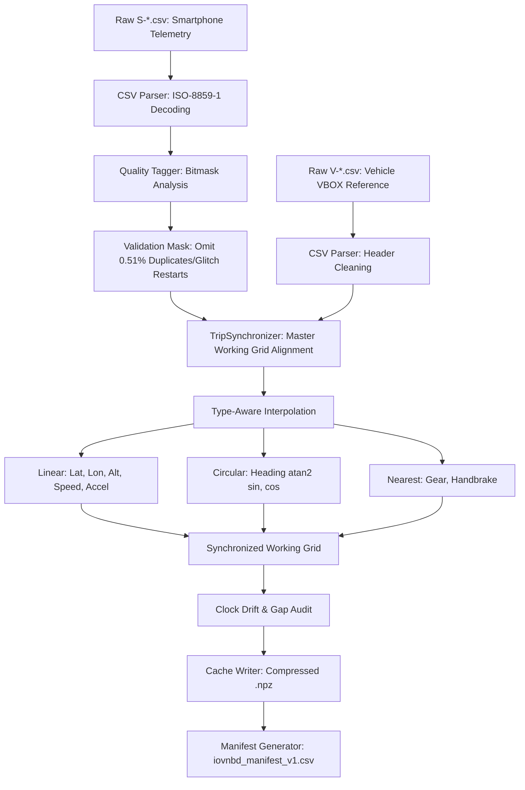

# COMPASS Phase 2 — Multi-Sensor Ingestion, Synchronization & Quality Pipeline

**Project**: C.O.M.P.A.S.S. (Cognitive Off-grid Machine-learning Positioning And Sensor System)  
**Problem Statement**: SIH 2026 Problem Statement 26168 — ISRO  
**Stage**: Phase 2 Complete Teaching & Reference Walkthrough  

---

## 1. Executive Summary & Why Phase 2 Existed

### The Core Problem
In Phase 0, we audited the raw files. In Phase 1, we defined clean data structures. But how do we turn **288 raw CSV text files (~194.2 MB total archive size)** with unaligned, noisy, jittery entries into clean, nanosecond-accurate, synchronized numeric arrays ready for navigation filters and machine learning?

The challenges in the raw data were severe:
1. **Clock Incommensurability**: The smartphone recorded time as integer milliseconds since app launch ($0, 100, 200\text{ ms}$). The vehicle CAN/VBOX system recorded time as floating-point seconds since midnight UTC ($54321.400, 54321.500\text{ s}$).
2. **Missing & Jittery Samples**: Android thread scheduling introduced timing jitter ($\pm 5\text{ ms}$ around the nominal $100\text{ ms}$ interval), along with occasional multi-second sensor dropouts.
3. **Data Flaws**: 10,920 duplicate timestamps and 16 non-monotonic session restarts existed in the raw smartphone logs.
4. **Different Data Types**: Continuous signals (velocities, accelerations) behave like smooth physical functions, but angles wrap around ($359.9^\circ \to 0.1^\circ$) and discrete vehicle states (CAN gear numbers, handbrake flags) cannot have fractional values like gear $2.7$.

If you feed raw, unsynchronized data into a neural network or Kalman filter, the model learns to associate an acceleration that happened at $t = 10.0\text{ s}$ with a vehicle speed that happened at $t = 10.5\text{ s}$.

### What Phase 2 Accomplished
Phase 2 built the **production offline ingestion and synchronization engine**:
- Ingested all 144 matched S/V file representations (corresponding to 72 unique physical trips).
- Built genuine timestamp-based synchronization aligning CAN/VBOX reference data onto the smartphone target working grid via relative elapsed time from stream origin.
- Implemented type-aware interpolation (linear for kinematics, circular trigonometry for headings, nearest-neighbor for gears).
- Built non-destructive quality tagging, preserving physical dynamic shocks (potholes $>4g$) while safely omitting non-computable duplicate and non-monotonic rows.
- Evaluated clock drift, passing 142 pairs and flagging Trip Y1 (Driver D) for exceeding synchronization thresholds.
- Cached all 144 trips into high-speed compressed NumPy archives (`data/cache/iovnbd/*.npz`), cataloged in `data/manifests/iovnbd_manifest_v1.csv` with an immutable collective SHA-256 hash (`7a267e...fa7`).

---

## 2. Technical Vocabulary & Physical Concepts

Before diving into the code, let us define the core physical and computational terms used throughout Phase 2.

### 1. Ingestion Pipeline
- **Simple Definition**: The automated software path that reads raw files from disk, cleans them, transforms their formats, and saves them into structured storage.
- **In COMPASS**: Translating raw CSV text into canonical memory arrays.
- **Why We Care**: Reading 288 CSV files with text parsing during training takes hours. Parsing once into compressed binary arrays reduces load times from hours to milliseconds.

### 2. Time Synchronization (Target Working Grid)
- **Simple Definition**: Aligning measurements taken by two independent clocks onto a single common timeline.
- **In COMPASS**: The smartphone IMU timestamps form the master **target working grid** ($t_k$). The vehicle VBOX reference data is sampled at its own times and is interpolated onto the exact timestamps of the smartphone grid via relative elapsed time ($t - t_0$). Cross-correlation was used as a diagnostic tool, not as the working grid interpolator.
- **Why We Care**: To train VelocityNet to predict speed from IMU motion, the target speed $v_k$ must be evaluated at the exact epoch the IMU window ended.

### 3. Circular Angle Interpolation (Trigonometric Interpolation)
- **Simple Definition**: Interpolating angles on a circle rather than on a flat line.
- **In COMPASS**: Heading angles wrapping around from $359^\circ$ to $1^\circ$.
- **Why We Care**: If a car turns gently across True North, the heading changes from $359^\circ$ to $1^\circ$. Standard linear interpolation computes the midpoint as:
  $$\frac{359^\circ + 1^\circ}{2} = 180^\circ \quad (\text{South!})$$
  The car was driving North, but naive linear interpolation claims it suddenly flipped South. Circular interpolation solves this using vector trigonometry ($\sin, \cos \to \text{atan2}$).

### 4. Zero-Order Hold (Nearest Neighbor)
- **Simple Definition**: Keeping a value constant until a new measurement arrives, rather than smoothing between values.
- **In COMPASS**: Discrete vehicle CAN signals like transmission gear ($1, 2, 3, 4, 5$) and handbrake ($0$ or $1$).
- **Why We Care**: A car is either in 2nd gear or 3rd gear. It is never in gear $2.4$. Discrete states must never be linearly interpolated.

### 5. Non-Destructive Quality Tagging
- **Simple Definition**: Flagging bad data with metadata bits without deleting the row.
- **In COMPASS**: Using `quality_flags` bitmasks on every sample.
- **Why We Care**: In inertial navigation, if you delete an anomalous sample at $t=1.5\text{ s}$, the time delta between $t=1.4\text{ s}$ and $t=1.6\text{ s}$ suddenly becomes $\Delta t = 0.2\text{ s}$. The navigation integrator must know that a gap occurred, rather than assuming time jumped smoothly.

---

## 3. End-to-End Pipeline Data Flow



---

## 4. Mathematical Mechanics of the Pipeline

### 4.1 Timestamp Normalization to Nanoseconds
Both streams are converted into signed 64-bit integer nanoseconds:
- Smartphone relative time:
  $$t_{\text{phone\_ns}} = \text{int}(t_{\text{ms}} \times 1\,000\,000)$$
- Vehicle time past midnight:
  $$t_{\text{vbox\_ns}} = \text{int}(\text{round}(t_{\text{sec}} \times 1\,000\,000\,000))$$

### 4.2 Stream Origin Synchronization (`relative_elapsed`)
Because the phone clock starts at 0 and the VBOX clock starts at seconds past midnight, direct timestamp subtraction is meaningless. The pipeline aligns relative elapsed time from stream origin:
$$t_{\text{elapsed\_S}}(k) = t_S(k) - t_S(0)$$
$$t_{\text{elapsed\_V}}(j) = t_V(j) - t_V(0)$$
The smartphone grid $t_{\text{elapsed\_S}}$ is the master target axis. For each smartphone epoch $k$, we locate the surrounding vehicle samples $j$ and $j+1$ such that:
$$t_{\text{elapsed\_V}}(j) \le t_{\text{elapsed\_S}}(k) < t_{\text{elapsed\_V}}(j+1)$$

### 4.3 Type-Aware Interpolation Mathematics

#### 1. Continuous Kinematics (Linear Interpolation)
For continuous physical quantities (position, speed, acceleration):
$$\alpha = \frac{t_{\text{target}} - t_j}{t_{j+1} - t_j}, \quad \alpha \in [0, 1)$$
$$x(t_{\text{target}}) = (1 - \alpha) x_j + \alpha x_{j+1}$$

#### 2. Angular Headings (Circular Interpolation)
To interpolate heading angles $\psi \in [0, 360)^\circ$ without edge wrap-around spikes:
1. Convert angles to Cartesian components on the unit circle:
   $$x_j = \cos(\psi_j), \quad y_j = \sin(\psi_j)$$
   $$x_{j+1} = \cos(\psi_{j+1}), \quad y_{j+1} = \sin(\psi_{j+1})$$
2. Linearly interpolate the Cartesian components:
   $$\bar{x} = (1 - \alpha) x_j + \alpha x_{j+1}, \quad \bar{y} = (1 - \alpha) y_j + \alpha y_{j+1}$$
3. Recover the interpolated heading via four-quadrant arctangent:
   $$\psi(t_{\text{target}}) = \text{atan2}(\bar{y}, \bar{x}) \pmod{360^\circ}$$

#### 3. Discrete Signals (Nearest Neighbor)
For integer CAN states (transmission gear, handbrake):
$$x(t_{\text{target}}) = \begin{cases} x_j & \text{if } \alpha < 0.5 \\ x_{j+1} & \text{if } \alpha \ge 0.5 \end{cases}$$

#### 4. Maximum Gap & Extrapolation Policy
- **Extrapolation**: Strictly **zero**. Target samples outside $[t_{V, \text{start}}, t_{V, \text{end}}]$ are filled with `NaN`.
- **Maximum Gap**: If the vehicle stream experiences a gap $> 1.0\text{ second}$, the pipeline does not interpolate across it; target samples inside the gap are assigned `NaN`.

---

## 5. Code Inventory: The Phase 2 Pipeline Modules

All pipeline source code is located in [`data/pipeline/`](file:///d:/Hackathon/Compass/data/pipeline/):

```
data/pipeline/
├── __init__.py           # Package exports
├── parse.py              # IOVNBDParser: Latin-1, header cleanup, column mapping
├── sync.py               # TripSynchronizer: grid alignment, interpolation, drift audit
├── quality_tagger.py     # QualityTagger: non-destructive bitmask classification
├── stationary_detect.py  # Stationary window detector
├── outage_index.py       # OutageWindow, synthetic outage generation
└── manifest.py           # Manifest generation & dataset audit records
```

### 5.1 `data/pipeline/parse.py`
- **Class**: `IOVNBDParser`
- **Responsibilities**: Reads raw CSVs with Latin-1 encoding, strips whitespace, converts timestamps to signed `int64` nanoseconds, and handles column unit conversions.

### 5.2 `data/pipeline/quality_tagger.py`
- **Class**: `QualityTagger`
- **Responsibilities**: Evaluates sensor physics and timestamp health, assigning non-destructive bitmask flags.
  - `FLAG_NON_MONOTONIC_TIMESTAMP` ($t_k \le t_{k-1}$)
  - `FLAG_DUPLICATE_TIMESTAMP` ($t_k == t_{k-1}$)
  - `FLAG_EXTREME_MOTION` ($\|\mathbf{f}\| > 39.24\,\text{m/s}^2$ or $\|\boldsymbol{\omega}\| > 10.0\,\text{rad/s}$)
  - `FLAG_SENSOR_DROPOUT` ($\Delta t_k > 300\,\text{ms}$)

### 5.3 `data/pipeline/sync.py`
- **Classes**: `TripSynchronizer`, `SyncResult`, `SyncDiagnostics`
- **Responsibilities**: Executes stream-origin time alignment onto the smartphone target grid, performs type-aware interpolation, and evaluates clock drift rate.

---

## 6. Real Empirical Results & Quality Audit Numbers

The offline pipeline script [`scripts/run_pipeline.py`](file:///d:/Hackathon/Compass/scripts/run_pipeline.py) processed all 144 file representations, generating [`docs/data_quality_report.md`](file:///d:/Hackathon/Compass/docs/data_quality_report.md):

### 6.1 Total Dataset Statistics
- **Total Matched Representations**: **144 pairs** (72 unique physical trips across Drivers A, B, D, E)
- **Total Driving Duration**: **59.48 hours**
- **Raw Smartphone Telemetry**: **2,141,490 rows**
- **Raw VBOX Reference Telemetry**: **2,142,070 rows**
- **Synchronized Rows Produced**: **2,141,490 rows**
- **Validated Downstream Rows Kept**: **2,130,554 rows (99.49%)**
- **Omitted Rows**: **10,936 rows (0.5107%)**

### 6.2 Omission & Preservation Policy
- **10,920 Duplicate Timestamps**: Across 2 trips; omitted from the validated stream.
- **16 Non-Monotonic Session Restarts**: Across 5 trips; omitted from the validated stream.
- **Extreme Motion Preserved**: 34 extreme-motion sample occurrences (14 accel events $>4g$, 28 gyro events $>10\,\text{rad/s}$) were **100% kept in the validated stream** to preserve real physical dynamics.
- **Sensor Dropouts Preserved**: 6 timing gaps (>300 ms) were **100% kept in the validated stream** so downstream filters can propagate across the gap.

### 6.3 Synchronization Acceptance Audit
- **Passing Pairs**: **142 / 144 representations (98.6%)**
- **Mean Overlap Coverage**: **99.91%**
- **Mean Clock Drift**: **-9.25 seconds** across ~60 hours of driving.
- **Policy Failures**: Trip Y1 (Driver D) exhibited **$-638.51\text{ seconds}$** of clock drift (threshold: 120 s). Both representations (`Categorised_Y1` and `Uncategorised_Y1`) were flagged and quarantined (`downstream_ready = False`).

### 6.4 Immutability & Collective Cache Hash
The collective SHA-256 hash of all 144 `.npz` files in `data/cache/iovnbd/` was computed:
$$\text{Phase 2 Cache SHA-256} = \mathbf{7a267e112af4193dcadb8800bd9cf4ed8abf7249a1ad53883bbd2cfd06200fa7}$$
All raw CSV files remained byte-for-byte unmodified.

---

## 7. Testing & Verification

The Phase 2 pipeline is covered by **46 tests**:
- [`tests/unit/test_pipeline_quality.py`](file:///d:/Hackathon/Compass/tests/unit/test_pipeline_quality.py) (45 unit tests): Validates bitmask flag logic, saturation thresholds, non-monotonic detection, and interpolation algorithms.
- [`tests/integration/test_pipeline_full_file.py`](file:///d:/Hackathon/Compass/tests/integration/test_pipeline_full_file.py) (1 integration test): Ingests a full real IO-VNBD trip, verifies >99.5% interpolation coverage, and validates cache serialization roundtrips.

---

## 8. Final Phase 2 Summary: What I Should Remember

1. **Dataset Scope**: 144 matched S/V file representations corresponding to 72 unique physical trips (~194.2 MB archive).
2. **Downstream Ready**: Exactly **142 representations passed** sync policy; Trip Y1 excluded due to $-638.5\text{ s}$ clock drift.
3. **Master Grid**: The smartphone IMU is the master target timeline. VBOX telemetry is interpolated onto that grid.
4. **Interpolation Policies**: Linear for kinematics; circular trigonometry for headings; nearest-neighbor for gears.
5. **Low Omission Rate**: 99.49% validated; only 0.51% non-computable duplicate and restart samples omitted.
6. **Dynamic Shocks Preserved**: Physical shocks (>4g) were kept for downstream adaptive filtering.
7. **Immutable Cache**: 144 compressed `.npz` files with collective SHA-256 hash `7a267e...fa7`.
