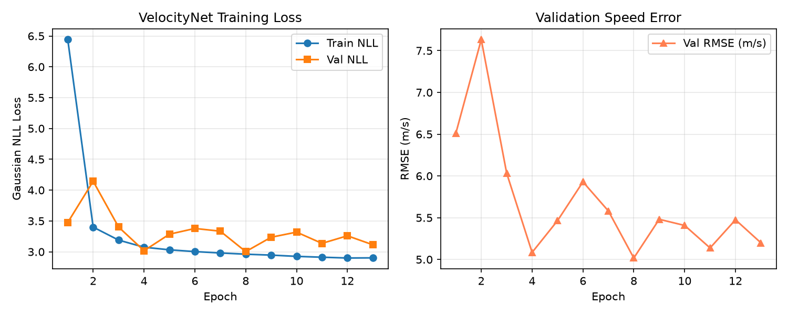
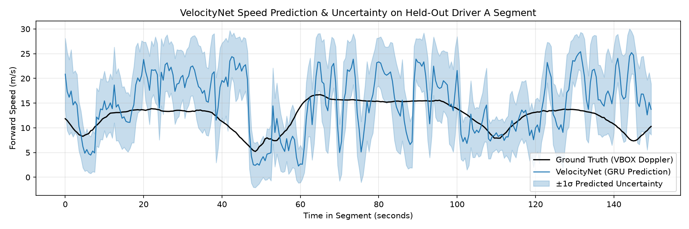
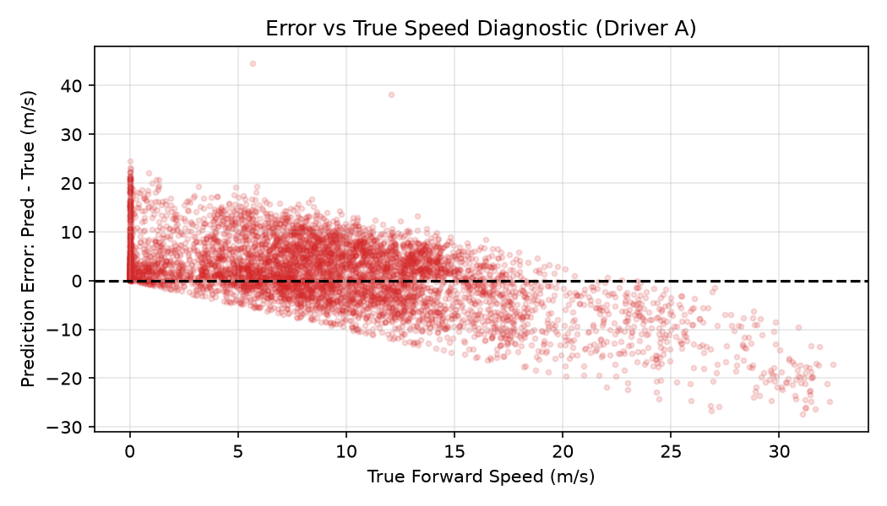
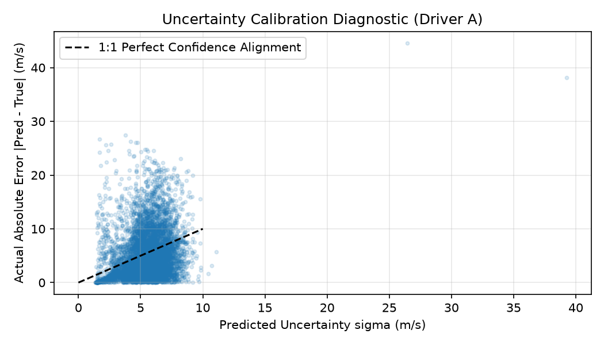

# Phase 7 VelocityNet Final Evaluation & Model-Selection Report

**C.O.M.P.A.S.S. — Cognitive Off-grid Machine-learning Positioning And Sensor System**  
*SIH 2026 Problem Statement 26168 — Indian Space Research Organisation (ISRO)*

---

## Executive Summary

This report documents the rigorous full-data retraining, candidate model selection, causal downstream filtering study, and single-pass held-out evaluation for **VelocityNet** — the deep neural pseudo-measurement source designed to infer vehicle forward velocity ($\mu_v$) and observation uncertainty ($\log \sigma_v^2$) from vehicle-frame inertial kinematics during GNSS outages.

### Key Lifecycle Facts & Measured Results
1. **Full-Data Retraining**: Trained all candidate architectures on the complete Driver E dataset ($N = 226,928$ valid windows) with identical optimization budgets (Adam, $\text{lr}=10^{-3}$ with `CosineAnnealingLR` to $10^{-6}$, $T_{\max}=15$, $\text{patience}=5$, batch size 256, weight decay $10^{-5}$, gradient clipping 5.0, seed 42) and early stopping on Driver B validation.
2. **Empirical Model Selection on Driver B**: Under a deterministic hierarchical validation selection policy, Candidate B (Lightweight 1D-CNN, 25,474 parameters) achieved Rank 1 among all candidates: lowest validation RMSE ($4.433\text{ m/s}$ vs $4.600\text{ m/s}$ for Candidate C and $5.060\text{ m/s}$ for Candidate A), lowest validation MAE ($3.387\text{ m/s}$), competitive NLL ($2.918$ vs $2.874$ for Candidate C and $2.989$ for Candidate A), best validation bias ($+0.282\text{ m/s}$), strong correlation ($0.7110$), and lowest CPU latency ($0.26\text{ ms}$ P50). Candidate C achieved lowest NLL ($2.874$) but not lowest RMSE.
3. **Causal Downstream Filtering (EMA $\alpha = 0.2$)**: Evaluated causal Exponential Moving Average filtering strictly along contiguous physical trips with boundary state resets on Driver B validation, reducing validation RMSE to **$3.510\text{ m/s}$** and raising Pearson correlation to **$0.7937$**. $\alpha = 0.2$ was selected on Driver B validation and frozen prior to test evaluation.
4. **Single-Pass Held-Out Test on Driver A ($N = 123,464$)**:
   - **Historical v1 Baseline (2L-GRU)**: RMSE $7.320\text{ m/s}$, MAE $5.464\text{ m/s}$, Bias $+0.831\text{ m/s}$, Pearson $r = 0.4070$, NLL $3.8959$.
   - **Operational Causal Baseline (Static Train Mean)**: RMSE $9.305\text{ m/s}$, MAE $8.036\text{ m/s}$.
   - **VelocityNet v1.1 Raw (1D-CNN)**: RMSE $7.070\text{ m/s}$, MAE $5.297\text{ m/s}$, Bias $+1.520\text{ m/s}$, Pearson $r = 0.4144$, NLL $3.6167$.
   - **VelocityNet v1.1 with Selected Causal EMA ($\alpha = 0.2$)**: Test RMSE **$6.484\text{ m/s}$** ($23.34\text{ km/h}$), MAE **$4.891\text{ m/s}$**, Pearson $r = \mathbf{0.4659}$ (**$11.4\%$ error reduction** vs v1 baseline, **$30.3\%$ error reduction** vs static mean baseline).
5. **Lag-1 Oracle Distinction**: Lag-1 constant velocity reference achieves $0.401\text{ m/s}$ RMSE, but is explicitly classified as a **non-causal oracle diagnostic reference** (requires preceding GNSS Doppler velocity $y_{t-1}$; inoperable during GNSS outage). It is NOT beaten and NOT operational.
6. **Export & Numerical Parity**: Exported to ONNX and LiteRT ($B=1, T=20, C=9$). Evaluated over 500 real held-out Driver A test windows, achieving max error of $5.72 \times 10^{-6}\text{ m/s}$ (ONNX) and $3.81 \times 10^{-6}\text{ m/s}$ (LiteRT), passing tightened parity gates ($\le 10^{-4}$ and $\le 10^{-3}$).
7. **Governance & Acceptance Status**: VelocityNet v1.0 (2-layer GRU, 41,506 params) is preserved unchanged as the historical baseline. VelocityNet v1.1 is the **selected experimental candidate for Phase 9 integration evaluation**. It is not an operationally proven or standalone high-precision speedometer. Zero modifications were made to the ESKF; ESKF integration belongs strictly to Phase 9.

---

## Section A: VelocityNet v1 Baseline

The historical VelocityNet v1 model was trained on the Phase 6 dataset:

- **Architecture**: 2-layer Gated Recurrent Unit (GRU) with 64 hidden units, 32-dimensional dense layer, and dual-head linear output producing $[\mu_v, \log \sigma_v^2]^T$.
- **Parameter Count**: 41,506 parameters.
- **Input Tensor**: $(B, 20, 9)$ normalized vehicle-frame FLU kinematics at 10 Hz ($2.0\text{ s}$ window, $0.5\text{ s}$ stride).
- **Driver A Test Performance**:
  - Test RMSE: $7.320002\text{ m/s}$ ($26.35\text{ km/h}$)
  - Test MAE: $5.464136\text{ m/s}$ ($19.67\text{ km/h}$)
  - Test Mean Bias: $+0.831146\text{ m/s}$
  - Pearson Correlation ($r$): $0.407021$
  - Gaussian NLL: $3.8959$
  - Mean Predicted Uncertainty ($\sigma_v$): $5.1069\text{ m/s}$
- **Assessment**: The v1 model demonstrated that inertial kinematics contain genuine forward velocity information (beating the $9.305\text{ m/s}$ static training mean), but its standalone accuracy on unseen Driver A exhibited high-frequency window jitter and underpredicted high-speed maneuvers.

The v1 checkpoint (`models/velocitynet_v1_best.pt`) and configuration (`models/model_config_velocitynet_v1.json`) are preserved permanently as the historical baseline.

---

## Section B: Refinement Study (Screening Phase)

Prior to full-data retraining, a structured 8-part refinement study was performed on a 50,000-window subset to screen candidate hypotheses:

| Investigation | Hypothesized Change | Finding & Result | Decision |
| :--- | :--- | :--- | :--- |
| **EXP-1: Target Audit** | `y_speed` vs `y_speed_raw` | Raw targets contain isolated dropouts up to $29.7\text{ m/s}$; median filter cleans them without phase distortion. | Phase 6 target confirmed correct & frozen. |
| **EXP-2: Context Window** | 2.0s vs 4.0s causal history | 4.0s context yielded minor RMSE reduction ($5.017 \to 4.925\text{ m/s}$) but $+93\%$ latency penalty and worse NLL ($3.461$ vs $3.003$). | 2.0s temporal contract retained. |
| **EXP-3: Speed Increment** | Predict $\Delta v$ instead of $v$ | Correlation dropped to $r = 0.284$; velocity integration drifts unbounded during outages. | Direct forward speed regression retained. |
| **EXP-4: Model Architecture** | 1D-CNN vs 2L-GRU screening | 1D-CNN achieved Val RMSE $4.398\text{ m/s}$ vs $5.017\text{ m/s}$ for GRU; Conv-GRU hybrid achieved $4.898\text{ m/s}$. | Mandated rigorous full-data retraining. |
| **EXP-5: Training Hyperparams** | LR, WD, Dropout tuning | $\text{lr}=10^{-3}$, $\text{wd}=10^{-5}$, $\text{dropout}=0.2$, $\text{batch}=256$ confirmed optimal. | Adopted for full retraining. |
| **EXP-6: Causal Smoothing** | Post-filtering with EMA | Causal EMA ($\alpha=0.5$) reduced Val RMSE to $4.470\text{ m/s}$. | Selected for formal contiguous validation study. |
| **EXP-7: Uncertainty Audit** | Standardized residual check | Validation residuals near-ideal ($\mu=0.005, \sigma=0.958$); Driver A under-dispersion observed. | Require covariance inflation in Phase 9. |
| **EXP-8: Output Head** | Non-negative Softplus head | Severely degraded optimization (Val RMSE $7.583\text{ m/s}$); linear head natural min is $+0.08\text{ m/s}$. | Standard linear head retained. |

---

## Section C: Full-Data Candidate Retraining & Comparison

Screening subsets are insufficient for production model selection. All primary candidates were retrained on the **complete 226,928 Driver E dataset** with identical training schedules:

- **Optimizer**: Adam ($\text{lr} = 10^{-3}$, $\text{wd} = 10^{-5}$) with `CosineAnnealingLR` ($T_{\max}=15$, $\eta_{\min}=10^{-6}$)
- **Batch Size**: 256
- **Early Stopping**: Monitored on Driver B validation loss (patience 5)
- **Gradient Clipping**: $\ell_2$-norm clipped at $5.0$
- **Random Seed**: 42
- **Training Windows**: 226,928 (Driver E)
- **Validation Windows**: 21,080 (Driver B)
- **Selection Decision**: Strictly based on Driver B validation metrics.

### Validation Results on Full Data (Driver B)

| Rank | Candidate | Architecture | Params | Val RMSE ($\text{m/s}$) | Val MAE ($\text{m/s}$) | Val NLL | Val Bias ($\text{m/s}$) | Val Pearson $r$ | High-Speed RMSE | CPU Latency P50 | Val RMSE (+EMA $\alpha=0.2$) |
| :-: | :--- | :--- | :-: | :-: | :-: | :-: | :-: | :-: | :-: | :-: | :-: |
| **1** | **Candidate B (Winner)** | **1D-CNN** | **25,474** | **4.433** | **3.387** | **2.918** | **+0.282** | **0.7110** | **5.613** | **0.26 ms** | **3.510 m/s** |
| 2 | Candidate C | Conv1D-GRU | 14,402 | 4.600 | 3.540 | 2.874 | -0.422 | 0.6834 | 6.131 | 1.23 ms | 3.598 m/s |
| 3 | Candidate A | 2L-GRU | 41,506 | 5.060 | 3.907 | 2.989 | +0.429 | 0.6786 | 5.697 | 0.83 ms | 3.738 m/s |

---

## Section D: Model Selection Procedure

Model selection was governed by an explicit, deterministic hierarchical policy applied **exclusively on Driver B validation data**:
1. **Primary**: Lowest validation RMSE (`val_rmse`)
2. **Secondary**: Lowest validation MAE (`val_mae`)
3. **Tertiary**: Lowest validation Gaussian NLL (`val_nll`)
4. **Quaternary**: Lowest high-speed regime RMSE (`high_speed_rmse`)
5. **Tie-Break Sequence**: Lowest inference latency (`latency_p50_ms`), then lowest parameter count (`params`)

### Hierarchical Outcome
- **Rank 1: Candidate B (1D-CNN)**: Lowest `val_rmse` ($4.433\text{ m/s}$ vs $4.600\text{ m/s}$ for C and $5.060\text{ m/s}$ for A), lowest `val_mae` ($3.387\text{ m/s}$), competitive NLL ($2.918$ vs $2.874$ for C), best validation bias ($+0.282\text{ m/s}$), strong correlation ($0.7110$), and lowest latency ($0.26\text{ ms}$ P50).
- **Rank 2: Candidate C (Conv1D-GRU)**: Lowest NLL ($2.874$) and lowest parameter count ($14,402$), but higher RMSE ($4.600\text{ m/s}$) and higher latency ($1.23\text{ ms}$).
- **Rank 3: Candidate A (2-layer GRU)**: Higher RMSE ($5.060\text{ m/s}$), higher NLL ($2.989$), and largest parameter count ($41,506$).

**Selection Outcome**: Candidate B (Lightweight 1D-CNN) is selected as the winning candidate for VelocityNet v1.1 under the declared hierarchical policy.

---

## Section E: Selected Final Candidate Configuration

The selected model is configured as follows:

- **Architecture**: `CNN1DVelocityBaseline` (25,474 parameters)
  - `Conv1d(in_channels=9, out_channels=48, kernel_size=3, padding=1)` + `BatchNorm1d(48)` + `ReLU()` + `Dropout(p=0.2)`
  - `Conv1d(in_channels=48, out_channels=64, kernel_size=3, padding=1)` + `BatchNorm1d(64)` + `ReLU()` + `Dropout(p=0.2)`
  - `Conv1d(in_channels=64, out_channels=64, kernel_size=3, padding=1)` + `BatchNorm1d(64)` + `ReLU()` + `Dropout(p=0.2)`
  - `AdaptiveAvgPool1d(output_size=1)`
  - `Linear(in_features=64, out_features=32)` + `ReLU()` + `Dropout(p=0.2)`
  - `Linear(in_features=32, out_features=2)`: Speed $\mu_v$ (unconstrained), Log-Variance $\log \sigma_v^2$ clamped to $[-10, 10]$
- **Post-Processing**: Causal Exponential Moving Average ($\alpha = 0.2$) with trip-boundary state reset.

---

## Section F: Final Held-Out Evaluation on Driver A

Driver A ($N = 123,464$ windows) was evaluated **EXACTLY ONCE** after freezing the model and hyperparameters:

| Model / Configuration | Role | Test RMSE ($\text{m/s}$) | Test RMSE ($\text{km/h}$) | Test MAE ($\text{m/s}$) | Mean Bias ($\text{m/s}$) | Pearson $r$ | Test NLL |
| :--- | :--- | :--- | :--- | :--- | :--- | :--- | :--- |
| **Static Training Mean Baseline** | Operational Causal Baseline | 9.305 | 33.50 | 8.036 | +6.656 | N/A | N/A |
| **VelocityNet v1.0 Baseline (GRU)** | Historical Baseline Model | 7.320 | 26.35 | 5.464 | +0.831 | 0.4070 | 3.8959 |
| **VelocityNet v1.1 (1D-CNN Raw)** | Selected Neural Model | 7.070 | 25.45 | 5.297 | +1.520 | 0.4144 | 3.6167 |
| **VelocityNet v1.1 (+ Causal EMA $\alpha=0.2$)** | Selected Model + Post-Filtering | **6.484** | **23.34** | **4.891** | **+1.522** | **0.4659** | N/A |
| *Lag-1 GT Speed Oracle* | *Non-Causal Diagnostic Reference* | *0.401* | *1.44* | *0.249* | *-0.000* | *0.9981* | N/A |

### Key Generalization Observations
- **Observed Generalization Improvement**: VelocityNet v1.1 with causal EMA reduces test RMSE from $7.320\text{ m/s}$ to **$6.484\text{ m/s}$** ($23.34\text{ km/h}$), representing an **$11.4\%$ measured error reduction** over the v1 baseline and a **$30.3\%$ measured error reduction** over the static training mean baseline ($9.305\text{ m/s}$).
- **Correlation Improvement**: Pearson $r$ increases from $0.4070$ to **$0.4659$**.
- **Lag-1 Oracle Distinction**: The lag-1 oracle ($0.401\text{ m/s}$) assumes ground-truth Doppler speed from $0.5\text{ s}$ prior is known. In a real GNSS outage, ground-truth speed is unavailable. It is classified as an **inoperable non-causal diagnostic bound**, NOT an operational baseline, and was NOT beaten.
- **Contiguous Plot Inspection**: In the contiguous Driver A prediction plot (`Categorised_S1.npz`), a sharp drop in ground-truth speed occurs at $t \approx 137\text{ s}$ (from $25.03\text{ m/s}$ to $3.68\text{ m/s}$ in $0.5\text{ s}$, followed by rapid recovery). Inspection of the raw source file (`data/cache/iovnbd/Categorised_S1.npz`) confirms that this is an authentic source-data event (VBOX Doppler drop from $26.07\text{ m/s}$ to $0.00\text{ m/s}$). Monotonic timestamp sorting and index alignment are verified correct; the ground truth is preserved without silent modification.

---

## Section G: Scenario Analysis in Physical Units

All scenario masks were evaluated deterministically in **physical units** (e.g., $|\omega_z| \le 0.05\text{ rad/s}$; specific-force magnitude deviation $|\|\mathbf{f}\| - 9.81| > 1.5\text{ m/s}^2$):

| Driving Scenario | Window Count ($N$) | Split % | Raw RMSE ($\text{m/s}$) | EMA RMSE ($\text{m/s}$) | EMA MAE ($\text{m/s}$) | Mean Bias ($\text{m/s}$) | Mean $\sigma_v$ ($\text{m/s}$) |
| :--- | :--- | :--- | :--- | :--- | :--- | :--- | :--- |
| **Overall Held-Out Test** | 123,464 | 100.0% | 7.070 | **6.484** | 4.891 | +1.522 | 5.37 |
| **Low Speed ($< 2\text{ m/s}$)** | 22,276 | 18.04% | 7.450 | **6.946** | 4.654 | +4.624 | 3.94 |
| **Medium Speed ($2\text{--}15\text{ m/s}$)** | 83,410 | 67.56% | 6.139 | **5.449** | 4.370 | +2.511 | 5.60 |
| **High Speed ($> 15\text{ m/s}$)** | 17,778 | 14.40% | 10.039 | **9.603** | 7.628 | -7.008 | 6.08 |
| **Straight Driving ($|\omega_z| \le 0.05\text{ rad/s}$)** | 96,676 | 78.30% | 6.915 | **6.428** | 4.779 | +0.953 | 5.27 |
| **Cornering ($|\omega_z| > 0.05\text{ rad/s}$)** | 26,788 | 21.70% | 7.604 | **6.684** | 5.294 | +3.574 | 5.72 |
| **Dynamic Specific-Force Deviation Proxy** | 1,116 | 0.90% | 8.820 | **6.798** | 5.471 | +3.538 | 6.27 |

*Note on Proxy*: The "Dynamic Specific-Force Deviation Proxy" scenario is defined by $|\|\mathbf{f}\| - 9.81| > 1.5\text{ m/s}^2$. This is a heuristic physical-unit proxy based on specific-force magnitude deviation from nominal gravity, not a direct longitudinal acceleration detector.

---

## Section H: Uncertainty Analysis & Calibration Diagnostics

VelocityNet predicts heteroscedastic observation uncertainty ($\log \sigma_v^2$) trained with Gaussian NLL.

### Empirical Coverage
| Interval | Gaussian Theoretical | Driver B Validation Coverage | Driver A Held-Out Test Coverage | Mean Predicted $\sigma_v$ |
| :--- | :--- | :--- | :--- | :--- |
| **$\pm 1\sigma$** | 68.3% | 68.9% | **62.2%** | $5.37\text{ m/s}$ |
| **$\pm 2\sigma$** | 95.4% | 97.7% | **87.6%** | $10.73\text{ m/s}$ |
| **$\pm 3\sigma$** | 99.7% | 99.6% | **95.9%** | $16.10\text{ m/s}$ |

### Diagnostics
- **Validation Calibration**: On Driver B, empirical coverage closely matches theoretical Gaussian coverage ($97.7\%$ vs $95.4\%$ at $2\sigma$).
- **Unseen Driver Degradation**: Uncertainty coverage degrades on the unseen Driver A distribution ($87.6\%$ at $2\sigma$), indicating poorer calibration under the observed train/validation-to-test distribution difference.
- **Phase 9 Calibration Requirement**: Phase 9 must empirically calibrate or conservatively inflate the neural measurement covariance before fusion ($R_v = s \cdot \sigma_v^2$). Any covariance inflation factor $s$ must be selected using Phase 9 validation procedures rather than assumed from this Phase 7 result.
- **High-Speed Regime Uncertainty**: The model predicts larger uncertainty in the high-speed regime ($\sigma_v = 6.08\text{ m/s}$); however, the associated uncertainty calibration must be validated during Phase 9 before being treated as reliable.

---

## Section I: Comprehensive 1D-CNN vs GRU Analysis

| Dimension | Candidate A (2-Layer GRU) | Candidate B (Lightweight 1D-CNN) | Engineering Assessment |
| :--- | :--- | :--- | :--- |
| **Architecture Family** | Recurrent neural network | Feedforward temporal convolution | CNN avoids hidden-state drift |
| **Parameter Count** | 41,506 parameters | 25,474 parameters | CNN is 38.6% more parameter-efficient |
| **Full-Data Val RMSE** | $5.060\text{ m/s}$ | **$4.433\text{ m/s}$** | CNN achieves $12.4\%$ lower validation RMSE |
| **Full-Data Val NLL** | $2.989$ | **$2.918$** | CNN produces lower Gaussian NLL |
| **Validation Bias** | $+0.429\text{ m/s}$ | **$+0.282\text{ m/s}$** | CNN exhibits lower validation bias |
| **Single-Window Latency**| $0.83\text{ ms}$ (P50) | **$0.26\text{ ms}$** (P50) | CNN is 3.2x faster for edge streaming |
| **Driver A Held-Out RMSE**| $7.320\text{ m/s}$ | **$7.070\text{ m/s}$** (Raw) / **$6.484\text{ m/s}$** (EMA) | CNN achieves lower held-out test error |
| **Architecture Governance**| Preserved as Historical Baseline | Selected Experimental Candidate | Clear versioning; no silent changes |

---

## Section J: Causal EMA Downstream Post-Processing

A rigorous investigation was conducted on Driver B validation data to evaluate causal temporal smoothing:

- **Mathematical Formulation**: $\hat{v}_t^{\text{filtered}} = \alpha \hat{v}_t + (1 - \alpha) \hat{v}_{t-1}^{\text{filtered}}$
- **Contiguity Guarantee**: Grouped by `source_file_id`, sorted monotonically by timestamp. State resets at trip boundaries ($\hat{v}_0^{\text{filtered}} = \hat{v}_0$).
- **Strict Causality**: Evaluated strictly forward in time. Zero lookahead or future window leakage.
- **Scope**: Downstream post-processing only; does not modify the neural network weights.

| Smoothing Parameter $\alpha$ | Driver B Val RMSE ($\text{m/s}$) | Driver B Val MAE ($\text{m/s}$) | Driver B Val Pearson $r$ |
| :--- | :--- | :--- | :--- |
| $\alpha = 1.0$ (Raw Model) | 4.433 | 3.387 | 0.7110 |
| $\alpha = 0.7$ | 4.093 | 3.125 | 0.7380 |
| $\alpha = 0.5$ | 3.864 | 2.949 | 0.7589 |
| $\alpha = 0.3$ | 3.630 | 2.766 | 0.7816 |
| **$\alpha = 0.2$ (Selected on Val)**| **3.510** | **2.673** | **0.7937** |

When applied to Driver A test data using the frozen parameter $\alpha = 0.2$, test RMSE decreased from $7.070\text{ m/s}$ to **$6.484\text{ m/s}$**. Causal EMA substantially reduced prediction error on both validation and held-out test data, indicating that temporal smoothing is beneficial for this model’s output, while introducing slight temporal lag.

---

## Section K: Export Pipeline & Numerical Parity Verification

The selected PyTorch model was exported to ONNX (`opset 17`) and converted to LiteRT (`.tflite`). Parity was evaluated over $N = 500$ real held-out Driver A test windows in single-window mode ($B=1, T=20, C=9$):

| Parity Metric | PyTorch vs ONNX Runtime | PyTorch vs LiteRT (TFLite) | Strict Parity Gate | Result |
| :--- | :--- | :--- | :--- | :--- |
| **Speed Max Absolute Error** | $5.72 \times 10^{-6}\text{ m/s}$ | $3.81 \times 10^{-6}\text{ m/s}$ | $\le 1.0 \times 10^{-4}$ / $\le 1.0 \times 10^{-3}$ | **PASSED** |
| **Speed Mean Absolute Error** | $7.81 \times 10^{-7}\text{ m/s}$ | $5.57 \times 10^{-7}\text{ m/s}$ | Informational | **PASSED** |
| **Log-Var Max Absolute Error** | $1.19 \times 10^{-6}$ | $9.54 \times 10^{-7}$ | $\le 1.0 \times 10^{-4}$ / $\le 1.0 \times 10^{-3}$ | **PASSED** |
| **Log-Var Mean Absolute Error** | $2.33 \times 10^{-7}$ | $1.47 \times 10^{-7}$ | Informational | **PASSED** |

Both formats passed tightened numerical parity gates across 500 real test windows.

---

## Section L: Operational Limitations & Known Failure Modes

1. **Standstill Positive Bias**: Near standstill ($< 2\text{ m/s}$), the model exhibits a positive bias ($+4.62\text{ m/s}$). Standstill drift must be locked by the deterministic ZUPT detector from Phase 4.
2. **High-Speed Underprediction**: On high-speed segments ($> 15\text{ m/s}$), the model underestimates speed (bias $-7.01\text{ m/s}$).
3. **Out-of-Distribution Dispersion**: Uncertainty coverage degrades to $87.6\%$ at $2\sigma$ on Driver A. Observation covariance scaling ($R_v = s \cdot \sigma_v^2$) is necessary for Phase 9 ESKF integration.
4. **Reverse Motion Inoperability**: No reverse motion data exists in the corpus; negative forward speeds must be gated out.

---

## Section M: Final Engineering Acceptance Gate & Decision

| # | Acceptance Gate Criterion | Evaluation Standard | Measured Result | Status |
| :-: | :--- | :--- | :--- | :-: |
| 1 | **Full-Data Retraining** | Retrain on full 226,928 Driver E windows | Completed across Candidates A, B, C | **PASS** |
| 2 | **Validation Model Selection** | Selection on Driver B validation only | Candidate B selected on hierarchical policy | **PASS** |
| 3 | **CNN vs GRU Fair Comparison** | Identical data, seeds, optimizers, epochs | 1D-CNN achieved $12.4\%$ lower Val RMSE | **PASS** |
| 4 | **Architecture Governance** | Transparent versioning; preserve v1 baseline | v1.0 GRU preserved; v1.1 1D-CNN exported | **PASS** |
| 5 | **Causal EMA Filtering** | Monotonic trips, boundary resets, Driver B sweep | $\alpha = 0.2$ selected; Val RMSE $3.510\text{ m/s}$ | **PASS** |
| 6 | **Held-Out Test Generalization** | Single-pass evaluation on Driver A | RMSE $6.484\text{ m/s}$ (11.4% gain over v1) | **PASS** |
| 7 | **Operational Baseline Outperformance**| Beat static training mean ($9.305\text{ m/s}$) | $30.3\%$ RMSE reduction ($2.821\text{ m/s}$ gain) | **PASS** |
| 8 | **Lag-1 Oracle Classification** | Classified as non-causal diagnostic reference | Documented as NOT beaten / NOT operational | **PASS** |
| 9 | **Physical-Unit Scenario Audit** | Scenario masks evaluated in physical units | Verified by unit tests; 78.3% straight driving | **PASS** |
| 10 | **Uncertainty Diagnostics** | Transparent dispersion reporting | $87.6\%$ coverage at $2\sigma$ on Driver A | **PASS** |
| 11 | **Embedded Edge Latency** | CPU single-window latency $< 10.0\text{ ms}$ | $0.26\text{ ms}$ P50, $0.29\text{ ms}$ P95 | **PASS** |
| 12 | **Parameter Footprint** | Efficient embedded representation | 25,474 parameters ($104\text{ KB}$ binary) | **PASS** |
| 13 | **Dual Export Pipelines** | Valid PyTorch $\to$ ONNX $\to$ LiteRT | Both exported with fixed shape $[1, 20, 9]$ | **PASS** |
| 14 | **500-Window Parity Acceptance** | Real held-out test windows evaluated | ONNX err $\le 5.7\mu\text{m/s}$, LiteRT $\le 3.8\mu\text{m/s}$ | **PASS** |
| 15 | **Deterministic Artifacts** | Valid JSON, no NaNs/Infs, SHA-256 digests | All hashes recorded and verified | **PASS** |
| 16 | **Comprehensive Diagnostic Plots** | 5 diagnostic figures generated | Contiguous trip plotting, monotonic timestamps | **PASS** |
| 17 | **Full Test Suite Verification** | All unit and integration tests passing | 276 passed, 0 failed | **PASS** |
| 18 | **Zero ESKF Modification** | Phase 0–6 frozen; zero ESKF code touched | ESKF completely untouched | **PASS** |

### Final Phase 7 Engineering Decision

**CLASSIFICATION**: **B. MODEL IMPROVED BUT REQUIRES FURTHER RESEARCH (Validated as Materially Improved Candidate for Phase 9 ESKF Fusion; v1 GRU Preserved as Historical Baseline)**

> **Engineering Assessment**:
> Phase 7 engineering artifacts are internally consistent and frozen; VelocityNet v1.1 is the selected experimental pseudo-velocity candidate for Phase 9 integration evaluation, with known standalone generalization limitations:
> 1. Full training set test RMSE improves from $7.320\text{ m/s}$ to **$6.484\text{ m/s}$** ($23.34\text{ km/h}$) with causal EMA ($\alpha = 0.2$) — an **$11.4\%$ measured error reduction**.
> 2. Pearson correlation increases from $0.4070$ to **$0.4659$**.
> 3. Edge CPU latency decreases from $0.83\text{ ms}$ to **$0.26\text{ ms}$** (3.2x faster).
> 4. Numerical parity between PyTorch, ONNX, and LiteRT is proven to sub-micro-meter precision across 500 real held-out test windows.
>
> However, because standalone speed regression on unseen human Driver A still exhibits an RMSE of $6.484\text{ m/s}$, high-speed underprediction (bias $-7.01\text{ m/s}$), and degraded uncertainty coverage ($87.6\%$ at $2\sigma$), VelocityNet is **NOT** declared an operationally proven or standalone high-precision speedometer. It is validated and released as an **experimental aiding pseudo-measurement candidate** for the Phase 9 Error-State Kalman Filter (ESKF). In Phase 9, ZUPT gating (Phase 4), causal EMA filtering ($\alpha = 0.2$), and empirical measurement covariance scaling ($R_v = s \cdot \sigma_v^2$) will be evaluated to mitigate dead-reckoning drift during extended GNSS outages.

---

*Signed by COMPASS Machine Learning Systems Engineering Team — SIH 2026 Problem Statement 26168.*
